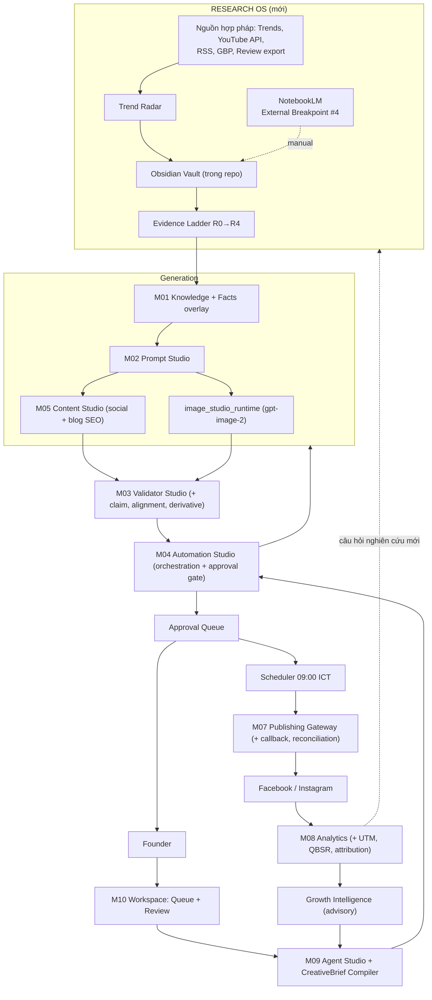

# VENHO GROWTH CONTENT & IMAGE AGENT — MASTER PLAN v3.0 (CONSOLIDATED)

**Trạng thái:** Ready for implementation handoff — Claude Code / Claude Extension VS Code
**Ngày:** 2026-08-03
**File này thay thế hoàn toàn:** v2.0, v2.1 (ChatGPT), v2.2 QC, v2.3 Research OS, v2.4 Trend Radar
**Nạp một file duy nhất. Không cần file nào khác.**

**Vai trò trong hệ thống:** Chương trình nâng cấp **A3 Content & Creative Agent** theo Living Lab Roadmap v1.3 §1.3 — chạy TRÊN VENHO AI Studio (M01–M10), không phải hệ thống song song.

**Namespace mã:** `GR` (Growth pipeline) · `RS` (Research OS) · `TR` (Trend Radar) · `PB` (Publishing cadence)
*Không đụng độ:* M01–M10 (module) · A1–A8 (hotel agent) · MT1–MT3 (Meta ads) · K1–K6 (K-Core) · L0–L6 (OS layer) · AS0–AS6 (agent stage)

**Repo chính:** `venho-ai-studio` · **Legacy đang thu hẹp:** `venho-social-content-agent`
**Kênh:** Facebook Page + Instagram Professional + Website blog (SEO) + Google Business Profile
**Timezone:** `Asia/Ho_Chi_Minh`

---

# MỤC LỤC

| Phần | Nội dung |
|---|---|
| 0 | Kết quả QC — 16 lỗi đã sửa |
| 1 | Mục tiêu và tiêu chí thành công |
| 2 | Quyết định kiến trúc và mapping chống build trùng |
| 3 | Clean Architecture |
| 4 | Domain model và state machines |
| 5 | Contracts (Contract-First) |
| 6 | Research OS — Obsidian Vault, NotebookLM, Claude Code, Evidence Ladder |
| 7 | Trend Radar — thu thập đa kênh và Brand Safety |
| 8 | Skill architecture — atomic + composite |
| 9 | Publishing — cadence, queue, evergreen, SEO |
| 10 | File tree hoàn chỉnh |
| 11 | Roadmap toàn bộ phase |
| 12 | Test và eval |
| 13 | Feature flags và rollback |
| 14 | Security và governance |
| 15 | Protocol giao việc cho AI coding agent + backlog |
| 16 | Decisions cần chốt |
| 17 | Definition of Done — 26 điều kiện |

---

# PHẦN 0 — KẾT QUẢ QC

## 0.1. Quy trình

Áp dụng quy trình QC 4 bước: phân tích toàn bộ → nhận diện lỗi → sửa → hợp nhất. Đối chiếu 4 nguồn sự thật: `task_memory.md`, `task_status.md` (430/430 tests), `VENHO_OS_LIVING_LAB_HUMAN_AI_AGENT_ROADMAP_v1_3_QC.md`, và nguyên tắc bất biến của Studio.

## 0.2. Bảng lỗi — 12 lỗi kiến trúc (GR) + 4 lỗi tài liệu (RS)

| # | Mức | Lỗi | Sửa |
|---|---|---|---|
| **GR-E1** | **Critical** | Đề xuất hệ content song song (`venho-os` control plane + Python workers) — vi phạm **Decision Locked #11** ("A3 chạy trên Studio pipeline, không build hệ content thứ hai"), tái hiện rủi ro "build trùng" mức Cao (Roadmap §22). Reimplement M03, M04, M05, M07, M08, M09 | Mọi năng lực mới ghép vào đúng module Studio sở hữu (mapping §2.3). Muốn hệ song song phải qua **Change Request L2 Governance** |
| **GR-E2** | **Critical** | Hai publishing gateway song song: Make.com (spec mới) và M07 (đã có HMAC approval, idempotency, receipt store, FB/IG adapters, 19 tests) → rủi ro duplicate post | **M07 là gateway duy nhất.** Make.com thành adapter đứng SAU M07. Callback + reconciliation build vào M07 |
| **GR-E3** | **High** | Yêu cầu validator song song TypeScript + Python — gấp đôi maintenance, vi phạm "M10 presentation-only" | **M03 là chủ sở hữu duy nhất của validation (Python).** UI chỉ đọc kết quả, không tính lại |
| **GR-E4** | **High** | Phụ thuộc repo `venho-os` làm control plane — repo chưa tồn tại (DR-OS-01 pending) | Control plane MVP = **mở rộng M10 Workspace**. React/Next là phase sau |
| **GR-E5** | **High** | Migration PostgreSQL ngay từ đầu — vi phạm nguyên tắc stack và Markdown/JSON Source of Truth | Bắt đầu **SQLite** (zero-ops, local-first). Postgres là **Decision GR-D3**. Schema Postgres-compatible từ đầu |
| GR-E6 | Medium | State machine mâu thuẫn giữa v2.0 và v2.1 | Chuẩn hóa một bộ canonical (§4) |
| GR-E7 | Medium | Ba ngưỡng QC ảnh song song: 7/10, 8.5/10, 9.0/10 | Mọi threshold về **policy registry** duy nhất, align rubric 07F (§5.6) |
| GR-E8 | Medium | Knowledge Facts thiết kế như subsystem mới — trùng K1 Knowledge và curated overlay M01 | Knowledge Facts = **curated overlay trong M01 domain** |
| GR-E9 | Medium | Legacy pipeline được "harden" lâu dài — kéo dài hai hệ | Phase 0 chỉ containment; retire theo migration gate Phase 4 |
| GR-E10 | Medium | Mở adapter `gpt-image-2` = đóng External Breakpoint #1 mà không ghi nhận | Ghi thành **Decision GR-D2** tường minh |
| GR-E11 | Low | Điểm "9.3/10" và baseline "4.1/10" không cùng eval harness | Điểm chỉ tính từ **golden eval set có version** (§12.4) |
| GR-E12 | Low | Budget ledger không map envelope 200 triệu VND | Map vào nhóm "CRM, AI tools, automation, data — 20 triệu" |
| RS-F1 | Medium | Skill đặt ở `skills/` root — sai vị trí Claude Code đọc | Chuyển `.claude/skills/` |
| RS-F2 | Medium | Skill liệt kê phẳng, không tách atomic/composite | Hai tầng: atomic + composite (§8) |
| RS-F3 | Medium | Thiếu YouTube/video làm nguồn nghiên cứu | Bổ sung vào 3 domain (§7.2) |
| RS-F4 | Medium | `CLAUDE.md` không có cơ chế quản trị thay đổi | Claude *đề xuất diff*, founder duyệt + commit (§6.5) |

## 0.3. Chín năng lực mới giữ lại từ v2.0/v2.1

1. **CreativeBrief** — hợp đồng sáng tạo khóa mục tiêu/audience/message/visual trước mọi generation.
2. **Knowledge Facts + Claim Verification** — mọi claim về giá/tiện nghi/review/khoảng cách phải có fact được duyệt còn hiệu lực.
3. **Cross-modal Alignment Validator** — copy và ảnh phải kể cùng một câu chuyện.
4. **Publication callback + reconciliation** — gateway `200` chỉ là `GATEWAY_ACCEPTED`.
5. **QBSR + attribution** — tối ưu theo qualified booking signals.
6. **Budget ledger** RESERVE → COMMIT | RELEASE.
7. **Immutable image runs** — mỗi generate là run mới, có manifest.
8. **3-candidate copy generation** với rubric lưu lý do loại.
9. **Golden eval sets** có version.

---

# PHẦN 1 — MỤC TIÊU VÀ TIÊU CHÍ THÀNH CÔNG

## 1.1. Mục tiêu sản phẩm

Tạo nội dung và hình ảnh đáng tin, nhất quán Hotel DNA/Linh An, đúng kênh, làm tăng **qualified demand** cho Ven Hồ Hotel — trong khi founder giữ toàn quyền phê duyệt, mọi claim có bằng chứng, chi phí dự đoán được. Đồng thời trở thành **cỗ máy nghiên cứu** tích lũy tri thức thương hiệu theo thời gian.

## 1.2. North-star metric

```text
QBSR (Qualified Booking Signal Rate) = unique_qualified_booking_signals / eligible_reach
```

Qualified signal = DM/điện thoại có ngày ở, số khách hoặc loại phòng · click booking link có UTM hợp lệ · booking start · booking xác nhận quy nguồn được.
**Không tính:** like, comment chung chung, spam, click lặp của cùng người dùng.

## 1.3. Quality gates (đo trên golden set có version)

| Chiều | Pilot gate | 90 ngày |
|---|---:|---:|
| Critical factual precision | 100% | 100% |
| Brand adherence | ≥95% | ≥97% |
| Copy–image alignment | ≥95% | ≥97% |
| Hotel DNA pass (ảnh liên quan) | ≥95% | ≥97% |
| Linh An identity pass (khi yêu cầu) | ≥92% | ≥95% |
| Duplicate publication | 0 | 0 |
| Publication có platform post ID | ≥99% | ≥99.5% |
| Human acceptance không sửa lớn | ≥70% | ≥80% |
| Ngày trống ngoài kế hoạch | 0 | 0 |

## 1.4. Non-goals

Không tự đặt/đổi giá và promotion · không tự trả lời hoặc chốt booking · không coi AI score là thay thế owner approval trong pilot · không tuyên bố winner từ một bài · không tối ưu reach đánh đổi booking intent · không nghiên cứu khi chưa có câu hỏi viết ra.

---

# PHẦN 2 — QUYẾT ĐỊNH KIẾN TRÚC

## 2.1. Quyết định chấp hành

1. **Chương trình chạy trên VENHO AI Studio.** Không repo mới, không hệ content thứ hai (Decision Locked #11).
2. **M07 là publishing gateway duy nhất.** Make.com là adapter sau M07 trong giai đoạn chuyển tiếp.
3. **M03 là chủ sở hữu duy nhất của validation.** UI chỉ hiển thị.
4. **Control plane MVP = M10 Workspace mở rộng.** Không chờ `venho-os` repo.
5. **Durable state = SQLite trước, Postgres theo Decision GR-D3.**
6. Topic approval ≠ final package approval.
7. Final approval tham chiếu **exact versions**. Mọi sửa đổi sau approval tự revoke.
8. Không validator nào fail/timeout/malformed được sinh `APPROVED` — fail-closed thành `UNVALIDATED`.
9. `gpt-image-2` qua versioned adapter; model/quality là config (Decision GR-D2).
10. Tối ưu theo QBSR, không theo engagement.
11. **0 API call trong unit/contract/integration tests mặc định.**
12. Growth Intelligence là **advisory-only** — `pending_approval`, route qua M04/M09.
13. **Chỉ R3 (Knowledge Fact được duyệt) mới được citable trong content publish.**
14. **Hệ thống không bao giờ tự sinh và tự đăng bài chưa được duyệt.**

## 2.2. Sơ đồ kiến trúc



## 2.3. Mapping năng lực → module sở hữu (chống build trùng)

| Năng lực | Module sở hữu | Vị trí code |
|---|---|---|
| Knowledge Facts + validity window | **M01** | `knowledge_studio/facts/` |
| CreativeBrief + Campaign | **M09** | `agent_studio/growth/` |
| Real prose + 3 candidates + rubric | **M05** | `content_studio/generators/` (tiêm adapter, không đổi cấu trúc) |
| Blog SEO tuần | **M05** | builder đã có — chỉ kích hoạt |
| Claim extraction + fact verification | **M03** | `validator_studio/claim_validator.py` |
| Cross-modal alignment | **M03** | `validator_studio/alignment_validator.py` |
| OCR + crop safety | **M03** | `validator_studio/derivative_validator.py` |
| Image generation + immutable runs | **GR mới** | `image_studio_runtime/` |
| Deterministic text overlay | GR | `image_studio_runtime/overlay/` |
| Approval snapshot exact-versions | **M04 + M07** | `automation_studio/approval_snapshot.py` |
| Callback + reconciliation | **M07** | `publishing_gateway/callback_receiver.py`, `reconciliation.py` |
| Make adapter (chuyển tiếp) | **M07** | `publishing_gateway/adapters/make_gateway.py` |
| Real metrics + observation windows | **M08** | `analytics_feedback/adapters/meta_insights.py` |
| UTM + attribution | **M08** | `analytics_feedback/attribution/` |
| Strategy Memory + weekly brief | **M08** | `analytics_feedback/strategy_memory/` |
| Durable jobs + budget ledger | **shared** | `shared/jobs/`, `shared/budget/` |
| Research OS + Evidence Ladder | **RS mới** | `research_engine/` |
| Trend Radar + Brand Safety | **TR mới** | `research_engine/trend_radar/` |
| Queue + cadence + evergreen | **GR** | `growth_orchestrator/application/` |
| Review/approval UI | **M10** | `ui/studio_app.py` + `dashboard/gateway.py` |
| Contracts + policy registry | Repo-level | `contracts/`, `config/projects/venho_hotel/` |

## 2.4. Số phận `venho-social-content-agent`

- **Phase 0:** containment tối thiểu (chặn publish sai). Không đầu tư tính năng.
- **Phase 1–3:** chạy song song read-only.
- **Phase 4 gate:** Studio pipeline publish 4 tuần liên tục, 0 duplicate → legacy standby.
- **Retire:** archive repo, giữ CLI compat trong `docs/legacy/`.

---

# PHẦN 3 — CLEAN ARCHITECTURE

## 3.1. Bốn tầng

```text
┌─────────────────────────────────────────────────────────┐
│ TẦNG 4 — INFRASTRUCTURE                                 │
│ SQLite store, file storage, scheduler, config loader,   │
│ HTTP callback server, secret loading, vault filesystem  │
├─────────────────────────────────────────────────────────┤
│ TẦNG 3 — INTERFACE ADAPTERS                             │
│ Provider adapters (text, gpt-image-2, Meta insights,    │
│ Make, trend collectors), module bridges (M01–M09),      │
│ Obsidian vault reader/writer, renderers, CLI, Streamlit │
├─────────────────────────────────────────────────────────┤
│ TẦNG 2 — APPLICATION (Use Cases)                        │
│ CollectSources · SynthesizeNotes · ProposeFact ·        │
│ ScanTrends · ScoreRelevance · PlanCampaign ·            │
│ CompileBrief · LockBrief · GenerateCopy · GenerateImage │
│ · ValidatePackage · ManageQueue · RequestApproval ·     │
│ ApproveExactVersions · DailyDispatch ·                  │
│ ReconcilePublication · IngestMetrics · AttributeSignal  │
├─────────────────────────────────────────────────────────┤
│ TẦNG 1 — DOMAIN                                         │
│ Aggregates, state machines, invariants, value objects,  │
│ Evidence Ladder, Brand Safety rules, policy interfaces  │
│ KHÔNG import provider, KHÔNG I/O                        │
└─────────────────────────────────────────────────────────┘
```

**Quy tắc phụ thuộc:** chỉ hướng vào trong. Domain không biết SQLite, OpenAI hay Obsidian tồn tại.

## 3.2. Hai quy tắc Studio kế thừa

1. **Bridge, không import sâu:** gọi M05 qua `content_bridge`, M03 qua `validator_bridge`. Không import nội bộ module khác.
2. **Config-first:** mọi threshold, model name, quality routing, budget cap, relevance score nằm trong YAML tại `config/projects/venho_hotel/`.

---

# PHẦN 4 — DOMAIN MODEL VÀ STATE MACHINES

## 4.1. Aggregates

| Aggregate | Mục đích | Module |
|---|---|---|
| `ResearchNote` | Note trong vault, có evidence level | RS |
| `TrendCandidate` | Trend đã chấm relevance + brand safety | TR |
| `KnowledgeFact` | Fact có validity window + approval | M01 |
| `Campaign` | Mục tiêu kinh doanh, segment, kỳ, offer, budget | M09 |
| `CreativeBrief` | Hợp đồng khóa giữa copy, image, validation | M09 |
| `ContentPackage` | Exact copy + asset versions publish cùng nhau | GR |
| `CopyVersion` | Copy bất biến theo platform | M05 |
| `ImageRun` / `ImageArtifact` | Một lần generate + artifacts bất biến | GR |
| `ValidationRun` | Một validator trên một target bất biến | M03 |
| `ApprovalRequest` | Quyết định human trên exact versions | M04 |
| `Publication` | Một ý định publish cho một platform | M07 |
| `MetricObservation` / `ConversionEvent` | Metric tại window / signal quy nguồn | M08 |
| `StrategyMemory` | Pattern có confidence + expiry | M08 |

**Định danh:** UUIDv7 (fallback UUIDv4). Mọi artifact production mang đủ: `brand_id, campaign_id, creative_brief_id+version, content_package_id, copy_version_id, image_run_id, asset_version_id, validation_snapshot_id, approval_request_id, publication_id, trace_id`. Slug chỉ là nhãn.

## 4.2. CreativeBrief

```text
DRAFT -> VALIDATING -> READY_FOR_APPROVAL -> LOCKED | REJECTED
LOCKED -> SUPERSEDED
```

Invariants: chỉ `LOCKED` được generate final · locked bất biến · sửa đổi tạo version mới supersede bản cũ · mọi proof point tham chiếu fact R3 hoặc source đã duyệt.

## 4.3. ContentPackage

```text
DRAFT -> GENERATING_COPY -> GENERATING_IMAGE -> VALIDATING
VALIDATING -> NEEDS_REVISION | READY_FOR_REVIEW | UNVALIDATED
READY_FOR_REVIEW -> APPROVED | REJECTED
APPROVED -> QUEUED -> SCHEDULED -> PUBLISHING
PUBLISHING -> PUBLISHED | PUBLISH_UNKNOWN | PUBLISH_FAILED | CANCELLED
PUBLISHED -> MEASURING -> MEASURED
```

Invariants:
- `READY_FOR_REVIEW` đòi hỏi MỌI validator bắt buộc đã **hoàn tất** (không phải pass — hoàn tất; kết quả quyết định nhánh).
- `APPROVED` đòi hỏi đúng một active copy version mỗi platform + một active asset version.
- Sửa copy/image/crop/overlay/CTA/offer/schedule sau approval → **tự revoke**.
- Fact R3 tham chiếu hết hạn hoặc bị revoke → **tự revoke approval**.
- `PUBLISHED` đòi hỏi platform post ID hoặc reconciliation proof.
- `PUBLISH_UNKNOWN` không được retry mù.

## 4.4. ImageRun

```text
QUEUED -> GENERATING -> GENERATED -> VALIDATING
VALIDATING -> APPROVED | NEEDS_REVIEW | UNVALIDATED | FAILED
```

Mỗi regeneration = run mới. Không run nào overwrite artifact của run khác.

## 4.5. Publication

```text
DRAFT -> READY -> DISPATCHING -> GATEWAY_ACCEPTED
GATEWAY_ACCEPTED -> PUBLISHED | UNKNOWN | FAILED
UNKNOWN -> PUBLISHED | FAILED | NEEDS_OPERATOR
```

`GATEWAY_ACCEPTED` là state DUY NHẤT được sinh trực tiếp từ HTTP `200`. Facebook và Instagram là hai Publication row độc lập.

## 4.6. ResearchNote (Evidence Ladder)

```text
R0 (raw) -> R1 (structured) -> R2 (synthesis) -> R3 (approved fact)
                             \-> R2-T (time-sensitive, auto-expire)
R3 -> R4 (proof point trong brief)
Bất kỳ cấp nào -> ARCHIVED (khi hết hạn)
```

**Không tồn tại code path nào cho phép R2 hoặc R2-T tự động lên R3.**

## 4.7. Job

```text
READY -> RUNNING -> SUCCEEDED | RETRYABLE_FAILED | TERMINAL_FAILED
```

Worker claim bằng lease có expiry; reconciliation worker thu hồi lease hết hạn. Trường bắt buộc: idempotency key, job type + version, attempt/max, lease owner + expiry, scheduled time, redacted last error, trace ID.

---

# PHẦN 5 — CONTRACTS (Contract-First)

> Mọi schema đặt tại `contracts/`, version hóa, có fixtures pass/fail. **Code viết SAU khi contract được duyệt.**

## 5.1. CreativeBrief (`contracts/creative_brief.schema.json` — v1.0)

```jsonc
{
  "schema_version": "1.0",
  "id": "01J...",
  "version": 1,
  "brand_id": "venho-hotel",
  "campaign_id": "01J...",
  "objective": "qualified_inquiry",        // qualified_inquiry|booking_click|awareness|retention
  "primary_metric": "qualified_dm_rate",
  "platforms": ["facebook", "instagram"],
  "audience_segment": "couple",            // theo taxonomy.yaml
  "funnel_stage": "consideration",
  "customer_tension": "muốn nghỉ gần Hồ Tây nhưng lo ảnh quảng cáo không đúng thực tế",
  "single_minded_message": "...",          // BẮT BUỘC — một thông điệp duy nhất
  "proof_points": [
    { "text": "12 phòng boutique", "fact_key": "hotel.room_count" }   // PHẢI có fact_key R3
  ],
  "context_refs": [                        // R2-T chỉ được dùng ở đây — định hình góc nhìn
    { "rs_id": "RS-2026-08-0031", "evidence_level": "R2-T", "role": "seasonal_context" }
  ],
  "content_angle": "local_experience",
  "hook_hypothesis": "một buổi sáng chậm bên Hồ Tây",
  "cta": { "type": "booking_link", "destination_key": "hotel.website", "strength": "soft" },
  "visual": {
    "scenario_key": "venho_rooftop_sunrise",     // BẮT BUỘC — không dùng pillar-level path
    "required_entities": ["west_lake", "rooftop_railing"],
    "forbidden_entities": ["bedroom_window", "highrise_skyline"],
    "linh_an": { "required": false, "reference_mode": "none" },
    "target_formats": ["feed_4_5", "square_1_1"]
  },
  "constraints": { "prohibited_claims": [], "critical_text_in_image": false },
  "lane": "daily",                         // daily | saturday_trend | evergreen | blog_seo
  "status": "LOCKED",
  "checksum": "sha256:..."
}
```

**Validation rules:** `objective, audience_segment, funnel_stage, single_minded_message, cta, visual.scenario_key` bắt buộc · conversion brief cần CTA đo được · mọi `proof_points[].fact_key` phải trỏ fact R3 active · `context_refs` chỉ chấp nhận R2/R2-T và **không bao giờ** được dùng làm claim · Linh An brief cần reference `rights_status=approved` · scenario resolver reject xung đột required/forbidden.

## 5.2. KnowledgeFact (`contracts/knowledge_fact.schema.json` — v1.0)

```jsonc
{
  "fact_key": "hotel.room_count",          // namespace: hotel.* | offer.* | venue.* | review.* | event.*
  "value": 12,
  "value_type": "integer",
  "source_type": "owner_confirmed",        // owner_confirmed|document|platform_verified
  "source_rs_id": "RS-2026-08-0014",       // truy về vault
  "confidence": 1.0,
  "valid_from": "2026-01-01T00:00:00+07:00",
  "valid_to": null,                        // giá/promotion/event BẮT BUỘC có valid_to
  "status": "approved",
  "version": 3,
  "approved_by": "harry",
  "approved_at": "2026-08-03T00:00:00+07:00"
}
```

**Fact bắt buộc có validity:** giá phòng · promotion · chính sách trẻ em · tồn phòng/room types · tiện nghi · điểm review + số review · khoảng cách/thời gian di chuyển · phone/website/booking URL/địa chỉ · tên/menu/giá/giờ mở cửa venue bên thứ ba · **sự kiện (ngày + địa điểm)**.

**Claim pipeline (M03 `claim_validator`):**

```text
Copy -> deterministic claim extraction -> claim list
     -> match knowledge_facts -> VERIFIED | UNSUPPORTED | CONFLICTED | EXPIRED
```

Critical claim `UNSUPPORTED|CONFLICTED|EXPIRED` = kill switch chặn publish. Ngôn ngữ chủ quan rõ ràng được pass. Validator lưu exact evidence + fact version.

## 5.3. ResearchNote frontmatter (`contracts/research_note.schema.json` — v1.0)

```yaml
---
rs_id: RS-2026-08-0014                    # BẮT BUỘC, duy nhất
type: source | note | synthesis | insight | event | trend
domain: guest_voice | competitor | local_intel | platform_trend
      | brand_visual | market_pricing | social_trend | local_events
evidence_level: R0 | R1 | R2 | R2-T | R3
status: draft | reviewed | promoted | archived
collected_at: 2026-08-03
source_uri: "https://..."                 # BẮT BUỘC nếu type=source
confidence: 0.0–1.0
expires_at: 2026-11-03                    # BẮT BUỘC với R2, R2-T, R3 có thời hạn
promoted_fact_keys: [hotel.review_score]  # điền khi promote lên M01
related_briefs: []
verified_by_human: false                  # BẮT BUỘC true với type=event trước khi dùng
tags: [westlake, boutique, couple]
---
```

Ba trường `evidence_level`, `expires_at`, `promoted_fact_keys` là cầu nối sang Claim Validator — không phải trang trí.

## 5.4. Event note (mở rộng cho `type: event`)

```yaml
---
rs_id: RS-2026-08-0031
type: event
domain: local_events
evidence_level: R2-T
event_name: "Lễ hội sen Hồ Tây"
event_start: 2026-08-15
event_end: 2026-08-17
venue: "Công viên nước Hồ Tây"
distance_from_hotel_km: 1.2
source_uri: "https://..."
expires_at: 2026-08-17                    # = event_end, BẮT BUỘC
verified_by_human: false                  # phải true trước khi thành proof point
relevance_to_guest: high | medium | low
---
```

**Sự kiện không bao giờ được nhắc trong content nếu `verified_by_human=false`.** Đăng sai ngày/địa điểm lễ hội cho khách đã đặt phòng là lỗi factual nghiêm trọng.

## 5.5. Copy candidate (`contracts/copy_candidate.schema.json` — v1.0)

3 candidate khác biệt thật sự mỗi brief:
1. emotional / experiential
2. practical / problem-solution
3. proof-led / trust-building

Paraphrase cùng hook không tính. Mỗi candidate trả: `platform, language, hook, body, cta, hashtags, alt_text, claims[], scene_summary{location, time_of_day, entities, mood}`.

**Rubric chọn:** Factual support = kill switch · Brief adherence 20% · Audience relevance 20% · Hook 15% · Benefit clarity 15% · Brand voice 10% · Platform fit 10% · CTA coherence 10%.

Lưu toàn bộ điểm + lý do loại. Chỉ candidate được chọn đi tiếp sang paid image generation.

## 5.6. Quality policy (`config/projects/venho_hotel/growth/quality_policy.yaml`)

```yaml
version: 1
image:
  dna_min: 9.0                    # align rubric 07F
  linh_an_identity_min: 9.0
  action_geometry_min: 9.0
  visual_quality_min: 8.5
  conditional_band: [8.0, 8.9]
copy:
  brand_voice_min: 9.0
  duplicate_similarity_block: 0.88
alignment:
  package_min: 9.0
kill_switches:
  - unsupported_critical_claim
  - wrong_hotel_environment
  - missing_required_identity
  - location_mismatch
  - critical_text_error
  - unverified_event_claim
  - forbidden_trend_category
verdict_rules:
  validator_incomplete: UNVALIDATED       # fail-closed
  any_kill_switch: NEEDS_REVISION
  all_pass: READY_FOR_REVIEW
```

**Verdict aggregation:** điểm KHÔNG được average qua các chiều kill-switch.

## 5.7. Image manifest (`contracts/image_manifest.schema.json` — v2.2)

```jsonc
{
  "schema_version": "2.2",
  "run_id": "01J...", "content_package_id": "01J...", "creative_brief_id": "01J...",
  "model": "gpt-image-2",                 // đọc từ config
  "operation": "edit",                    // generate|edit
  "quality": "medium", "size": "1024x1280",
  "prompt_contract_version": "1.0",
  "base_prompt": "...", "override_patch": {}, "final_prompt": "...",
  "prompt_hash": "sha256:...",
  "reference_asset_ids": ["01J..."],
  "reference_mode": "environment",        // environment|face|none
  "dna_subject": "lake_view_room", "dna_version": "2.7",
  "scenario_key": "venho_lake_view_room_sunrise",
  "estimated_cost_minor": 0, "actual_cost_minor": null,
  "artifacts": [], "validation_run_ids": [],
  "created_at": "..."
}
```

Layout bất biến:

```text
data/projects/venho_hotel/growth/artifacts/{content_package_id}/images/{run_id}/
  source-reference.json · generated.png · feed-4x5.png · square-1x1.png
  story-9x16.png · validation-report.json · manifest.json
```

## 5.8. Publication command + callback (`contracts/publication_command.schema.json` — v2.2)

**Idempotency key tất định:**
```text
brand + platform + account + content_package_id + copy_version_id + asset_version_id + scheduled_at
```
Cùng key → trả kết quả cũ, không bao giờ tạo post thứ hai.

**Callback bắt buộc:** `publication_id, idempotency_key, platform, status, platform_post_id, permalink, published_at, error_code` — HMAC v1 + timestamp replay protection + dedupe. Thiếu callback → `UNKNOWN` → reconcile trước mọi retry.

## 5.9. Danh sách contract đầy đủ

```text
contracts/
  creative_brief.schema.json          knowledge_fact.schema.json
  research_note.schema.json           trend_candidate.schema.json
  copy_candidate.schema.json          content_package.schema.json
  image_prompt_contract.schema.json   image_manifest.schema.json
  validation_report.schema.json       approval_snapshot.schema.json
  publication_command.schema.json     publication_callback.schema.json
  metric_observation.schema.json      conversion_event.schema.json
  strategy_memory.schema.json
  fixtures/{schema_name}/{valid|invalid}/*.json
```

---

# PHẦN 6 — RESEARCH OS

## 6.1. Vì sao cần tầng này

Pipeline sản xuất trả lời "làm sao sản xuất một bài đúng và đẹp?". Nó không trả lời **"lấy đâu ra điều đáng nói?"**.

Thiếu tầng Research → CreativeBrief compile từ trí nhớ founder và suy đoán của model — đúng loại đầu vào mà Knowledge Facts + Claim Validator được dựng ra để chặn. Agent sẽ rất giỏi diễn đạt nhưng hết chuyện sau 30–40 bài. Đây là nguyên nhân phổ biến nhất khiến content agent chết ở tháng thứ ba.

```text
Research OS → Knowledge Facts → CreativeBrief → Content Pipeline → Publish → Analytics
     ↑                                                                          │
     └──────────── vòng phản hồi: analytics sinh câu hỏi nghiên cứu mới ────────┘
```

## 6.2. Bốn công cụ — vị trí kiến trúc

| Công cụ | Tầng | Vai trò duy nhất | KHÔNG làm |
|---|---|---|---|
| **Obsidian** | Tầng 3 (human interface) | Giao diện đọc/viết trên chính markdown của repo | Không lưu dữ liệu riêng, không là source of truth độc lập, không chứa logic |
| **NotebookLM** | External Breakpoint #4 | Tổng hợp corpus lớn thành synthesis note | Không tự động hóa được; không là nơi lưu trữ cuối |
| **Claude Code** | Tầng 3 (agent interface) | Chạy research task + implementation task theo `CLAUDE.md` | Không tự promote insight thành Fact; không publish |
| **Skill Creator** | Cross-cutting | Đóng gói workflow lặp lại thành Skill tái sử dụng và bán được | Không chứa business logic riêng |

## 6.3. Obsidian Vault — kho tri thức, không phải database

**Quyết định RS-D1: Vault = một view trên repo, KHÔNG phải store thứ hai.**

Đây là điểm dễ sai nhất. Vault nằm ngoài repo = hai nguồn sự thật cho tri thức — đúng lỗi GR-E1 lặp lại ở tầng knowledge. Vault phải trỏ vào repo:

```text
Obsidian Vault root = venho-ai-studio/

Hiển thị:  research/ · docs/ · contracts/ · CLAUDE.md
Ẩn (.obsidian/app.json → userIgnoreFilters):
           data/ · tests/ · .git/ · **/__pycache__/ · *.py · node_modules/
```

**Vì sao hợp:** Studio đã markdown-first, single-file convention, versioned files. Backlinks cho thấy một insight đang được bao nhiêu brief sử dụng. Dataview biến frontmatter thành bảng truy vấn không cần code. Git version hóa tri thức cùng code sinh ra nó.

**Cấu hình bắt buộc** (`.obsidian/app.json`, commit vào repo):

```json
{
  "userIgnoreFilters": ["data/", "tests/", ".git/", "**/__pycache__/", "node_modules/"],
  "attachmentFolderPath": "research/_attachments",
  "newFileLocation": "folder",
  "newFileFolderPath": "research/notes",
  "alwaysUpdateLinks": true
}
```

**Plugin đề xuất:** Dataview (bắt buộc — dùng cho `_index.md`), Templater, Calendar.

**Dashboard `research/_index.md`:**

```markdown
## Cần promote (R2 đã review, chờ duyệt)
```dataview
TABLE domain, confidence, expires_at
FROM "research/insights" WHERE status = "reviewed" AND evidence_level = "R2"
SORT expires_at ASC
```

## Sắp hết hạn (7 ngày tới)
```dataview
TABLE evidence_level, expires_at, promoted_fact_keys
FROM "research" WHERE expires_at <= date(today) + dur(7 days) AND status != "archived"
SORT expires_at ASC
```

## Sự kiện chưa verify
```dataview
TABLE event_name, event_start, venue
FROM "research/events" WHERE verified_by_human = false AND event_end >= date(today)
```
```

## 6.4. NotebookLM — External Breakpoint #4

**Sự thật kỹ thuật:** không có API công khai cho người dùng thường; chỉ có bản enterprise trong Gemini Enterprise; sản phẩm đã đổi tên Gemini Notebook; Podcast API đã deprecated.

**Quyết định RS-D2: giữ manual vô thời hạn.** Xử lý y hệt Google Flow.

Danh sách External Breakpoint cập nhật:

| # | Breakpoint | Trạng thái |
|---|---|---|
| 1 | Image generation (Flow / GPT Image) | Đang đóng qua `image_studio_runtime` (GR-D2) |
| 2 | Video rendering (Veo / Kling) | Giữ manual |
| 3 | Post-render validation | Giữ manual |
| **4** | **Research synthesis (NotebookLM)** | **Giữ manual — không có API** |

**Contract VÀO** (human upload thủ công):

```text
research/_notebooklm_inbox/{topic_slug}/
  sources.md      # danh sách nguồn + lý do chọn (audit trail)
  question.md     # câu hỏi nghiên cứu — BẮT BUỘC, một câu duy nhất
```

**Contract RA** (human export về repo — bước quan trọng nhất):

```text
research/synthesis/{topic_slug}_{YYYYMMDD}.md
  frontmatter: type=synthesis, evidence_level=R2, expires_at BẮT BUỘC
  body: mỗi luận điểm PHẢI kèm nguồn gốc; không truy được nguồn → đánh dấu [UNSOURCED]
```

**Nguyên tắc bất biến:** output NotebookLM luôn là **R2**, không bao giờ tự thành R3.

**Khi nào dùng:** corpus >20 nguồn · tài liệu dài (báo cáo ngành, 200 review, tài liệu OTA) · cần Audio Overview để founder nghe khi di chuyển (phù hợp mobile-first). Corpus nhỏ → Claude Code nhanh hơn và ở ngay trong repo.

> **CẤM:** clone và cài repo wrapper reverse-engineer NotebookLM (`notebooklm-api` hoặc tương tự). Lý do: `setup.py install` là thực thi mã tùy ý từ repo lạ trên máy chứa `.env.local`; `notebooklm login` lưu session token tài khoản Google chính; vi phạm ToS; vỡ bất cứ lúc nào. Đối chiếu sự cố rotate `OPENAI_API_KEY` tháng 7 — rủi ro credential là rủi ro đã xảy ra thật.

## 6.5. Claude Code — research runner + implementation runner

**Tệp neo bắt buộc — `CLAUDE.md` ở root repo:**

```markdown
# CLAUDE.md — Ven Hồ AI Studio

## Đọc trước mọi task
- task_memory.md — kiến trúc, contract, nguyên tắc bất biến
- task_status.md — trạng thái module + test count hiện tại
- contracts/ — schema liên quan đến task

## Nguyên tắc không được vi phạm
1. 0 API call trong pytest. Provider mặc định = mock.
2. Bridge, không import sâu module khác.
3. Threshold/model name/relevance score đọc từ config/, không hard-code.
4. Không tự promote R2 hoặc R2-T → R3. Promotion cần founder approve.
5. Không sửa quá một module ownership boundary trong một task.
6. Không scrape Facebook/Instagram/TikTok. Chỉ nguồn có API/RSS chính thức.
7. Không publish bài chưa có ApprovalRequest hợp lệ.
8. Kết thúc task: cập nhật task_memory.md + task_status.md.

## Lệnh verify
python3 -m pytest -q     # phải ≥430 pass, 0 API call
```

**Hai loại research task:**
- **RS-COLLECT** — thu thập có cấu trúc: đọc review export, trích entity, xuất note R1. Deterministic.
- **RS-SYNTH** — tổng hợp corpus nhỏ thành insight R2 kèm nguồn cho từng luận điểm.

Claude Code **không** được ghi vào `knowledge_studio/facts/` — promotion là hành động của founder.

**RS-F4 — Governance cho `CLAUDE.md`:** không cho phép Claude tự viết lại file này (đây là character drift ở cấp dự án, mâu thuẫn nguyên tắc decision locking). Cơ chế đúng:

```bash
.claude/CLAUDE.md.proposed    # Claude ghi diff đề xuất + lý do từng thay đổi
```
Founder review → merge thủ công → commit. `CLAUDE.md` version bằng git như mọi decision khác.

## 6.6. Evidence Ladder — xương sống

| Cấp | Tên | Nguồn tạo | Được dùng ở đâu |
|---|---|---|---|
| **R0** | Raw source | Export review, screenshot OTA, PDF, URL | Chỉ lưu trữ + audit |
| **R1** | Structured note | Claude Code RS-COLLECT | Nội bộ, không citable |
| **R2** | Synthesis / insight | NotebookLM hoặc RS-SYNTH | Định hướng brief; **không publish như fact** |
| **R2-T** | Time-sensitive insight | Trend Radar, event scan | **Góc nhìn / hook / bối cảnh** — không bao giờ là claim |
| **R3** | Approved Knowledge Fact | Founder duyệt qua promotion gate | **Chỉ R3 được xuất hiện như claim** |
| **R4** | Proof point trong brief | CreativeBrief tham chiếu R3 | Đầu vào production |

### Ranh giới quyết định — quan trọng nhất toàn tài liệu

> **R2-T định hình GÓC NHÌN. R3 cung cấp SỰ THẬT.**

| Câu trong bài | Cấp cần | Hợp lệ? |
|---|---|---|
| "Cuối tuần này Hồ Tây vào mùa sen" | R2-T (bối cảnh) | ✅ Mô tả chung, không cam kết |
| "Lễ hội sen diễn ra 15–17/8 tại Công viên nước Hồ Tây" | **R3** | ⛔ Cần verify human + promote |
| "Phòng lake view cách đó 1,2km" | **R3** | ⛔ Cần fact `hotel.distance.westlake_park` |
| "Một buổi sáng chậm bên hồ" | Không cần | ✅ Ngôn ngữ chủ quan |

Claim Validator đã enforce: R2-T không map được `fact_key` → mọi câu khẳng định dựa trên R2-T bị chặn. **Đây là hành vi đúng, không phải bug.**

### Quy tắc bất biến

1. **Chỉ R3 mới citable.**
2. **Không tự động promote.** R2/R2-T → R3 luôn cần founder approve. Agent chỉ *đề xuất*.
3. **Mọi cấp từ R2 trở lên phải có `expires_at`.**
4. **Fact hết hạn → tự động revoke approval** của mọi ContentPackage chưa publish tham chiếu nó.

### Promotion gate — CLI

```bash
venho-research promote --note RS-2026-08-0014 --fact-key hotel.review_score
# → hiển thị: giá trị đề xuất, nguồn gốc (rs_id chain), confidence, expires_at đề xuất
# → chờ founder xác nhận (y/N)
# → ghi knowledge_facts: status=approved, approved_by, approved_at, source_rs_id
# → ghi audit event append-only
```

### Auto-expiry (`detect_stale_knowledge.py`, chạy hằng ngày)

- R2/R2-T quá hạn → `status: archived`, **không xóa** (giữ audit).
- Fact R3 quá hạn → revoke approval mọi package chưa publish + alert dashboard.
- Sự kiện qua `event_end` → archived nhưng **giữ làm dữ liệu mùa vụ năm sau** (lễ hội thường lặp lại — đây là tài sản thật).

## 6.7. Tám domain nghiên cứu

| Domain | Câu hỏi cốt lõi | Nguồn | Nhịp | Expiry mặc định |
|---|---|---|---|---|
| `guest_voice` | Khách thật sự khen/chê gì? | Review export Agoda/Booking/Google, DM | Tuần | 180 ngày |
| `competitor` | 5–8 đối thủ Hồ Tây định vị/định giá thế nào? | OTA listing, YouTube, website | 2 tuần | 90 ngày |
| `local_intel` | Quanh Hồ Tây có gì đáng kể cho khách? | Khảo sát thực địa, Maps API, báo địa phương | Tháng | 180 ngày |
| `platform_trend` | FB/IG ưu tiên format nào? | Meta newsroom, creator report | Tháng | 90 ngày |
| `brand_visual` | Visual DNA nào đang hoạt động? | M08 performance + Visual DNA v2.7 | Tháng | 90 ngày |
| `market_pricing` | Mùa vụ, sự kiện, demand Hà Nội | Lịch lễ, sự kiện thành phố, A1 pickup | Tháng | 120 ngày |
| `social_trend` | Tuần này xã hội chú ý gì mà Ven Hồ nói được? | Google Trends, News RSS, YouTube | **Hằng ngày** | **7 ngày** |
| `local_events` | Quanh Hồ Tây sắp có sự kiện gì? | Trang sự kiện, GBP, báo địa phương | 2 lần/tuần | **= event_end** |

**Guardrail chống lãng phí:** mỗi chu kỳ nghiên cứu bắt đầu bằng **đúng một câu hỏi viết ra**. Không có câu hỏi → không chạy research. Đây là guardrail chống rủi ro "Build Agent thay vì bán phòng" (Roadmap §22, mức Cao).

---

# PHẦN 7 — TREND RADAR

## 7.1. Vị trí kiến trúc

Trend Radar là sub-package của `research_engine`, KHÔNG phải hệ thống mới. Nó chỉ sinh note R1/R2-T vào vault; mọi thứ sau đó đi qua Evidence Ladder.

```text
Nguồn hợp pháp → collector → normalize → dedupe → relevance score → brand safety gate
   → note R1/R2-T vào vault → Trend Digest → dashboard → Harry duyệt
```

## 7.2. Nguồn được phép và bị cấm

### ĐƯỢC PHÉP

| Nguồn | Cách lấy | Domain | Chi phí |
|---|---|---|---|
| Google Trends | pytrends / export thủ công | `social_trend` | Miễn phí |
| YouTube Data API | API chính thức — **metadata + transcript** | `competitor`, `local_intel`, `social_trend` | Free quota 10k units/ngày |
| Meta Insights (trang CỦA MÌNH) | Graph API — đã có trong M08 | `platform_trend` | Miễn phí |
| Google Business Profile | API chính thức | `local_intel` | Miễn phí |
| News RSS (VnExpress, Hanoi Times, Tuổi Trẻ…) | RSS công khai | `social_trend`, `local_events` | Miễn phí |
| Sự kiện chính thức | Web sự kiện, trang thành phố, trang venue | `local_events` | Miễn phí |
| Review OTA | **Export thủ công** từ dashboard | `guest_voice` | Miễn phí |
| Google Maps Places | API chính thức | `local_intel` | Phí thấp |

### BỊ CẤM (ghi rõ để agent không tự ý làm)

- Scrape Facebook/Instagram của đối thủ — vi phạm ToS, ban account, vỡ liên tục.
- Scrape TikTok — tương tự.
- Tải và tái sử dụng nội dung video/ảnh của người khác. **Chỉ metadata + transcript** cho phân tích nội bộ.
- Bất kỳ wrapper reverse-engineer nào dùng session cookie tài khoản Google/Meta cá nhân.

> **Nguyên tắc: thà thiếu một nguồn còn hơn mất một tài khoản.**

## 7.3. Relevance scoring

`config/projects/venho_hotel/research/trend_policy.yaml`:

```yaml
version: 1
relevance_dimensions:
  geographic:
    westlake: 1.0
    hanoi: 0.7
    vietnam: 0.4
    global: 0.1
  thematic:
    travel_stay: 1.0
    food_local: 0.8
    lifestyle_culture: 0.6
    seasonal_weather: 0.5
    unrelated: 0.0
  actionability:
    direct: 1.0        # trực tiếp về Hồ Tây/lưu trú
    adjacent: 0.6      # liên quan gián tiếp
    stretch: 0.2       # phải gượng ép
scoring: weighted_product          # tránh một chiều 0 bị bù bởi chiều khác
min_score_to_vault: 0.35
min_score_to_saturday_lane: 0.60
```

Trend dưới ngưỡng bị loại **và ghi lý do** — không vào vault để tránh loãng kho tri thức.

## 7.4. Brand Safety Gate — kill switch bắt buộc

Đây là phần rủi ro cao nhất toàn hệ thống. "Chủ đề hot nhất xã hội" thường xuyên là thứ mà một khách sạn bám vào sẽ tự hủy hoại thương hiệu.

`config/projects/venho_hotel/research/brand_safety.yaml`:

```yaml
version: 1
forbidden_trend_categories:      # kill switch — không chấm điểm, chặn thẳng
  - politics_governance          # chính trị, chính sách nhạy cảm
  - disaster_accident            # thiên tai, tai nạn, thương vong
  - death_tragedy                # tang lễ, mất mát
  - crime_scandal                # tội phạm, bê bối
  - celebrity_personal           # đời tư người nổi tiếng
  - health_crisis                # dịch bệnh, khủng hoảng y tế
  - religion_ethnicity           # tôn giáo, dân tộc
  - competitor_negative          # tin xấu về đối thủ
  - social_conflict              # tranh cãi xã hội đang chia rẽ

required_intersection:           # trend PHẢI giao ít nhất 1 mục
  - travel_accommodation
  - hanoi_westlake_local
  - food_culinary
  - seasonal_weather_nature
  - culture_festival_positive

min_relevance_score: 0.60
human_approval: mandatory        # KHÔNG BAO GIỜ tự động, kể cả tương lai
```

**Quy tắc bất biến (TR-D3):** trend lane không bao giờ được auto-approve, kể cả khi các lane khác nới lỏng. **Rủi ro bất đối xứng** — 52 bài trend/năm chạy tốt không bù được một bài sai bối cảnh.

## 7.5. Ba loại trend phù hợp

1. **Mùa vụ / thiên nhiên** — mùa sen Hồ Tây, sương sớm mùa đông, hoàng hôn tháng 9, hoa sưa. An toàn nhất, ăn khớp Visual DNA sẵn có.
2. **Sự kiện văn hóa tích cực** — lễ hội, triển lãm, marathon quanh hồ, Tết. Cần `verified_by_human=true`.
3. **Trend lifestyle liên quan lưu trú** — workcation, staycation, du lịch chậm, "chữa lành". Bám được mà không cần bám tin tức.

Ba loại này phủ gần hết nhu cầu thực tế và tránh hoàn toàn vùng nguy hiểm.

---

# PHẦN 8 — SKILL ARCHITECTURE

## 8.1. Vị trí đúng (sửa RS-F1)

Claude Code đọc skill ở `.claude/skills/` (project-level) hoặc `~/.claude/skills/` (personal).

## 8.2. Quy tắc composition (sửa RS-F2)

- **Atomic skill:** làm đúng một việc, không gọi skill khác, có eval riêng.
- **Composite skill:** chỉ điều phối atomic skill theo chuỗi + xử lý lỗi. **Không chứa business logic.**
- Composite bắt đầu chứa logic nghiệp vụ → logic đó thuộc về một module Python, không thuộc Skill.

**Lợi ích productize:** khách sạn khác mua đúng atomic skill họ cần mà không phải lấy cả pipeline.

## 8.3. Danh mục Skill

### Atomic (nội bộ)

| Skill | Việc duy nhất | Gọi vào |
|---|---|---|
| `venho-source-collect` | Thu thập nguồn → note R1 | `venho-research collect` |
| `venho-trend-scan` | Quét trend → chấm relevance | `venho-trend scan` |
| `venho-synth` | Corpus nhỏ → insight R2 kèm nguồn | `venho-research synth` |
| `venho-fact-propose` | Insight R2 → đề xuất Fact | `venho-research promote` |
| `venho-content-package` | Locked brief → package chờ duyệt | `venho-growth run` |

### Composite (nội bộ)

| Skill | Chuỗi điều phối |
|---|---|
| `venho-research-cycle` | domain + question → collect → synth → insight note |
| `venho-daily-queue` | insight pool → brief → copy → image → validate → queue |
| `venho-weekly-trend` | trend scan (T4–T5) → relevance → brand safety → digest T6 |
| `venho-qc-4step` | Quy trình QC 4 bước cho mọi tài liệu OS |

### Productize (bán ra ngoài — Phase 4)

| Skill | Giá trị bán | Điều kiện |
|---|---|---|
| `hotel-review-intelligence` | Review → root cause → draft phản hồi | A2 chạy thật ≥2 chu kỳ |
| `hotel-trend-radar` | Trend địa phương + brand safety | TR chạy ≥8 tuần |
| `hotel-content-engine` | Brief → content đa kênh có QC | Chạy được hotel #2 không sửa core |
| `hotel-pricing-calendar` | Ưu tiên productize #1 theo Roadmap | Đủ dữ liệu ADR/RevPAR 2 mùa vụ |

**Mỗi Skill phải có:** `SKILL.md` với trigger rõ ràng · input/output contract · ví dụ chạy · **eval set riêng**. Skill không có eval = skill không bán được.

---

# PHẦN 9 — PUBLISHING

## 9.1. Cadence ramp có gate (TR-D2)

Nhảy thẳng 3 → 7 bài/tuần là tăng 2,3×. Rủi ro đo được:
- Duplicate detector chặn ở similarity ≥0,88. Với 12 phòng và một địa điểm cố định, không gian chủ đề hữu hạn.
- Fatigue detection 28/90 ngày sẽ cảnh báo.
- Chi phí ảnh ×2,3.
- Reach trung bình/bài thường giảm khi tăng tần suất đột ngột — tổng reach có thể không tăng.

`config/projects/venho_hotel/growth/cadence_policy.yaml`:

| Giai đoạn | Nhịp | Điều kiện lên nhịp tiếp |
|---|---|---|
| A (tuần 1–4) | 3 bài/tuần (T2/T4/T6) | Queue runway ổn định ≥5 ngày, QC pass ≥90% |
| B (tuần 5–8) | 5 bài/tuần (+T3/T5) | Reach/bài không giảm >15%, duplicate block <10% |
| C (tuần 9+) | **7 bài/tuần** | QBSR không giảm so với baseline giai đoạn B |

Gate fail → **tự động lùi về nhịp trước + alert**.

## 9.2. Approval Queue trên VenHo OS Dashboard

### Vì sao không duyệt từng bài
7 bài/tuần × duyệt riêng lẻ = 7 lần context switch. Founder mobile-first sẽ trễ, và trễ một ngày là mất một slot.

### Thiết kế

```text
┌─ VENHO OS · Content Queue ────────────────────────────┐
│ Runway: 6 ngày ✅        Cần duyệt: 4 bài             │
├───────────────────────────────────────────────────────┤
│ ☐ T2 04/08 · Lake view sáng sớm      [ảnh] ✅QC 9.2  │
│ ☐ T3 05/08 · Cà phê ven hồ           [ảnh] ✅QC 9.0  │
│ ☐ T4 06/08 · Phòng đôi cho cặp đôi   [ảnh] ⚠️QC 8.4  │
│ ☐ T5 07/08 · Đường Nguyễn Đình Thi   [ảnh] ✅QC 9.1  │
│ ☐ T7 09/08 · 🔥 TREND (chờ thứ 6)    [ ]    —        │
├───────────────────────────────────────────────────────┤
│ [Duyệt tất cả ✅]  [Duyệt đã chọn]  [Xem chi tiết]   │
└───────────────────────────────────────────────────────┘
```

Mỗi dòng mở ra Final Review đầy đủ: FB/IG preview cạnh nhau, ảnh + crops, claims + evidence chain (đến `rs_id`), validation theo chiều, cost, revision history, scheduled time.

**Duyệt hàng loạt vẫn tuân thủ exact-version approval** — mỗi bài sinh một `ApprovalRequest` riêng với snapshot `copy_version_id` + `asset_version_id`. "Duyệt tất cả" là tiện ích UI, không phải nới lỏng invariant.

### Runway policy

`config/projects/venho_hotel/growth/queue_policy.yaml`:

| Runway | Trạng thái | Hành động |
|---|---|---|
| ≥5 ngày | 🟢 Healthy | Không làm gì |
| 3–4 ngày | 🟡 Warning | Thông báo dashboard + sinh thêm draft |
| 1–2 ngày | 🟠 Critical | Alert (email/Zalo) + ưu tiên sinh draft |
| 0 ngày | 🔴 Empty | Dùng Evergreen Pool |

## 9.3. Evergreen Pool — mạng an toàn (TR-D5)

10–15 bài đã duyệt trước, **không chứa claim thời sự** (không sự kiện, không giá, không promotion, không số liệu có expiry). Chỉ nội dung ổn định: kiến trúc, view hồ, trải nghiệm phòng, câu chuyện thương hiệu.

**Quy tắc:**
1. Evergreen **cũng phải qua approval đầy đủ** — không có ngoại lệ.
2. Mỗi bài dùng lại tối đa **1 lần/90 ngày**.
3. Dùng evergreen → alert cho Harry biết queue đã cạn.
4. Evergreen cũng hết → **bỏ trống ngày đó + alert**. Hệ thống KHÔNG BAO GIỜ tự sinh và tự đăng bài chưa duyệt.

## 9.4. Dispatch pipeline 09:00

```text
08:45  Pre-flight check
       ├─ Fact expiry check → fact hết hạn? → revoke → lấy bài kế tiếp
       ├─ Approval còn hiệu lực? (không bị revoke bởi edit)
       ├─ Asset còn truy cập được? (URL + hash khớp)
       ├─ Event claim còn verified? (event chưa qua)
       └─ Fail toàn bộ → Evergreen → vẫn fail → alert + bỏ trống

09:00  Dispatch qua M07
       ├─ Facebook publication (row riêng)
       ├─ Instagram publication (row riêng)
       └─ HTTP 200 → GATEWAY_ACCEPTED (KHÔNG phải PUBLISHED)

09:00+ Callback → PUBLISHED + platform_post_id + permalink
09:30  Chưa callback → UNKNOWN → reconciliation
10:00  Vẫn UNKNOWN → NEEDS_OPERATOR + alert
```

Scheduler: idempotent dispatch, timezone `Asia/Ho_Chi_Minh`, GitHub cron chỉ là fallback. Trigger trùng → đúng 1 job nhờ idempotency key.

## 9.5. Trend Lane — thứ 7

### Timeline cứng

```text
T4  09:00  Trend scan tự động (7 ngày qua)
T5  09:00  Synthesis + relevance scoring → top 3 candidate
T6  08:00  Trend Digest lên dashboard — Harry chọn 1 trong 3
T6  12:00  CUTOFF 1 — chưa chọn → hủy lane, dùng bài thường
T6  14:00  Generate copy + image cho chủ đề đã chọn
T6  17:00  Final review → Harry duyệt
T6  20:00  CUTOFF 2 — chưa duyệt → fallback queue thường
T7  09:00  Publish
```

Hai cutoff cứng là bắt buộc. Không có chúng, trend lane tạo áp lực duyệt gấp tối thứ 6 — đúng lúc founder ít sẵn sàng nhất, và duyệt vội là nơi lỗi thương hiệu xảy ra.

## 9.6. "Chuẩn SEO" — ba bề mặt khác nhau (TR-D4)

**Facebook và Instagram gần như không phải bề mặt SEO.** Google index nội dung trong đó rất hạn chế. Tối ưu hashtag không phải SEO.

| Bề mặt | Bản chất | Tối ưu gì | Module |
|---|---|---|---|
| **Facebook / Instagram** | Discovery trong nền tảng | Hook 3 giây đầu, alt text, geo tag, hashtag tập trung, saves/shares | M05 social builder (đã có) |
| **Google Business Profile** | **SEO local thật** | Keyword "khách sạn Hồ Tây", post định kỳ, ảnh, Q&A, review | GBP post — nối A4 |
| **Website blog** | **SEO organic thật** | Từ khóa, cấu trúc H, internal link, schema, độ dài | **M05 blog SEO builder — đã có, chưa dùng** |

**Đề xuất:** cùng kho research sinh thêm **1 bài blog SEO/tuần** cho website. M05 đã có `blog SEO` builder trong 16 steps hoàn thành — năng lực có sẵn, chưa kích hoạt. Đây là đòn bẩy SEO thật cho "khách sạn Hồ Tây", feed thẳng vào mục tiêu direct share ≥25% của Roadmap. Chi phí thêm gần bằng 0.

---

# PHẦN 10 — FILE TREE HOÀN CHỈNH

```text
venho-ai-studio/
│
├── CLAUDE.md                                 # ★ neo context Claude Code (§6.5)
├── .claude/
│   ├── CLAUDE.md.proposed                    # ★ governance — diff chờ founder duyệt
│   └── skills/                               # ★ vị trí đúng (RS-F1)
│       ├── venho-source-collect/SKILL.md     #   atomic
│       ├── venho-trend-scan/SKILL.md         #   atomic
│       ├── venho-synth/SKILL.md              #   atomic
│       ├── venho-fact-propose/SKILL.md       #   atomic
│       ├── venho-content-package/SKILL.md    #   atomic
│       ├── venho-research-cycle/SKILL.md     #   composite
│       ├── venho-daily-queue/SKILL.md        #   composite
│       ├── venho-weekly-trend/SKILL.md       #   composite
│       ├── venho-qc-4step/SKILL.md           #   composite
│       └── _productize/                      #   nhóm bán ra ngoài (Phase 4)
│           ├── hotel-review-intelligence/
│           ├── hotel-trend-radar/
│           ├── hotel-content-engine/
│           └── hotel-pricing-calendar/
│
├── .obsidian/                                # ★ vault config — COMMIT vào repo
│   ├── app.json                              #   userIgnoreFilters: data/, tests/, *.py
│   ├── community-plugins.json                #   Dataview, Templater, Calendar
│   └── templates/
│       ├── source_note.md · insight_note.md
│       ├── synthesis_note.md · event_note.md · trend_note.md
│
├── contracts/                                # ★ Contract-First, version hóa
│   ├── creative_brief.schema.json
│   ├── knowledge_fact.schema.json
│   ├── research_note.schema.json
│   ├── trend_candidate.schema.json
│   ├── copy_candidate.schema.json
│   ├── content_package.schema.json
│   ├── image_prompt_contract.schema.json
│   ├── image_manifest.schema.json
│   ├── validation_report.schema.json
│   ├── approval_snapshot.schema.json
│   ├── publication_command.schema.json
│   ├── publication_callback.schema.json
│   ├── metric_observation.schema.json
│   ├── conversion_event.schema.json
│   ├── strategy_memory.schema.json
│   └── fixtures/{schema_name}/{valid,invalid}/*.json
│
├── research/                                 # ★ Obsidian Vault chính
│   ├── _index.md                             #   Dataview dashboard (§6.3)
│   ├── _attachments/
│   ├── _notebooklm_inbox/{topic_slug}/       #   contract VÀO breakpoint #4
│   │   ├── sources.md · question.md
│   ├── questions/                            #   backlog câu hỏi nghiên cứu
│   ├── sources/{domain}/                     #   R0 raw
│   ├── notes/{domain}/                       #   R1 structured
│   ├── synthesis/                            #   R2 — output NotebookLM/Claude Code
│   ├── insights/                             #   R2 đã review, chờ promote
│   ├── trends/{YYYY-WW}/                     #   R2-T theo tuần
│   │   ├── _scan.md · _digest.md · {trend_slug}.md
│   └── events/                               #   sự kiện quanh Hồ Tây
│       └── {YYYY-MM}_{event_slug}.md         #   expires_at = event_end
│
├── research_engine/                          # ★ package RS
│   ├── domain/
│   │   ├── evidence_level.py                 #   R0–R4 + R2-T, quy tắc chuyển cấp
│   │   ├── research_note.py                  #   aggregate + frontmatter contract
│   │   └── promotion_policy.py               #   điều kiện R2→R3, KHÔNG tự động
│   ├── application/
│   │   ├── collect_sources.py                #   RS-COLLECT
│   │   ├── synthesize_notes.py               #   RS-SYNTH (corpus nhỏ)
│   │   ├── propose_fact.py                   #   sinh đề xuất Fact
│   │   └── detect_stale_knowledge.py         #   quét expires_at → cảnh báo/revoke
│   ├── adapters/
│   │   ├── vault_reader.py                   #   đọc/ghi markdown + frontmatter
│   │   ├── m01_facts_bridge.py               #   ghi Fact qua M01
│   │   ├── m08_signal_bridge.py              #   analytics → câu hỏi nghiên cứu mới
│   │   └── notebooklm_handoff.py             #   inbox generator + export verifier
│   ├── trend_radar/                          # ★ package TR
│   │   ├── domain/
│   │   │   ├── trend_candidate.py            #   aggregate + relevance model
│   │   │   └── brand_safety.py               #   kill switch categories
│   │   ├── collectors/                       #   một file/nguồn, đều có rate limit
│   │   │   ├── google_trends.py
│   │   │   ├── youtube_data.py               #   metadata + transcript, KHÔNG tải video
│   │   │   ├── news_rss.py
│   │   │   ├── gbp_local.py
│   │   │   └── event_calendar.py
│   │   ├── application/
│   │   │   ├── scan_trends.py                #   T4 09:00
│   │   │   ├── score_relevance.py            #   §7.3
│   │   │   ├── build_digest.py               #   T5 → top 3
│   │   │   └── verify_event.py               #   gate verified_by_human
│   │   └── cli.py                            #   venho-trend scan|digest|verify
│   └── cli.py                                #   venho-research collect|synth|promote|stale
│
├── knowledge_studio/                         # M01
│   ├── vision/                               #   (hiện có)
│   └── facts/                                # ★ Knowledge Facts overlay
│       ├── fact_store.py                     #   CRUD + validity window + version
│       ├── fact_resolver.py                  #   resolve fact_key → giá trị active tại t
│       └── fact_approval.py                  #   approval lifecycle, append-only
│
├── prompt_studio/                            # M02 (hiện có — không đổi vai trò)
│
├── validator_studio/                         # M03
│   ├── image_validator.py                    #   (hiện có)
│   ├── prompt_validator.py                   #   (hiện có)
│   ├── face_validator.py                     #   (hiện có — rubric 07F)
│   ├── content_validator.py                  #   (hiện có)
│   ├── claim_validator.py                    # ★ #5 — claim vs facts R3
│   ├── alignment_validator.py                # ★ #6 — scene-graph brief–copy–ảnh
│   └── derivative_validator.py               # ★ #7 — OCR + crop safety
│
├── automation_studio/                        # M04
│   ├── adapters/                             #   (hiện có)
│   └── approval_snapshot.py                  # ★ exact-version + revocation rules
│
├── content_studio/                           # M05
│   ├── builders/                             #   (hiện có — gồm blog SEO chưa dùng)
│   └── generators/                           # ★ tiêm adapter, KHÔNG đổi cấu trúc
│       ├── provider_text.py                  #   Claude adapter (mock trong tests)
│       ├── candidate_generator.py            #   3 candidates khác biệt thật
│       └── candidate_selector.py             #   rubric + lưu điểm + lý do loại
│
├── video_studio/                             # M06 (hiện có — ngoài phạm vi)
│
├── publishing_gateway/                       # M07
│   ├── adapters/
│   │   ├── facebook.py · instagram.py        #   (hiện có)
│   │   └── make_gateway.py                   # ★ Make đứng SAU guardrails M07
│   ├── approval_verifier.py                  #   (hiện có — mở rộng approval_snapshot)
│   ├── receipt_store.py                      #   (hiện có)
│   ├── callback_receiver.py                  # ★ HMAC callback, dedupe
│   └── reconciliation.py                     # ★ UNKNOWN → proof | NEEDS_OPERATOR
│
├── analytics_feedback/                       # M08
│   ├── adapters/
│   │   ├── mock_metrics.py                   #   (hiện có — mặc định trong tests)
│   │   └── meta_insights.py                  # ★ real metrics, feature-flag off
│   ├── attribution/                          # ★
│   │   ├── utm_builder.py                    #   utm_content = publication_id
│   │   ├── inquiry_matcher.py                #   DM keyword, pseudonymize
│   │   └── attribution_engine.py             #   direct | assisted | unattributed
│   └── strategy_memory/                      # ★ advisory-only
│       ├── pattern_inference.py              #   Bayesian smoothing, decay, expiry
│       └── weekly_brief_generator.py
│
├── agent_studio/                             # M09
│   └── growth/                               # ★
│       ├── campaign_planner.py               #   objective → campaign + funnel mix
│       ├── brief_compiler.py                 #   campaign + insights → brief draft
│       ├── brief_lifecycle.py                #   DRAFT→…→LOCKED, supersede
│       └── scenario_registry.py              #   scenario_key → DNA + refs + rules
│
├── image_studio_runtime/                     # ★ package GR (Decision GR-D2)
│   ├── domain/
│   │   ├── image_run.py                      #   aggregate + state machine
│   │   └── quality_router.py                 #   risk class → quality
│   ├── application/
│   │   ├── generate_image.py                 #   brief + prompt → run
│   │   └── repair_image.py                   #   1 targeted repair → NEEDS_REVIEW
│   ├── adapters/
│   │   ├── gpt_image_provider.py             #   429/5xx backoff + jitter
│   │   ├── mock_image_provider.py            #   MẶC ĐỊNH trong tests
│   │   └── m02_prompt_bridge.py              #   consume prompt contract M02
│   ├── overlay/
│   │   └── text_compositor.py                #   deterministic — critical text
│   └── storage/
│       └── run_store.py                      #   immutable run folders + manifest
│
├── growth_orchestrator/                      # ★ use cases xâu chuỗi (Tầng 2)
│   ├── domain/
│   │   ├── content_package.py                #   aggregate + state machine §4.3
│   │   └── publication_policy.py
│   ├── application/
│   │   ├── run_content_pipeline.py           #   brief → copy → image → validate
│   │   ├── manage_queue.py                   #   runway policy §9.2
│   │   ├── evergreen_pool.py                 #   §9.3
│   │   ├── approve_exact_versions.py
│   │   ├── daily_dispatch.py                 #   pre-flight + 09:00 §9.4
│   │   ├── trend_lane.py                     #   timeline T4→T7 §9.5
│   │   └── measure_publication.py            #   qua M08
│   ├── bridges/                              #   KHÔNG import sâu
│   │   ├── m03_validator_bridge.py
│   │   ├── m04_automation_bridge.py
│   │   ├── m05_content_bridge.py
│   │   ├── m07_publishing_bridge.py
│   │   └── m08_analytics_bridge.py
│   └── cli.py                                #   venho-growth run|queue|approve|reconcile
│
├── shared/
│   ├── vision/                               #   (hiện có)
│   ├── jobs/                                 # ★ SQLite lease queue
│   │   ├── job_store.py                      #   READY→RUNNING→… + lease expiry
│   │   ├── worker.py                         #   claim, heartbeat, recovery
│   │   └── scheduler.py                      #   09:00 ICT, idempotent dispatch
│   └── budget/                               # ★
│       └── ledger.py                         #   RESERVE→COMMIT|RELEASE, alert 70/85/100%
│
├── dashboard/                                # M10 (hiện có — thêm GR sections)
├── ui/
│   └── studio_app.py                         #   (hiện có — thêm Queue + Final Review)
│
├── config/projects/venho_hotel/
│   ├── growth/                               # ★
│   │   ├── quality_policy.yaml               #   §5.6 — single source thresholds
│   │   ├── model_policy.yaml                 #   model names, quality routing
│   │   ├── budget_policy.yaml                #   caps, map envelope 20tr
│   │   ├── taxonomy.yaml                     #   audience/funnel/angle/format/cta/style
│   │   ├── scenario_registry.yaml            #   scenario_key → DNA/refs/rules
│   │   ├── attribution_policy.yaml           #   windows, dedupe, pseudonymization
│   │   ├── cadence_policy.yaml               #   ramp A/B/C §9.1
│   │   ├── queue_policy.yaml                 #   runway thresholds §9.2
│   │   └── feature_flags.yaml                #   §13
│   ├── research/                             # ★
│   │   ├── domains.yaml                      #   8 domain + nhịp + nguồn
│   │   ├── evidence_policy.yaml              #   R0–R4 + R2-T, expiry mặc định
│   │   ├── promotion_policy.yaml             #   ai duyệt, confidence tối thiểu
│   │   ├── trend_policy.yaml                 #   relevance scoring §7.3
│   │   ├── brand_safety.yaml                 #   kill switch §7.4
│   │   └── event_sources.yaml                #   nguồn sự kiện đã duyệt
│   └── ...                                   #   (hiện có: content/, video/, publishing/…)
│
├── data/projects/venho_hotel/growth/         # ★ (.gitignore)
│   ├── growth.db                             #   SQLite: jobs, packages, publications, ledger
│   ├── facts/                                #   knowledge facts JSON export (audit)
│   ├── briefs/
│   ├── artifacts/{package_id}/images/{run_id}/
│   ├── queue/                                #   queue state + evergreen pool
│   ├── analytics/
│   └── exports/YYYY/MM/{package_id}/         #   brief.json, facebook.txt, instagram.txt,
│                                             #   manifest.json, validation-summary.json,
│                                             #   publication-summary.json
│
├── tests/                                    #   430 hiện có + mới
│   ├── test_knowledge_facts.py
│   ├── test_claim_validator.py
│   ├── test_alignment_validator.py
│   ├── test_brief_lifecycle.py
│   ├── test_candidate_generation.py
│   ├── test_image_runtime.py                 #   mock provider only
│   ├── test_approval_snapshot.py
│   ├── test_publication_reconciliation.py
│   ├── test_jobs_and_budget.py
│   ├── test_attribution.py
│   ├── test_evidence_ladder.py               #   R2/R2-T không tự thành R3
│   ├── test_research_notes.py                #   frontmatter contract
│   ├── test_fact_promotion.py                #   promotion cần approval
│   ├── test_stale_detection.py               #   fact hết hạn revoke approval
│   ├── test_trend_relevance.py               #   trend dưới ngưỡng bị loại
│   ├── test_brand_safety_gate.py             #   danh mục cấm luôn bị chặn
│   ├── test_event_verification.py            #   event chưa verify không vào content
│   ├── test_queue_runway.py                  #   queue cạn → evergreen → alert
│   ├── test_daily_dispatch.py                #   pre-flight, fact expiry, idempotency
│   └── contracts/                            #   schema fixtures pass/fail
│
├── docs/
│   ├── growth/
│   │   ├── how_to_run_growth_pipeline.md
│   │   ├── how_to_run_research_os.md
│   │   ├── migration_from_legacy_agent.md
│   │   └── eval_golden_sets.md
│   └── legacy/                               #   CLI compat khi retire repo cũ
│
├── task_memory.md · task_status.md
└── pyproject.toml                            #   thêm: research_engine*, image_studio_runtime*,
                                              #   growth_orchestrator*

venho-social-content-agent/                   # LEGACY — chỉ Phase 0, sau đó freeze
```

---

# PHẦN 11 — ROADMAP

> Nguyên tắc: **gap-based, không greenfield.** Mỗi phase dừng ở MVP milestone chờ Harry accept. Toàn bộ 430 tests hiện có phải pass sau MỖI phase.

## Phase 0 — Containment trên legacy (tuần 1)

Chặn publish sai trên hệ hiện tại, không đầu tư tính năng mới.

- Tách topic approval khỏi final approval trong state + label.
- Bỏ `approved=true` hard-code trong Make payload.
- Nâng threshold ảnh lên policy-driven `9.0`.
- Thêm `UNVALIDATED` fail-closed.
- Guard brief–copy–ảnh location alignment (rule-based đơn giản).
- Make `200` lưu là `GATEWAY_ACCEPTED`.
- Feature flag rollback.

**Exit gate:** rooftop brief + bedroom image không thể publish · điểm 8 không hiển thị là approved · 0 paid call trong verification · tests legacy pass.

## Phase 1 — Contracts + Policy Registry (tuần 2–3)

- `contracts/` với 15 schema + fixtures pass/fail.
- `config/.../growth/` (9 YAML) + `config/.../research/` (6 YAML).
- `shared/budget/ledger.py` + `shared/jobs/` (SQLite, lease queue, scheduler skeleton).

**Exit gate:** mọi fixture pass/fail đúng · không threshold/model string nào lặp ngoài policy registry · 430 tests + mới pass.

## Phase 1.5 — Research OS foundation (tuần 3–5, song song Phase 2)

| Task | Nội dung | Phụ thuộc |
|---|---|---|
| RS-001 | `CLAUDE.md` + `.obsidian/` vault config + 5 template | — |
| RS-002 | `research_note.schema.json` + frontmatter validator | GR-P1-001 |
| RS-003 | `research_engine/domain/` — Evidence Ladder + promotion policy | RS-002 |
| RS-004 | `vault_reader.py` + `collect_sources.py` (RS-COLLECT) | RS-003 |
| RS-005 | `notebooklm_handoff.py` — inbox generator + export verifier | RS-003 |
| RS-006 | `propose_fact.py` + `m01_facts_bridge.py` + promotion CLI | GR-P2-001 |
| RS-007 | `detect_stale_knowledge.py` + hook revoke approval | GR-P4-001 |
| RS-008 | Skill: `venho-source-collect`, `venho-synth`, `venho-fact-propose` | RS-006 |
| RS-009 | Seed: `guest_voice` (review hiện có) + `competitor` (5–8 đối thủ) | RS-004 |

**Exit gate:** một câu hỏi chạy trọn vòng R0→R3 và fact xuất hiện trong CreativeBrief · R2 không thể tự lên R3 (có test) · fact hết hạn revoke đúng approval · vault mở được trong Obsidian, Dataview liệt kê đúng · 430 tests + RS pass, 0 API call.

## Phase 1.6 — Trend Radar (tuần 6–8)

| Task | Nội dung | Phụ thuộc |
|---|---|---|
| TR-001 | `trend_policy.yaml` + `brand_safety.yaml` + relevance model | RS-003 |
| TR-002 | Collectors: Google Trends, News RSS | TR-001 |
| TR-003 | Collector YouTube Data API (metadata + transcript) | TR-002 |
| TR-004 | `local_events` domain + `verify_event.py` gate | TR-001 |
| TR-005 | R2-T evidence level + auto-expiry | RS-003 |
| TR-006 | Trend Digest generator → dashboard | TR-002 |
| TR-007 | Skill `venho-trend-scan` + `venho-weekly-trend` | TR-006 |

**Exit gate:** một trend chạy trọn scan → score → digest → duyệt → bài T7 · danh mục cấm bị chặn 100% trên test set · sự kiện chưa verify không lọt vào content · R2-T không thể thành claim.

## Phase 2 — Knowledge Facts + Copy thật (tuần 4–6, song song 1.5)

- `knowledge_studio/facts/` — store, resolver, approval.
- M05 `generators/` — provider thật (mock trong tests), 3 candidates, selection rubric.
- M03 `claim_validator.py`.
- Seed facts từ dữ liệu Ven Hồ đã có (12 phòng, review 8.5, địa chỉ, kênh…).

**Exit gate:** critical factual error = 0 trên golden content set v1 · giá/policy/review/khoảng cách không nguồn bị chặn · Harry approve được locked brief trước paid generation.

## Phase 3 — Image runtime + Multimodal QC (tuần 7–10) — cần GR-D2

- `image_studio_runtime/` — provider adapter, mock, quality router, immutable runs, overlay.
- `scenario_registry.py` + `scenario_registry.yaml` (map Visual DNA v2.7).
- M03 `alignment_validator.py` + `derivative_validator.py`.
- Chính sách paid: 1 generation + 1 targeted repair → `NEEDS_REVIEW`. 429/5xx backoff không tạo variant mới.

**Exit gate:** required-subject omission = 0 · alignment ≥95% · mọi paid run có manifest đầy đủ · không artifact bị overwrite.

## Phase 4 — Approval exact-versions + Publishing tin cậy (tuần 11–13)

- M04 `approval_snapshot.py` + revocation rules.
- M07 `callback_receiver.py`, `reconciliation.py`, `make_gateway.py`.
- M10 panels: Final Review + Operations states.
- **Migration gate legacy:** Studio publish 4 tuần, 0 duplicate → legacy standby.

**Exit gate:** duplicate = 0 trong chaos tests · edit sau approval chặn dispatch · Make acceptance không hiển thị là published · mỗi publication có post ID hoặc reconciliation proof.

## Phase 4.5 — Daily cadence (tuần 13–15)

| Task | Nội dung |
|---|---|
| PB-001 | Queue UI + batch approval trên VenHo OS |
| PB-002 | Runway policy + alert |
| PB-003 | Evergreen Pool (10–15 bài duyệt trước) |
| PB-004 | Pre-flight check 08:45 |
| PB-005 | Scheduler 09:00 idempotent |
| PB-006 | Cadence ramp A→B→C có gate tự động |
| PB-007 | Trend Lane T4→T7 |
| PB-008 | Blog SEO tuần (kích hoạt M05 blog builder) |

**Exit gate:** 14 ngày liên tục đăng đúng 09:00, 0 duplicate, 0 ngày trống ngoài ý muốn · pre-flight bắt được fact hết hạn · ramp gate tự lùi nhịp khi metric xấu.

## Phase 5 — Scheduler + Durable ops (tuần 16–17)

- Worker heartbeat, stale-job recovery, retry matrix, lateness alert.
- Budget ledger alert 70/85/100%; 100% → block paid call trừ override có ghi nhận.

**Exit gate:** duplicate trigger tạo 1 job · restart thu hồi lease hết hạn · late run có alert · budget cap block đúng.

## Phase 6 — Analytics + Attribution (tuần 18–21)

- M08 `meta_insights.py` (flag off mặc định), windows 1h/24h/72h/7d/28d.
- `attribution/` — UTM (`utm_content=publication_id`), DM keyword, pseudonymization, direct/assisted/unattributed.
- M10 content performance view (đọc M08 output — không tính lại).

**Exit gate:** một inquiry test truy được về đúng một publication · null ≠ unavailable ≠ zero · sample metrics khớp nguồn.

## Phase 7 — Growth Intelligence pilot (tuần 22–25)

- `strategy_memory/` — Bayesian smoothing, confidence, scope, decay, expiry.
- Weekly strategy brief — **advisory-only, `pending_approval`**.
- Sample không đủ → `INCONCLUSIVE`.
- Vòng phản hồi: analytics sinh câu hỏi nghiên cứu mới vào `research/questions/`.

**Exit gate:** mọi recommendation có evidence + limitations · không strategy memory promote từ dữ liệu thiếu · QBSR không giảm quá guardrail.

## Phase 8 — Controlled rollout (tuần 26+)

```text
Shadow -> 25% pilot (human-approved) -> 50% -> 100% (vẫn human-approved)
-> auto-approval phạm vi hẹp CHỈ KHI có quyết định riêng của Harry
   (KHÔNG BAO GIỜ áp dụng cho trend lane)
```

**Exit gate:** scorecard ≥9.3/10 trên golden set có version · 90-day metrics đủ để so sánh · ≥1 Skill `_productize` chạy được cho hotel #2 không sửa core · runbook/rollback/budget/ownership documented.

---

# PHẦN 12 — TEST VÀ EVAL

## 12.1. Quy tắc bất biến

- **0 API call trong pytest.** Text/image/metrics/trend provider mặc định mock. `optimize_fn=optimize_mock` giữ nguyên cho M02.
- Không publish thật từ tests. Không đọc secret thật.
- 430 tests Studio pass sau mọi phase.

## 12.2. Test pyramid

**Unit:** state transitions (kể cả forbidden) · Evidence Ladder chuyển cấp · claim extraction/matching · relevance scoring · brand safety kill switch · prompt contract assembly · scenario resolution · platform formatting · duplicate scoring · verdict aggregation · idempotency key · budget reserve/commit/release · UTM + dedupe · runway policy.

**Contract:** mỗi schema có fixtures pass/fail · frontmatter validator · schedule 1.0 legacy vẫn đọc được trong migration window · provider adapter request/response mapping.

**Integration (mock providers):** question → collect → synth → insight → propose fact → approve → locked brief → 3 candidates → selection → mock image → validation → queue → approval exact versions → dispatch → callback → ambiguous timeout → reconciliation → artifact + manifest recovery → budget release on failure.

**E2E (staging, non-paid fixture image):** FB success + IG failure là hai state độc lập · duplicate dispatch cùng key = 1 post · edit sau approval revoke · fact hết hạn revoke · validator unavailable không bao giờ publish · scheduler duplicate = 1 job · queue cạn → evergreen → alert.

## 12.3. Acceptance style bắt buộc

```text
Given [persisted precondition]
When  [command hoặc API action]
Then  [observable domain result]
And   [audit / cost / validation / side-effect invariant]
```

Ví dụ:

```text
Given một event note có verified_by_human=false
When  brief compiler cố dùng nó làm proof point
Then  compile thất bại với ERR_UNVERIFIED_EVENT
And   không paid generation nào được kích hoạt
And   audit event ghi lại lần từ chối
```

## 12.4. Golden eval sets (version hóa)

- **Content set:** ≥100 CreativeBrief cases — audience × funnel × factual conflict × local topics × offers × 2 platforms.
- **Image set:** ≥60 cases — phòng thật, rooftop, street, local food, Linh An static/dynamic, mọi target crop.
- **Trend set:** ≥40 cases — gồm ≥15 case thuộc danh mục cấm để test kill switch.

Release report ghi: dataset version · policy + model versions · automated + reviewer scores · disagreements + adjudication · cost · latency · pass/fail theo gate.

Paid eval chạy trong workflow riêng có budget cap được duyệt — không nằm trong CI thường.

---

# PHẦN 13 — FEATURE FLAGS VÀ ROLLBACK

`config/projects/venho_hotel/growth/feature_flags.yaml`:

```yaml
final_approval_required: true          # KHÔNG BAO GIỜ tắt trong pilot
canonical_publication_state: true
multimodal_qc_enabled: true
research_os_enabled: false             # bật Phase 1.5
trend_radar_enabled: false             # bật Phase 1.6
make_callback_enabled: false           # bật Phase 4
daily_cadence_enabled: false           # bật Phase 4.5
trend_lane_enabled: false              # bật Phase 4.5
blog_seo_enabled: false                # bật Phase 4.5
external_scheduler_enabled: false      # bật Phase 5
meta_insights_enabled: false           # bật Phase 6
growth_recommendations_enabled: false  # bật Phase 7
legacy_agent_active: true              # tắt ở Phase 4 migration gate
```

**Rollback rules:** tắt flag không được reinterpret state đã lưu · migration forward-only với compatible reads · approved artifacts bất biến · **disable dispatch TRƯỚC khi rollback approval/validation** · Git export luôn khả dụng cho recovery · vault markdown luôn đọc được kể cả khi `research_engine` tắt.

---

# PHẦN 14 — SECURITY VÀ GOVERNANCE

1. Secrets chỉ ở GitHub Secrets / secret manager; không bao giờ trong repo, log, prompt, manifest, vault.
2. Callback + command dùng HMAC version hóa + timestamp replay protection.
3. Public image URL dùng lifetime tối thiểu.
4. File access resolve logical asset ID trong approved roots; client không gửi absolute path.
5. External source content = **untrusted input**, không được override prompt policy (chống prompt injection qua trend/news content).
6. Provider output/error redact trước khi lưu.
7. Linh An + human references phải có rights metadata.
8. Approval override ghi actor, reason, policy version, before/after hash.
9. Audit events append-only.
10. Inquiry identifiers pseudonymize trước khi vào vault hoặc analytics store.
11. **Không cài wrapper reverse-engineer dùng session cookie tài khoản cá nhân** (§6.4).
12. Collector chỉ truy cập nguồn trong `event_sources.yaml` / `trend_policy.yaml` đã duyệt.
13. Không lưu dữ liệu cá nhân khách trong vault.

---

# PHẦN 15 — PROTOCOL GIAO VIỆC CHO AI CODING AGENT

## 15.1. Task contract

```text
Task ID:                    <NS>-<PHASE>-<SEQ>   (GR-P2-003 | RS-004 | TR-002 | PB-001)
Objective:
Business reason:
Module ownership:           (theo §2.3 — KHÔNG vượt boundary)
Allowed files/modules:
Out of scope:
Current behavior:
Target behavior:
Input/output contract:      (tham chiếu contracts/*.schema.json)
Domain invariants:
Backward-compatibility:
Security constraints:
Cost constraints:
Acceptance tests:           (Given/When/Then/And)
Verification commands:      python3 -m pytest -q     # phải ≥430 pass
Rollback plan:
Documentation updates:      task_memory.md · task_status.md
```

## 15.2. Mandatory AI rules

1. Đọc `CLAUDE.md`, `task_memory.md` và `contracts/` liên quan TRƯỚC khi sửa code.
2. Kiểm tra dirty worktree; không đụng thay đổi không liên quan.
3. Không sửa nhiều module ownership boundary trong một task.
4. Không duplicate model name, threshold, scenario, relevance score, policy constant — đọc từ `config/`.
5. Không gọi paid API để verify thông thường. Mock provider là mặc định.
6. Không publish platform thật từ tests.
7. Không log secrets, signed URLs, tokens, webhook credentials.
8. Không gán `approved/published` thiếu evidence bắt buộc.
9. **Không tự promote R2/R2-T → R3.**
10. **Không scrape Facebook/Instagram/TikTok.** Chỉ nguồn API/RSS chính thức.
11. Viết tests TRƯỚC khi tuyên bố một domain invariant hoàn thành.
12. Bridge, không import sâu.
13. Gặp quyết định chưa chốt → dừng và báo, không tự chọn behavior thay đổi business policy.
14. Kết thúc task: cập nhật `task_memory.md`, `task_status.md`, commit hash, test result.
15. Đề xuất sửa `CLAUDE.md` phải ghi vào `.claude/CLAUDE.md.proposed`, không sửa trực tiếp.

## 15.3. Backlog ưu tiên

| Ưu tiên | Task ID | Nội dung | Module | Phụ thuộc |
|---:|---|---|---|---|
| P0 | GR-P0-001 | Tách topic vs final approval | legacy | — |
| P0 | GR-P0-002 | Bỏ `approved=true` hard-code | legacy | 001 |
| P0 | GR-P0-003 | Threshold 9.0 + `UNVALIDATED` | legacy | — |
| P0 | GR-P0-004 | Make `200` = `GATEWAY_ACCEPTED` | legacy | 002 |
| P1 | GR-P1-001 | 15 JSON Schemas + fixtures | contracts | P0 |
| P1 | GR-P1-002 | 15 file policy YAML | config | P1-001 |
| P1 | GR-P1-003 | SQLite jobs + budget ledger | shared | P1-001 |
| P1 | RS-001…003 | CLAUDE.md, vault config, Evidence Ladder domain | RS | P1-001 |
| P1 | RS-004…005 | vault_reader, collect, notebooklm handoff | RS | RS-003 |
| P1 | GR-P2-001 | Knowledge Facts store/resolver/approval | M01 | P1 |
| P1 | GR-P2-002 | M05 tiêm adapter + 3 candidates + rubric | M05 | P1 |
| P1 | GR-P2-003 | Claim validator | M03 | P2-001 |
| P1 | RS-006 | propose_fact + promotion CLI | RS | P2-001 |
| P1 | TR-001…003 | Trend policy, brand safety, collectors | TR | RS-003 |
| P1 | TR-004…006 | Events, R2-T, digest | TR | TR-001 |
| P1 | GR-P3-001 | Scenario registry (map Visual DNA v2.7) | M09 | P1 |
| P1 | GR-P3-002 | image_studio_runtime + mock provider | GR | GR-D2 |
| P1 | GR-P3-003 | Alignment + derivative validators | M03 | P3-002 |
| P1 | GR-P4-001 | Approval snapshot exact-versions | M04 | P3 |
| P1 | GR-P4-002 | M07 callback + reconciliation + Make adapter | M07 | P4-001 |
| P1 | GR-P4-003 | M10 Final Review + Operations panels | M10 | P4-002 |
| P1 | PB-001…008 | Queue, runway, evergreen, dispatch, ramp, trend lane, blog SEO | GR/M10 | P4 |
| P2 | GR-P5-001 | Scheduler + recovery + retry matrix | shared | P4.5 |
| P2 | GR-P6-001 | Meta insights adapter + windows | M08 | P4-002 |
| P2 | GR-P6-002 | UTM + attribution engine | M08 | P6-001 |
| P3 | GR-P7-001 | Strategy memory + weekly brief | M08 | P6-002 |
| P3 | RS-008 / TR-007 | Skills atomic + composite | skills | tương ứng |
| P3 | GR-P8-001 | Golden sets + shadow/pilot rollout | tests/docs | P7 |

---

# PHẦN 16 — DECISIONS CẦN CHỐT

| ID | Quyết định | Đề xuất | Lý do |
|---|---|---|---|
| **GR-D1** | Chạy trên Studio (hủy hướng hệ song song) | **Chấp thuận** | Đúng Decision Locked #11; tiết kiệm 40–50% effort |
| **GR-D2** | Đóng External Breakpoint #1 qua `image_studio_runtime` | **Chấp thuận có điều kiện** | Creative Studio đã chạy `generate_image.py` thật. Điều kiện: mock mặc định trong tests, budget ledger hoạt động trước paid call đầu |
| **GR-D3** | SQLite → PostgreSQL | **SQLite năm 1** | Trigger chuyển: multi-process workers, hosted control plane, >2 user đồng thời |
| **GR-D4** | Số phận `venho-social-content-agent` | Freeze sau P0 → standby sau P4 → archive | Tránh hai hệ |
| **GR-D5** | venho-os control plane (React) | Gắn **DR-OS-01**, không blocker | M10 Streamlit đủ cho pilot |
| **GR-D6** | Text provider cho M05 | Claude Sonnet, temp>0 chỉ ở M05 | Đúng nguyên tắc Studio |
| **RS-D1** | Obsidian vault trong hay ngoài repo | **Trong repo** | Ngoài repo = hai nguồn sự thật cho tri thức |
| **RS-D2** | NotebookLM là breakpoint manual | **Có, vô thời hạn** | Không có API công khai; wrapper reverse-engineer là rủi ro credential |
| **RS-D3** | M05 prose generator | **Tiêm adapter**, không phát triển M05 | Follow-up đã ghi trong task_status |
| **RS-D4** | Ai promote R2 → R3 | **Chỉ founder** | Không nới lỏng năm 1 |
| **RS-D5** | Skill productize đầu tiên | `hotel-review-intelligence` | Dữ liệu review sẵn có, validate nhanh nhất |
| **TR-D1** | Scrape social đối thủ | **Không** | ToS + rủi ro credential |
| **TR-D2** | Nhịp 7 bài/tuần ngay | **Ramp A→B→C có gate** | Duplicate/fatigue/cost là rủi ro đo được |
| **TR-D3** | Trend lane auto-approve | **Không bao giờ** | Rủi ro bất đối xứng |
| **TR-D4** | Bổ sung blog SEO tuần | **Có** — M05 đã có builder | Đây mới là SEO thật; chi phí ~0 |
| **TR-D5** | Evergreen pool bắt buộc | **Có**, 10–15 bài trước khi bật daily | Không có thì ngày trống là chắc chắn |
| **TR-D6** | Ai verify sự kiện | **Harry** | Sai ngày lễ hội = lỗi nghiêm trọng với khách đã đặt phòng |

---

# PHẦN 17 — DEFINITION OF DONE

Chương trình hoàn thành khi và chỉ khi:

### Content & Factuality
1. Mọi final post sinh từ một CreativeBrief `LOCKED`.
2. Mọi critical claim có Knowledge Fact R3 được duyệt còn hiệu lực.
3. Facebook và Instagram copy validate độc lập.
4. Scenario, Hotel DNA, Linh An policy, references version hóa và truy vết được.
5. Copy–brief–ảnh pass cross-modal validation.

### Approval & Publishing
6. Owner approval tham chiếu exact copy + asset versions.
7. Publication idempotent, chứng minh bằng platform post ID hoặc reconciliation evidence.
8. 14 ngày đăng liên tục 09:00, 0 duplicate, 0 ngày trống ngoài kế hoạch.
9. Cadence ramp tự động lùi nhịp khi gate metric fail.
10. Trend lane không bao giờ auto-approve.

### Research OS
11. Mọi claim publish truy được về Knowledge Fact R3 có nguồn gốc R0/R1/R2 rõ ràng trong vault.
12. Không tồn tại code path nào cho phép promote tự động R2 hoặc R2-T → R3.
13. Tám domain nghiên cứu đều có ≥1 chu kỳ chạy thật và sinh ≥1 fact được duyệt.
14. Fact hết hạn tự động cảnh báo và revoke approval của package chưa publish.
15. Sự kiện chưa `verified_by_human` không xuất hiện trong bất kỳ content nào.

### Trend Radar
16. Không collector nào truy cập nguồn ngoài danh sách được duyệt.
17. Mọi trend thuộc danh mục cấm bị chặn ở gate, có test chứng minh.
18. R2-T không tồn tại code path nào cho phép trở thành claim publish.

### Analytics & Learning
19. Analytics nối publication → qualified inquiry/booking signal khi có evidence.
20. Mọi recommendation có evidence, confidence, scope, expiry — ở trạng thái advisory chờ duyệt.
21. Vòng phản hồi hoạt động: analytics sinh câu hỏi nghiên cứu mới.

### Vận hành & Quản trị
22. Cost, latency, errors, retries, manifests audit được đầy đủ.
23. Toàn bộ quality/reliability/business release gates pass.
24. Scorecard ≥9.3/10 trên golden set có version sau đủ thời gian quan sát.
25. `CLAUDE.md` chỉ thay đổi qua diff được founder duyệt và commit.
26. **430 tests Studio gốc + toàn bộ tests mới pass, 0 API call.** `task_memory.md` và `task_status.md` phản ánh đúng trạng thái cuối.

Cho tới khi đủ 26 điều kiện, hệ thống phải được mô tả theo phase hiện tại, không phải "fully autonomous growth agent".

---

# CHANGELOG

| Version | Nội dung |
|---|---|
| v2.0 / v2.1 | Bản gốc ChatGPT — kiến trúc hệ song song, PostgreSQL, Make gateway |
| v2.2 QC | Sửa 12 lỗi kiến trúc; chuyển toàn bộ về Studio; M07 gateway duy nhất; SQLite; Clean Architecture |
| v2.3 | Bổ sung Research OS: Obsidian vault, NotebookLM breakpoint #4, Claude Code, Skill Creator, Evidence Ladder R0–R4, 6 domain |
| v2.4 | Sửa 4 lỗi v2.3; bổ sung Trend Radar, R2-T, 8 domain, Brand Safety Gate, approval queue, evergreen pool, cadence ramp, 3 bề mặt SEO |
| **v3.0** | **Hợp nhất toàn bộ thành một file. Đánh số liền mạch, một file tree hoàn chỉnh (không còn delta), một bảng Decisions gộp (17 quyết định), một DoD gộp (26 điều kiện), một backlog gộp. Không thêm quyết định mới.** |
