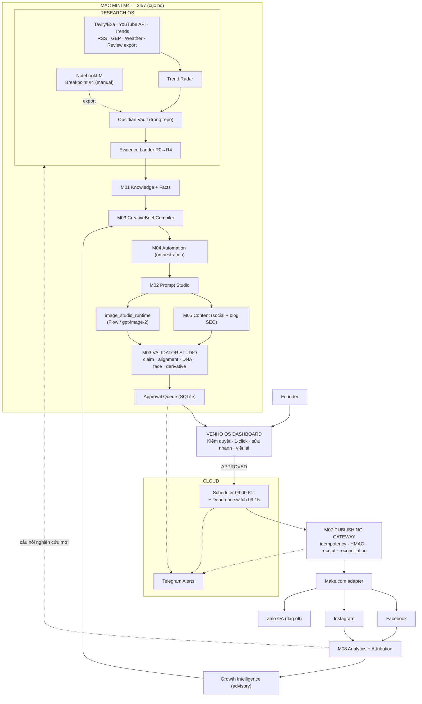

# VENHO GROWTH CONTENT & IMAGE AGENT — MASTER PLAN v3.1 (CONSOLIDATED)

**Trạng thái:** Ready for implementation handoff — Claude Code / Claude Extension VS Code
**Ngày:** 2026-08-03
**Thay thế hoàn toàn:** v2.0, v2.1 (ChatGPT), v2.2 QC, v2.3, v2.4, v3.0
**Nạp một file duy nhất. Không cần file nào khác.**

**Vai trò:** Chương trình nâng cấp **A3 Content & Creative Agent** theo Living Lab Roadmap v1.3 §1.3 — chạy TRÊN VENHO AI Studio (M01–M10), không phải hệ thống song song.

**Namespace:** `GR` (Growth) · `RS` (Research OS) · `TR` (Trend Radar) · `PB` (Publishing) · `IN` (Infrastructure)
*Không đụng độ:* M01–M10 · A1–A8 · MT1–MT3 · K1–K6 · L0–L6 · AS0–AS6

**Repo chính:** `venho-ai-studio` · **Legacy:** `venho-social-content-agent`
**Host:** Mac Mini M4 chạy 24/7 (cục bộ) + cloud deadman switch
**Kênh:** Facebook Page + Instagram Professional + Website blog (SEO) + Google Business Profile · Zalo OA (flag off)
**Nhịp đăng:** **4 bài/tuần — T2, T4, T6 (thường) + T7 (đặc biệt)** · 09:00 `Asia/Ho_Chi_Minh`

---

# MỤC LỤC

| Phần | Nội dung |
|---|---|
| 0 | Kết quả QC — 16 lỗi đã sửa |
| 1 | Mục tiêu và tiêu chí thành công |
| 2 | Quyết định kiến trúc và mapping chống build trùng |
| 3 | Clean Architecture |
| 4 | Domain model và state machines |
| 5 | Contracts (Contract-First) |
| 6 | Research OS — Obsidian, NotebookLM, Claude Code, Evidence Ladder |
| 7 | Trend Radar — thu thập đa kênh và Brand Safety |
| 8 | Skill architecture — atomic + composite |
| 9 | Publishing — nhịp 4 bài/tuần, queue, evergreen, SEO |
| 10 | **Kiến trúc triển khai vật lý — Mac Mini M4 + Cloud** |
| 11 | File tree hoàn chỉnh |
| 12 | Roadmap toàn bộ phase |
| 13 | Test và eval |
| 14 | Feature flags và rollback |
| 15 | Security và governance |
| 16 | Protocol giao việc cho AI coding agent + backlog |
| 17 | Decisions cần chốt |
| 18 | Definition of Done — 27 điều kiện |

---

# PHẦN 0 — KẾT QUẢ QC

## 0.1. Quy trình

Quy trình QC 4 bước: phân tích toàn bộ → nhận diện lỗi → sửa → hợp nhất. Đối chiếu 4 nguồn sự thật: `task_memory.md`, `task_status.md` (430/430 tests), `VENHO_OS_LIVING_LAB_HUMAN_AI_AGENT_ROADMAP_v1_3_QC.md`, nguyên tắc bất biến của Studio.

## 0.2. Bảng lỗi — 12 lỗi kiến trúc (GR) + 4 lỗi tài liệu (RS)

| # | Mức | Lỗi | Sửa |
|---|---|---|---|
| **GR-E1** | **Critical** | Hệ content song song (`venho-os` + Python workers) — vi phạm **Decision Locked #11**, tái hiện rủi ro "build trùng" mức Cao (Roadmap §22). Reimplement M03, M04, M05, M07, M08, M09 | Mọi năng lực ghép vào module Studio sở hữu (§2.3). Muốn hệ song song phải qua **CR L2 Governance** |
| **GR-E2** | **Critical** | Hai publishing gateway: Make.com và M07 (đã có HMAC approval, idempotency, receipt store, FB/IG adapters, 19 tests) → rủi ro duplicate post | **M07 là gateway duy nhất.** Make.com là adapter SAU M07 |
| **GR-E3** | **High** | Validator song song TypeScript + Python | **M03 sở hữu duy nhất validation.** UI chỉ đọc kết quả |
| **GR-E4** | **High** | Phụ thuộc repo `venho-os` chưa tồn tại (DR-OS-01 pending) | Control plane MVP = **M10 Workspace mở rộng** |
| **GR-E5** | **High** | PostgreSQL ngay từ đầu | **SQLite** trước (GR-D3), schema Postgres-compatible |
| GR-E6 | Medium | State machine mâu thuẫn v2.0 vs v2.1 | Một bộ canonical (§4) |
| GR-E7 | Medium | Ba ngưỡng QC ảnh song song: 7/10, 8.5/10, 9.0/10 | **Policy registry** duy nhất, align rubric 07F (§5.6) |
| GR-E8 | Medium | Knowledge Facts như subsystem mới — trùng K1 và M01 overlay | **Curated overlay trong M01** |
| GR-E9 | Medium | Legacy được "harden" lâu dài | Phase 0 chỉ containment; retire theo gate Phase 4 |
| GR-E10 | Medium | Mở adapter `gpt-image-2` = đóng Breakpoint #1 không ghi nhận | **Decision GR-D2** tường minh |
| GR-E11 | Low | "9.3/10" và "4.1/10" không cùng eval harness | Điểm chỉ tính từ **golden eval set có version** (§13.4) |
| GR-E12 | Low | Budget ledger không map envelope 200 triệu | Map nhóm "CRM, AI tools, automation, data — 20 triệu" |
| RS-F1 | Medium | Skill ở `skills/` root — sai vị trí Claude Code đọc | `.claude/skills/` |
| RS-F2 | Medium | Skill phẳng, không tách atomic/composite | Hai tầng (§8) |
| RS-F3 | Medium | Thiếu YouTube/video làm nguồn | Bổ sung 3 domain (§7.2) |
| RS-F4 | Medium | `CLAUDE.md` không có quản trị thay đổi | Claude *đề xuất diff*, founder duyệt + commit (§6.5) |

## 0.3. Chín năng lực giữ lại từ v2.0/v2.1

CreativeBrief · Knowledge Facts + Claim Verification · Cross-modal Alignment · Publication callback + reconciliation · QBSR + attribution · Budget ledger RESERVE/COMMIT/RELEASE · Immutable image runs · 3-candidate copy generation · Golden eval sets có version.

---

# PHẦN 1 — MỤC TIÊU VÀ TIÊU CHÍ THÀNH CÔNG

## 1.1. Mục tiêu sản phẩm

Tạo nội dung và hình ảnh đáng tin, nhất quán Hotel DNA/Linh An, đúng kênh, làm tăng **qualified demand** cho Ven Hồ Hotel — founder giữ toàn quyền phê duyệt, mọi claim có bằng chứng, chi phí dự đoán được. Đồng thời trở thành **cỗ máy nghiên cứu** tích lũy tri thức thương hiệu theo thời gian.

## 1.2. North-star metric

```text
QBSR = unique_qualified_booking_signals / eligible_reach
```

Qualified signal = DM/điện thoại có ngày ở, số khách hoặc loại phòng · click booking link có UTM hợp lệ · booking start · booking xác nhận quy nguồn được.
**Không tính:** like, comment chung chung, spam, click lặp cùng người dùng.

## 1.3. Quality gates (đo trên golden set có version)

| Chiều | Pilot | 90 ngày |
|---|---:|---:|
| Critical factual precision | 100% | 100% |
| Brand adherence | ≥95% | ≥97% |
| Copy–image alignment | ≥95% | ≥97% |
| Hotel DNA pass | ≥95% | ≥97% |
| Linh An identity pass (khi yêu cầu) | ≥92% | ≥95% |
| Duplicate publication | 0 | 0 |
| Publication có platform post ID | ≥99% | ≥99.5% |
| Human acceptance không sửa lớn | ≥70% | ≥80% |
| **Slot bị lỡ (4 slot/tuần)** | **0** | **0** |

## 1.4. Non-goals

Không tự đặt/đổi giá và promotion · không tự trả lời hoặc chốt booking · không coi AI score là thay thế owner approval · không tuyên bố winner từ một bài · không tối ưu reach đánh đổi booking intent · không nghiên cứu khi chưa có câu hỏi viết ra.

---

# PHẦN 2 — QUYẾT ĐỊNH KIẾN TRÚC

## 2.1. Quyết định chấp hành

1. **Chạy trên VENHO AI Studio.** Không repo mới, không hệ content thứ hai (Decision Locked #11).
2. **M07 là publishing gateway duy nhất.** Make.com là adapter SAU M07.
3. **M03 sở hữu duy nhất validation.** UI chỉ hiển thị.
4. **Control plane MVP = M10 Workspace mở rộng.**
5. **Durable state = SQLite** (GR-D3).
6. Topic approval ≠ final package approval.
7. Final approval tham chiếu **exact versions**. Sửa đổi sau approval tự revoke.
8. Validator fail/timeout/malformed → fail-closed `UNVALIDATED`, không bao giờ `APPROVED`.
9. `gpt-image-2` qua versioned adapter; model/quality là config (GR-D2).
10. Tối ưu theo QBSR, không theo engagement.
11. **0 API call trong tests mặc định.**
12. Growth Intelligence **advisory-only** — `pending_approval`.
13. **Chỉ R3 (Knowledge Fact được duyệt) mới citable trong content publish.**
14. **Hệ thống không bao giờ tự sinh và tự đăng bài chưa được duyệt.**
15. **Mọi content phải qua M03 trước khi lên dashboard.** Founder duyệt trên kết quả QC, không duyệt mò.
16. **Generation chạy cục bộ (Mac Mini), dispatch có cloud deadman switch.**

## 2.2. Sơ đồ kiến trúc



**Ba khác biệt then chốt so với sơ đồ ban đầu của Harry:**

1. **M03 nằm giữa generation và dashboard.** Founder duyệt trên kết quả QC có sẵn (`✅QC 9.2` / `⚠️QC 8.4`), không phải tự phát hiện lỗi factual, lỗi ảnh, lỗi trùng lặp.
2. **Make.com đứng SAU M07.** Bấm Approve → M07 (idempotency key, HMAC, receipt, `GATEWAY_ACCEPTED` ≠ `PUBLISHED`, reconciliation) → Make adapter → nền tảng. Bấm Approve hai lần vẫn chỉ ra một bài.
3. **Vault chỉ chứa `research/`.** Brand DNA, Room Catalog, Visual DNA v2.7 thuộc `knowledge_studio/` + `config/`. Obsidian *đọc thấy* chúng vì vault trỏ vào repo, nhưng không sở hữu.

## 2.3. Mapping năng lực → module sở hữu

| Năng lực | Module | Vị trí code |
|---|---|---|
| Knowledge Facts + validity window | **M01** | `knowledge_studio/facts/` |
| CreativeBrief + Campaign | **M09** | `agent_studio/growth/` |
| Real prose + 3 candidates + rubric | **M05** | `content_studio/generators/` (tiêm adapter) |
| Blog SEO tuần | **M05** | builder đã có — chỉ kích hoạt |
| Claim verification | **M03** | `validator_studio/claim_validator.py` |
| Cross-modal alignment | **M03** | `validator_studio/alignment_validator.py` |
| OCR + crop safety | **M03** | `validator_studio/derivative_validator.py` |
| Image generation + immutable runs | **GR** | `image_studio_runtime/` |
| Approval snapshot exact-versions | **M04 + M07** | `automation_studio/approval_snapshot.py` |
| Callback + reconciliation | **M07** | `publishing_gateway/callback_receiver.py`, `reconciliation.py` |
| Make + Zalo adapter | **M07** | `publishing_gateway/adapters/` |
| Real metrics + windows | **M08** | `analytics_feedback/adapters/meta_insights.py` |
| UTM + attribution | **M08** | `analytics_feedback/attribution/` |
| Strategy Memory | **M08** | `analytics_feedback/strategy_memory/` |
| Durable jobs + budget ledger | **shared** | `shared/jobs/`, `shared/budget/` |
| Telegram alerts | **shared** | `shared/notify/telegram.py` |
| Research OS + Evidence Ladder | **RS** | `research_engine/` |
| Trend Radar + Brand Safety | **TR** | `research_engine/trend_radar/` |
| Queue + cadence + evergreen | **GR** | `growth_orchestrator/application/` |
| Host runtime + deadman switch | **IN** | `infra/` |
| Review/approval UI | **M10** | `ui/studio_app.py` + `dashboard/gateway.py` |

## 2.4. Số phận `venho-social-content-agent`

Phase 0 containment tối thiểu → Phase 1–3 read-only song song → **Phase 4 gate:** Studio publish 4 tuần liên tục 0 duplicate → standby → archive, giữ CLI compat trong `docs/legacy/`.

---

# PHẦN 3 — CLEAN ARCHITECTURE

```text
┌─────────────────────────────────────────────────────────┐
│ TẦNG 4 — INFRASTRUCTURE                                 │
│ SQLite, file storage, launchd scheduler, config loader, │
│ HTTP callback server, secret loading, vault filesystem, │
│ Telegram client, deadman switch                         │
├─────────────────────────────────────────────────────────┤
│ TẦNG 3 — INTERFACE ADAPTERS                             │
│ Provider adapters (text, gpt-image-2, Tavily/Exa,       │
│ YouTube, weather, Meta insights, Make, Zalo),           │
│ module bridges (M01–M09), vault reader/writer,          │
│ renderers, CLI, Streamlit                               │
├─────────────────────────────────────────────────────────┤
│ TẦNG 2 — APPLICATION (Use Cases)                        │
│ CollectSources · SynthesizeNotes · ProposeFact ·        │
│ ScanTrends · ScoreRelevance · CompileBrief · LockBrief  │
│ · GenerateCopy · GenerateImage · ValidatePackage ·      │
│ ManageQueue · ApproveExactVersions · DispatchSlot ·     │
│ ReconcilePublication · IngestMetrics · AttributeSignal  │
├─────────────────────────────────────────────────────────┤
│ TẦNG 1 — DOMAIN                                         │
│ Aggregates, state machines, invariants, value objects,  │
│ Evidence Ladder, Brand Safety, slot policy              │
│ KHÔNG import provider, KHÔNG I/O                        │
└─────────────────────────────────────────────────────────┘
```

**Quy tắc:** phụ thuộc chỉ hướng vào trong. Domain không biết SQLite, OpenAI, Obsidian, Telegram tồn tại.

**Hai quy tắc Studio kế thừa:** bridge không import sâu · config-first (mọi threshold, model name, relevance score trong YAML).

---

# PHẦN 4 — DOMAIN MODEL VÀ STATE MACHINES

## 4.1. Aggregates

| Aggregate | Mục đích | Module |
|---|---|---|
| `ResearchNote` | Note trong vault có evidence level | RS |
| `TrendCandidate` | Trend đã chấm relevance + brand safety | TR |
| `KnowledgeFact` | Fact có validity window + approval | M01 |
| `Campaign` | Mục tiêu, segment, kỳ, offer, budget | M09 |
| `CreativeBrief` | Hợp đồng khóa giữa copy, image, validation | M09 |
| `ContentPackage` | Exact copy + asset versions publish cùng nhau | GR |
| `PublishingSlot` | Một ô lịch (T2/T4/T6/T7) cần lấp | GR |
| `CopyVersion` | Copy bất biến theo platform | M05 |
| `ImageRun` / `ImageArtifact` | Một lần generate + artifacts bất biến | GR |
| `ValidationRun` | Một validator trên một target bất biến | M03 |
| `ApprovalRequest` | Quyết định human trên exact versions | M04 |
| `Publication` | Một ý định publish cho một platform | M07 |
| `MetricObservation` / `ConversionEvent` | Metric / signal quy nguồn | M08 |
| `StrategyMemory` | Pattern có confidence + expiry | M08 |

**Định danh:** UUIDv7 (fallback v4). Mọi artifact production mang đủ: `brand_id, campaign_id, creative_brief_id+version, content_package_id, slot_id, copy_version_id, image_run_id, asset_version_id, validation_snapshot_id, approval_request_id, publication_id, trace_id`.

## 4.2. CreativeBrief

```text
DRAFT -> VALIDATING -> READY_FOR_APPROVAL -> LOCKED | REJECTED
LOCKED -> SUPERSEDED
```

Chỉ `LOCKED` được generate final · locked bất biến · sửa đổi tạo version mới supersede · mọi proof point tham chiếu fact R3.

## 4.3. ContentPackage

```text
DRAFT -> GENERATING_COPY -> GENERATING_IMAGE -> VALIDATING
VALIDATING -> NEEDS_REVISION | READY_FOR_REVIEW | UNVALIDATED
READY_FOR_REVIEW -> APPROVED | REJECTED
APPROVED -> QUEUED -> SCHEDULED -> PUBLISHING
PUBLISHING -> PUBLISHED | PUBLISH_UNKNOWN | PUBLISH_FAILED | CANCELLED
PUBLISHED -> MEASURING -> MEASURED
```

**Invariants:**
- `READY_FOR_REVIEW` đòi hỏi MỌI validator bắt buộc đã **hoàn tất** (không phải pass — hoàn tất; kết quả quyết định nhánh).
- `APPROVED` đòi hỏi đúng một active copy version mỗi platform + một active asset version.
- Sửa copy/image/crop/overlay/CTA/offer/schedule sau approval → **tự revoke**.
- Fact R3 tham chiếu hết hạn hoặc bị revoke → **tự revoke approval**.
- `PUBLISHED` đòi hỏi platform post ID hoặc reconciliation proof.
- `PUBLISH_UNKNOWN` không được retry mù.

## 4.4. PublishingSlot (mới trong v3.1)

```text
OPEN -> DRAFT_ASSIGNED -> PENDING_APPROVAL -> FILLED
FILLED -> DISPATCHED -> COMPLETED
OPEN -> EVERGREEN_FALLBACK -> DISPATCHED
OPEN -> MISSED   (chỉ khi cả queue lẫn evergreen đều cạn → alert Telegram)
```

Slot được tạo trước 14 ngày theo `cadence_policy.yaml`. Mỗi slot có `slot_type`: `regular` (T2/T4/T6) hoặc `special` (T7).

## 4.5. ImageRun

```text
QUEUED -> GENERATING -> GENERATED -> VALIDATING
VALIDATING -> APPROVED | NEEDS_REVIEW | UNVALIDATED | FAILED
```

Mỗi regeneration = run mới. Không overwrite artifact của run khác.

## 4.6. Publication

```text
DRAFT -> READY -> DISPATCHING -> GATEWAY_ACCEPTED
GATEWAY_ACCEPTED -> PUBLISHED | UNKNOWN | FAILED
UNKNOWN -> PUBLISHED | FAILED | NEEDS_OPERATOR
```

`GATEWAY_ACCEPTED` là state DUY NHẤT sinh trực tiếp từ HTTP `200`. Facebook / Instagram / Zalo là ba Publication row độc lập.

## 4.7. ResearchNote (Evidence Ladder)

```text
R0 (raw) -> R1 (structured) -> R2 (synthesis) -> R3 (approved fact)
                             \-> R2-T (time-sensitive, auto-expire)
R3 -> R4 (proof point trong brief)
Bất kỳ cấp nào -> ARCHIVED (khi hết hạn)
```

**Không tồn tại code path nào cho phép R2 hoặc R2-T tự động lên R3.**

## 4.8. Job

```text
READY -> RUNNING -> SUCCEEDED | RETRYABLE_FAILED | TERMINAL_FAILED
```

Worker claim bằng lease có expiry; reconciliation worker thu hồi lease hết hạn.

---

# PHẦN 5 — CONTRACTS (Contract-First)

> Mọi schema tại `contracts/`, version hóa, có fixtures pass/fail. **Code viết SAU khi contract được duyệt.**

## 5.1. CreativeBrief (`creative_brief.schema.json` — v1.1)

```jsonc
{
  "schema_version": "1.1",
  "id": "01J...", "version": 1,
  "brand_id": "venho-hotel", "campaign_id": "01J...",
  "slot_id": "01J...",                     // ★ v3.1 — gắn với PublishingSlot
  "lane": "regular",                       // regular | special | evergreen | blog_seo
  "objective": "qualified_inquiry",        // qualified_inquiry|booking_click|awareness|retention
  "primary_metric": "qualified_dm_rate",
  "platforms": ["facebook", "instagram"],
  "audience_segment": "couple",
  "funnel_stage": "consideration",
  "customer_tension": "muốn nghỉ gần Hồ Tây nhưng lo ảnh quảng cáo không đúng thực tế",
  "single_minded_message": "...",          // BẮT BUỘC — một thông điệp duy nhất
  "proof_points": [
    { "text": "12 phòng boutique", "fact_key": "hotel.room_count" }   // PHẢI trỏ fact R3
  ],
  "context_refs": [                        // R2/R2-T CHỈ được dùng ở đây — định hình góc nhìn
    { "rs_id": "RS-2026-08-0031", "evidence_level": "R2-T", "role": "seasonal_context" }
  ],
  "content_angle": "local_experience",
  "hook_hypothesis": "một buổi sáng chậm bên Hồ Tây",
  "cta": { "type": "booking_link", "destination_key": "hotel.website", "strength": "soft" },
  "visual": {
    "scenario_key": "venho_rooftop_sunrise",      // BẮT BUỘC
    "required_entities": ["west_lake", "rooftop_railing"],
    "forbidden_entities": ["bedroom_window", "highrise_skyline"],
    "linh_an": { "required": false, "reference_mode": "none" },
    "target_formats": ["feed_4_5", "square_1_1"]
  },
  "constraints": { "prohibited_claims": [], "critical_text_in_image": false },
  "status": "LOCKED",
  "checksum": "sha256:..."
}
```

**Validation:** `objective, audience_segment, funnel_stage, single_minded_message, cta, visual.scenario_key` bắt buộc · mọi `proof_points[].fact_key` trỏ fact R3 active · `context_refs` chỉ chấp nhận R2/R2-T và **không bao giờ** dùng làm claim · Linh An brief cần `rights_status=approved` · scenario resolver reject xung đột required/forbidden.

## 5.2. KnowledgeFact (`knowledge_fact.schema.json` — v1.0)

```jsonc
{
  "fact_key": "hotel.room_count",     // hotel.* | offer.* | venue.* | review.* | event.*
  "value": 12, "value_type": "integer",
  "source_type": "owner_confirmed",   // owner_confirmed|document|platform_verified
  "source_rs_id": "RS-2026-08-0014",  // truy về vault
  "confidence": 1.0,
  "valid_from": "2026-01-01T00:00:00+07:00",
  "valid_to": null,                   // giá/promotion/event BẮT BUỘC có valid_to
  "status": "approved", "version": 3,
  "approved_by": "harry", "approved_at": "2026-08-03T00:00:00+07:00"
}
```

**Bắt buộc có validity:** giá phòng · promotion · chính sách trẻ em · tồn phòng/room types · tiện nghi · điểm review + số review · khoảng cách/thời gian di chuyển · phone/website/booking URL/địa chỉ · venue bên thứ ba · **sự kiện (ngày + địa điểm)**.

**Claim pipeline (M03):**
```text
Copy -> deterministic claim extraction -> claim list
     -> match knowledge_facts -> VERIFIED | UNSUPPORTED | CONFLICTED | EXPIRED
```
Critical claim `UNSUPPORTED|CONFLICTED|EXPIRED` = kill switch chặn publish. Ngôn ngữ chủ quan rõ ràng được pass.

## 5.3. ResearchNote frontmatter (`research_note.schema.json` — v1.1)

```yaml
---
rs_id: RS-2026-08-0014                    # BẮT BUỘC, duy nhất
type: source | note | synthesis | insight | event | trend | weather
domain: guest_voice | competitor | local_intel | platform_trend | brand_visual
      | market_pricing | social_trend | local_events | weather_signal
evidence_level: R0 | R1 | R2 | R2-T | R3
status: draft | reviewed | promoted | archived
collected_at: 2026-08-03
source_uri: "https://..."                 # BẮT BUỘC nếu type=source
collector: tavily | exa | youtube_api | trends | rss | gbp | weather | manual
confidence: 0.0–1.0
expires_at: 2026-11-03                    # BẮT BUỘC với R2, R2-T, R3 có thời hạn
promoted_fact_keys: [hotel.review_score]
related_briefs: []
verified_by_human: false                  # BẮT BUỘC true với type=event
tags: [westlake, boutique, couple]
---
```

## 5.4. Event note (`type: event`)

```yaml
---
rs_id: RS-2026-08-0031
type: event
domain: local_events
evidence_level: R2-T
event_name: "Lễ hội sen Hồ Tây"
event_start: 2026-08-15
event_end: 2026-08-17
venue: "Công viên nước Hồ Tây"
distance_from_hotel_km: 1.2
source_uri: "https://..."
expires_at: 2026-08-17                    # = event_end, BẮT BUỘC
verified_by_human: false                  # phải true trước khi thành proof point
relevance_to_guest: high | medium | low
---
```

**Sự kiện không bao giờ được nhắc trong content nếu `verified_by_human=false`.** Đăng sai ngày/địa điểm lễ hội cho khách đã đặt phòng là lỗi factual nghiêm trọng.

## 5.5. Weather signal (★ mới v3.1, `type: weather`)

```yaml
---
rs_id: RS-2026-08-0044
type: weather
domain: weather_signal
evidence_level: R2-T
forecast_date: 2026-08-06
condition: morning_mist | clear_sunrise | rain | heat | cold_snap | golden_sunset
temperature_range: [24, 31]
visual_opportunity: "sương sớm trên mặt hồ, ánh sáng khuếch tán"
matching_scenario_keys: [venho_lake_view_room_sunrise, venho_rooftop_sunrise]
expires_at: 2026-08-07T00:00:00+07:00     # 24–48h, BẮT BUỘC
---
```

Weather **chỉ là R2-T** — dùng chọn scenario và góc kể chuyện, không bao giờ là claim. Không viết "ngày mai trời đẹp" như một lời hứa.

## 5.6. Copy candidate (`copy_candidate.schema.json` — v1.0)

3 candidate khác biệt thật sự: (1) emotional/experiential · (2) practical/problem-solution · (3) proof-led/trust. Paraphrase cùng hook không tính.

Mỗi candidate trả: `platform, language, hook, body, cta, hashtags, alt_text, claims[], scene_summary{location, time_of_day, entities, mood}`.

**Rubric:** Factual support = kill switch · Brief adherence 20% · Audience relevance 20% · Hook 15% · Benefit clarity 15% · Brand voice 10% · Platform fit 10% · CTA coherence 10%. Lưu toàn bộ điểm + lý do loại. Chỉ candidate được chọn đi tiếp sang paid image generation.

## 5.7. Quality policy (`config/projects/venho_hotel/growth/quality_policy.yaml`)

```yaml
version: 1
image:
  dna_min: 9.0                    # align rubric 07F
  linh_an_identity_min: 9.0
  action_geometry_min: 9.0
  visual_quality_min: 8.5
  conditional_band: [8.0, 8.9]
copy:
  brand_voice_min: 9.0
  duplicate_similarity_block: 0.88
alignment:
  package_min: 9.0
kill_switches:
  - unsupported_critical_claim
  - wrong_hotel_environment
  - missing_required_identity
  - location_mismatch
  - critical_text_error
  - unverified_event_claim
  - forbidden_trend_category
verdict_rules:
  validator_incomplete: UNVALIDATED       # fail-closed
  any_kill_switch: NEEDS_REVISION
  all_pass: READY_FOR_REVIEW
```

**Verdict aggregation:** điểm KHÔNG được average qua các chiều kill-switch.

## 5.8. Image manifest (`image_manifest.schema.json` — v2.2)

```jsonc
{
  "schema_version": "2.2",
  "run_id": "01J...", "content_package_id": "01J...", "creative_brief_id": "01J...",
  "engine": "gpt_image_2",                // gpt_image_2 | google_flow_manual
  "model": "gpt-image-2",                 // đọc từ config
  "operation": "edit", "quality": "medium", "size": "1024x1280",
  "prompt_contract_version": "1.0",
  "base_prompt": "...", "override_patch": {}, "final_prompt": "...",
  "prompt_hash": "sha256:...",
  "reference_asset_ids": ["01J..."], "reference_mode": "environment",
  "dna_subject": "lake_view_room", "dna_version": "2.7",
  "scenario_key": "venho_lake_view_room_sunrise",
  "estimated_cost_minor": 0, "actual_cost_minor": null,
  "artifacts": [], "validation_run_ids": [], "created_at": "..."
}
```

Layout bất biến:
```text
data/projects/venho_hotel/growth/artifacts/{content_package_id}/images/{run_id}/
  source-reference.json · generated.png · feed-4x5.png · square-1x1.png
  story-9x16.png · validation-report.json · manifest.json
```

## 5.9. Publication command + callback (`publication_command.schema.json` — v2.2)

**Idempotency key tất định:**
```text
brand + platform + account + content_package_id + copy_version_id + asset_version_id + scheduled_at
```
Cùng key → trả kết quả cũ, không bao giờ tạo post thứ hai.

**Callback bắt buộc:** `publication_id, idempotency_key, platform, status, platform_post_id, permalink, published_at, error_code` — HMAC v1 + timestamp replay protection + dedupe. Thiếu callback → `UNKNOWN` → reconcile trước mọi retry.

## 5.10. Danh sách contract đầy đủ (16)

```text
contracts/
  creative_brief · knowledge_fact · research_note · trend_candidate
  weather_signal · publishing_slot · copy_candidate · content_package
  image_prompt_contract · image_manifest · validation_report
  approval_snapshot · publication_command · publication_callback
  metric_observation · conversion_event · strategy_memory
  fixtures/{schema_name}/{valid,invalid}/*.json
```

---

# PHẦN 6 — RESEARCH OS

## 6.1. Vì sao cần tầng này

Pipeline sản xuất trả lời "làm sao sản xuất một bài đúng và đẹp?". Nó không trả lời **"lấy đâu ra điều đáng nói?"**.

Thiếu tầng Research → CreativeBrief compile từ trí nhớ founder và suy đoán của model — đúng loại đầu vào mà Knowledge Facts + Claim Validator được dựng ra để chặn. Agent rất giỏi diễn đạt nhưng hết chuyện sau 30–40 bài. Đây là nguyên nhân phổ biến nhất khiến content agent chết ở tháng thứ ba.

```text
Research OS → Knowledge Facts → CreativeBrief → Content Pipeline → Publish → Analytics
     ↑                                                                          │
     └──────────── vòng phản hồi: analytics sinh câu hỏi nghiên cứu mới ────────┘
```

## 6.2. Bốn công cụ — vị trí kiến trúc

| Công cụ | Tầng | Vai trò duy nhất | KHÔNG làm |
|---|---|---|---|
| **Obsidian** | Tầng 3 (human) | Giao diện đọc/viết trên markdown của repo | Không lưu dữ liệu riêng, không là source of truth độc lập, không chứa logic |
| **NotebookLM** | Breakpoint #4 | Tổng hợp corpus lớn thành synthesis note | Không tự động hóa được; không là nơi lưu trữ cuối |
| **Claude Code** | Tầng 3 (agent) | Chạy research + implementation task theo `CLAUDE.md` | Không tự promote insight thành Fact; không publish |
| **Skill Creator** | Cross-cutting | Đóng gói workflow lặp lại thành Skill tái sử dụng và bán được | Không chứa business logic riêng |

## 6.3. Obsidian Vault — kho tri thức, không phải database

**RS-D1: Vault = một view trên repo, KHÔNG phải store thứ hai.**

Vault nằm ngoài repo = hai nguồn sự thật cho tri thức — lỗi GR-E1 lặp lại ở tầng knowledge.

```text
Obsidian Vault root = venho-ai-studio/

Hiển thị:  research/ · docs/ · contracts/ · CLAUDE.md
           knowledge_studio/ (chỉ đọc — KHÔNG sở hữu)
Ẩn:        data/ · tests/ · .git/ · **/__pycache__/ · *.py · node_modules/
```

**Ranh giới sở hữu (★ làm rõ trong v3.1):**

| Nội dung | Sở hữu bởi | Vault có đọc thấy? |
|---|---|---|
| Brand DNA, Room Catalog, Visual DNA v2.7 | `knowledge_studio/` + `config/` | Có (read-only) |
| Knowledge Facts R3 | `knowledge_studio/facts/` | Có (read-only) |
| Research notes R0–R2-T, insights, trends, events, weather | **`research/`** | **Có (đọc + ghi)** |
| Audience insights (đã promote) | M01 facts | Có (read-only) |

**Cấu hình `.obsidian/app.json`** (commit vào repo):

```json
{
  "userIgnoreFilters": ["data/", "tests/", ".git/", "**/__pycache__/", "node_modules/"],
  "attachmentFolderPath": "research/_attachments",
  "newFileLocation": "folder",
  "newFileFolderPath": "research/notes",
  "alwaysUpdateLinks": true
}
```

**Plugin:** Dataview (bắt buộc), Templater, Calendar.

**Dashboard `research/_index.md`:**

```markdown
## Cần promote (R2 đã review, chờ duyệt)
```dataview
TABLE domain, confidence, expires_at
FROM "research/insights" WHERE status = "reviewed" AND evidence_level = "R2"
SORT expires_at ASC
```

## Sắp hết hạn (7 ngày tới)
```dataview
TABLE evidence_level, expires_at, promoted_fact_keys
FROM "research" WHERE expires_at <= date(today) + dur(7 days) AND status != "archived"
SORT expires_at ASC
```

## Sự kiện chưa verify
```dataview
TABLE event_name, event_start, venue
FROM "research/events" WHERE verified_by_human = false AND event_end >= date(today)
```

## Tín hiệu thời tiết 3 ngày tới
```dataview
TABLE condition, visual_opportunity, matching_scenario_keys
FROM "research/weather" WHERE forecast_date >= date(today)
SORT forecast_date ASC
```
```

## 6.4. NotebookLM — External Breakpoint #4

**Sự thật kỹ thuật:** không có API công khai cho người dùng thường; chỉ có bản enterprise trong Gemini Enterprise; sản phẩm đã đổi tên Gemini Notebook; Podcast API đã deprecated.

**RS-D2: giữ manual vô thời hạn.** Xử lý y hệt Google Flow.

| # | External Breakpoint | Trạng thái |
|---|---|---|
| 1 | Image generation (Flow / GPT Image) | Đang đóng qua `image_studio_runtime` (GR-D2) |
| 2 | Video rendering (Veo / Kling) | Giữ manual |
| 3 | Post-render validation | Giữ manual |
| **4** | **Research synthesis (NotebookLM)** | **Giữ manual — không có API** |

**Contract VÀO:**
```text
research/_notebooklm_inbox/{topic_slug}/
  sources.md      # danh sách nguồn + lý do chọn (audit trail)
  question.md     # câu hỏi nghiên cứu — BẮT BUỘC, một câu duy nhất
```

**Contract RA:**
```text
research/synthesis/{topic_slug}_{YYYYMMDD}.md
  frontmatter: type=synthesis, evidence_level=R2, expires_at BẮT BUỘC
  body: mỗi luận điểm PHẢI kèm nguồn gốc; không truy được → [UNSOURCED]
```

**Bất biến:** output NotebookLM luôn là **R2**, không bao giờ tự thành R3.

**Khi nào dùng:** corpus >20 nguồn · tài liệu dài (báo cáo ngành, 200 review) · Audio Overview để founder nghe khi di chuyển. Corpus nhỏ → Claude Code nhanh hơn.

> **CẤM:** clone và cài wrapper reverse-engineer NotebookLM. `setup.py install` là thực thi mã tùy ý từ repo lạ trên máy chứa `.env.local`; `notebooklm login` lưu session token tài khoản Google chính; vi phạm ToS; vỡ bất cứ lúc nào. Đối chiếu sự cố rotate `OPENAI_API_KEY` tháng 7 — rủi ro credential đã xảy ra thật.

## 6.5. Claude Code — research runner + implementation runner

**`CLAUDE.md` ở root repo:**

```markdown
# CLAUDE.md — Ven Hồ AI Studio

## Đọc trước mọi task
- task_memory.md · task_status.md · contracts/ (schema liên quan)

## Nguyên tắc không được vi phạm
1. 0 API call trong pytest. Provider mặc định = mock.
2. Bridge, không import sâu module khác.
3. Threshold/model name/relevance score đọc từ config/, không hard-code.
4. Không tự promote R2 hoặc R2-T → R3. Promotion cần founder approve.
5. Không sửa quá một module ownership boundary trong một task.
6. Không scrape Facebook/Instagram/TikTok. Chỉ nguồn API/RSS chính thức.
7. Không publish bài chưa có ApprovalRequest hợp lệ.
8. Mọi content phải qua M03 trước khi lên dashboard.
9. Kết thúc task: cập nhật task_memory.md + task_status.md.

## Lệnh verify
python3 -m pytest -q     # phải ≥430 pass, 0 API call
```

**Hai loại research task:**
- **RS-COLLECT** — thu thập có cấu trúc, deterministic → note R1.
- **RS-SYNTH** — tổng hợp corpus nhỏ → insight R2 kèm nguồn từng luận điểm.

Claude Code **không** được ghi vào `knowledge_studio/facts/`.

**RS-F4 — Governance `CLAUDE.md`:** Claude ghi diff vào `.claude/CLAUDE.md.proposed`, founder review → merge → commit. Không sửa trực tiếp. (Chống character drift ở cấp dự án.)

## 6.6. Evidence Ladder — xương sống

| Cấp | Tên | Nguồn tạo | Dùng ở đâu |
|---|---|---|---|
| **R0** | Raw source | Export review, screenshot, PDF, URL | Chỉ lưu trữ + audit |
| **R1** | Structured note | Claude Code RS-COLLECT | Nội bộ, không citable |
| **R2** | Synthesis / insight | NotebookLM hoặc RS-SYNTH | Định hướng brief; không publish như fact |
| **R2-T** | Time-sensitive | Trend Radar, event scan, weather | **Góc nhìn / hook / bối cảnh** |
| **R3** | Approved Knowledge Fact | Founder duyệt qua promotion gate | **Chỉ R3 được xuất hiện như claim** |
| **R4** | Proof point trong brief | CreativeBrief tham chiếu R3 | Đầu vào production |

### Ranh giới quyết định — quan trọng nhất toàn tài liệu

> **R2-T định hình GÓC NHÌN. R3 cung cấp SỰ THẬT.**

| Câu trong bài | Cấp cần | Hợp lệ? |
|---|---|---|
| "Cuối tuần này Hồ Tây vào mùa sen" | R2-T | ✅ Mô tả chung, không cam kết |
| "Lễ hội sen diễn ra 15–17/8 tại Công viên nước Hồ Tây" | **R3** | ⛔ Cần verify human + promote |
| "Phòng lake view cách đó 1,2km" | **R3** | ⛔ Cần fact `hotel.distance.westlake_park` |
| "Sáng nay sương giăng mặt hồ" (ảnh chụp thật) | R2-T | ✅ Mô tả bối cảnh |
| "Ngày mai trời sẽ đẹp" | — | ⛔ Lời hứa về tương lai, không đăng |
| "Một buổi sáng chậm bên hồ" | Không cần | ✅ Ngôn ngữ chủ quan |

Claim Validator đã enforce: R2-T không map được `fact_key` → mọi câu khẳng định dựa trên R2-T bị chặn. **Đây là hành vi đúng, không phải bug.**

### Bốn quy tắc bất biến

1. **Chỉ R3 mới citable.**
2. **Không tự động promote.** R2/R2-T → R3 luôn cần founder approve. Agent chỉ *đề xuất*.
3. **Mọi cấp từ R2 trở lên phải có `expires_at`.**
4. **Fact hết hạn → tự động revoke approval** của mọi ContentPackage chưa publish tham chiếu nó.

### Promotion gate

```bash
venho-research promote --note RS-2026-08-0014 --fact-key hotel.review_score
# → hiển thị: giá trị đề xuất, nguồn gốc (rs_id chain), confidence, expires_at
# → chờ founder xác nhận (y/N)
# → ghi knowledge_facts: status=approved, approved_by, approved_at, source_rs_id
# → ghi audit event append-only
```

### Auto-expiry (`detect_stale_knowledge.py`, hằng ngày 07:00)

- R2/R2-T quá hạn → `status: archived`, **không xóa** (giữ audit).
- Fact R3 quá hạn → revoke approval mọi package chưa publish + **alert Telegram**.
- Sự kiện qua `event_end` → archived nhưng **giữ làm dữ liệu mùa vụ năm sau** (lễ hội lặp lại — tài sản thật).
- Weather quá 48h → archived ngay.

## 6.7. Chín domain nghiên cứu (★ +weather_signal)

| Domain | Câu hỏi cốt lõi | Nguồn | Nhịp | Expiry |
|---|---|---|---|---|
| `guest_voice` | Khách thật sự khen/chê gì? | Review export Agoda/Booking/Google, DM | Tuần | 180 ngày |
| `competitor` | 5–8 đối thủ Hồ Tây định vị/định giá thế nào? | Tavily/Exa, YouTube, OTA listing | 2 tuần | 90 ngày |
| `local_intel` | Quanh Hồ Tây có gì đáng kể cho khách? | Khảo sát thực địa, Maps API, Tavily | Tháng | 180 ngày |
| `platform_trend` | FB/IG ưu tiên format nào? | Meta newsroom, creator report | Tháng | 90 ngày |
| `brand_visual` | Visual DNA nào đang hoạt động? | M08 performance + Visual DNA v2.7 | Tháng | 90 ngày |
| `market_pricing` | Mùa vụ, sự kiện, demand Hà Nội | Lịch lễ, sự kiện, A1 pickup | Tháng | 120 ngày |
| `social_trend` | Tuần này xã hội chú ý gì mà Ven Hồ nói được? | Tavily/Exa, Google Trends, RSS, YouTube | **Hằng ngày** | **7 ngày** |
| `local_events` | Quanh Hồ Tây sắp có sự kiện gì? | Trang sự kiện, GBP, Tavily | 2 lần/tuần | **= event_end** |
| **`weather_signal`** ★ | Thời tiết 3 ngày tới tạo cơ hội hình ảnh gì? | Weather API | **Hằng ngày 06:00** | **24–48h** |

**Guardrail:** mỗi chu kỳ nghiên cứu bắt đầu bằng **đúng một câu hỏi viết ra**. Không có câu hỏi → không chạy research. (Chống rủi ro "Build Agent thay vì bán phòng", Roadmap §22 mức Cao.)

---

# PHẦN 7 — TREND RADAR

## 7.1. Vị trí

Sub-package của `research_engine`, KHÔNG phải hệ thống mới. Chỉ sinh note R1/R2-T vào vault; mọi thứ sau đó đi qua Evidence Ladder.

```text
Nguồn hợp pháp → collector → normalize → dedupe → relevance score → brand safety gate
   → note R1/R2-T vào vault → Trend Digest → dashboard → Harry duyệt
```

## 7.2. Nguồn được phép và bị cấm

### ĐƯỢC PHÉP

| Nguồn | Cách lấy | Domain | Chi phí |
|---|---|---|---|
| **Tavily / Exa** ★ | Search API — **collector chính** | `social_trend`, `competitor`, `local_intel`, `local_events` | Có phí → qua budget ledger |
| **Weather API** ★ | API chính thức | `weather_signal` | Miễn phí/rẻ |
| YouTube Data API | API chính thức — **metadata + transcript** | `competitor`, `local_intel`, `social_trend` | Free quota 10k units/ngày |
| Google Trends | pytrends / export | `social_trend` | Miễn phí |
| News RSS (VnExpress, Hanoi Times, Tuổi Trẻ) | RSS công khai — **fallback** | `social_trend`, `local_events` | Miễn phí |
| Meta Insights (trang CỦA MÌNH) | Graph API — đã có M08 | `platform_trend` | Miễn phí |
| Google Business Profile | API chính thức | `local_intel` | Miễn phí |
| Google Maps Places | API chính thức | `local_intel` | Phí thấp |
| Review OTA | **Export thủ công** | `guest_voice` | Miễn phí |

### BỊ CẤM

- Scrape Facebook/Instagram của đối thủ — vi phạm ToS, ban account, vỡ liên tục.
- Scrape TikTok — tương tự.
- Tải và tái sử dụng nội dung video/ảnh người khác. **Chỉ metadata + transcript.**
- Wrapper reverse-engineer dùng session cookie tài khoản cá nhân.

> **Nguyên tắc: thà thiếu một nguồn còn hơn mất một tài khoản.**

> **Bảo mật quan trọng:** nội dung trả về từ Tavily/Exa/RSS/YouTube là **untrusted input**. Không được override prompt policy. Chống prompt injection qua nội dung trend (§15.5).

## 7.3. Relevance scoring

`config/projects/venho_hotel/research/trend_policy.yaml`:

```yaml
version: 1
relevance_dimensions:
  geographic:   { westlake: 1.0, hanoi: 0.7, vietnam: 0.4, global: 0.1 }
  thematic:     { travel_stay: 1.0, food_local: 0.8, lifestyle_culture: 0.6,
                  seasonal_weather: 0.5, unrelated: 0.0 }
  actionability:{ direct: 1.0, adjacent: 0.6, stretch: 0.2 }
scoring: weighted_product          # tránh một chiều 0 bị bù bởi chiều khác
min_score_to_vault: 0.35
min_score_to_special_lane: 0.60
```

Trend dưới ngưỡng bị loại **và ghi lý do** — không vào vault để tránh loãng kho tri thức.

## 7.4. Brand Safety Gate — kill switch bắt buộc

Phần rủi ro cao nhất toàn hệ thống. "Chủ đề hot nhất xã hội" thường xuyên là thứ mà khách sạn bám vào sẽ tự hủy hoại thương hiệu.

`config/projects/venho_hotel/research/brand_safety.yaml`:

```yaml
version: 1
forbidden_trend_categories:      # kill switch — không chấm điểm, chặn thẳng
  - politics_governance          # chính trị, chính sách nhạy cảm
  - disaster_accident            # thiên tai, tai nạn, thương vong
  - death_tragedy                # tang lễ, mất mát
  - crime_scandal                # tội phạm, bê bối
  - celebrity_personal           # đời tư người nổi tiếng
  - health_crisis                # dịch bệnh, khủng hoảng y tế
  - religion_ethnicity           # tôn giáo, dân tộc
  - competitor_negative          # tin xấu về đối thủ
  - social_conflict              # tranh cãi xã hội đang chia rẽ

required_intersection:           # trend PHẢI giao ít nhất 1 mục
  - travel_accommodation
  - hanoi_westlake_local
  - food_culinary
  - seasonal_weather_nature
  - culture_festival_positive

min_relevance_score: 0.60
human_approval: mandatory        # KHÔNG BAO GIỜ tự động, kể cả tương lai
```

**TR-D3 bất biến:** lane đặc biệt T7 không bao giờ auto-approve. **Rủi ro bất đối xứng** — 52 bài đặc biệt/năm chạy tốt không bù được một bài sai bối cảnh.

---

# PHẦN 8 — SKILL ARCHITECTURE

## 8.1. Vị trí đúng

Claude Code đọc skill ở `.claude/skills/` (project) hoặc `~/.claude/skills/` (personal).

## 8.2. Quy tắc composition

- **Atomic skill:** một việc, không gọi skill khác, có eval riêng.
- **Composite skill:** chỉ điều phối atomic skill + xử lý lỗi. **Không chứa business logic.**
- Composite chứa logic nghiệp vụ → logic đó thuộc module Python.

**Lợi ích productize:** khách sạn khác mua đúng atomic skill họ cần mà không lấy cả pipeline.

## 8.3. Danh mục Skill

### Atomic
| Skill | Việc duy nhất | Gọi vào |
|---|---|---|
| `venho-source-collect` | Thu thập nguồn → note R1 | `venho-research collect` |
| `venho-trend-scan` | Quét trend → chấm relevance | `venho-trend scan` |
| `venho-weather-scan` ★ | Quét thời tiết → R2-T + scenario match | `venho-trend weather` |
| `venho-synth` | Corpus nhỏ → insight R2 kèm nguồn | `venho-research synth` |
| `venho-fact-propose` | Insight R2 → đề xuất Fact | `venho-research promote` |
| `venho-content-package` | Locked brief → package chờ duyệt | `venho-growth run` |

### Composite
| Skill | Chuỗi điều phối |
|---|---|
| `venho-research-cycle` | domain + question → collect → synth → insight |
| `venho-slot-fill` ★ | slot trống → brief → copy → image → M03 → queue |
| `venho-special-lane` ★ | T3–T5 scan → relevance → brand safety → digest T6 |
| `venho-qc-4step` | Quy trình QC 4 bước cho tài liệu OS |

### Productize (Phase 4)
| Skill | Điều kiện |
|---|---|
| `hotel-review-intelligence` | A2 chạy thật ≥2 chu kỳ — **ưu tiên #1** (RS-D5) |
| `hotel-trend-radar` | TR chạy ≥8 tuần |
| `hotel-content-engine` | Chạy được hotel #2 không sửa core |
| `hotel-pricing-calendar` | Đủ dữ liệu ADR/RevPAR 2 mùa vụ |

**Mỗi Skill phải có:** `SKILL.md` trigger rõ ràng · input/output contract · ví dụ chạy · **eval set riêng**. Skill không có eval = skill không bán được.

---

# PHẦN 9 — PUBLISHING

## 9.1. Nhịp cố định 4 bài/tuần (★ thay đổi lớn trong v3.1)

`config/projects/venho_hotel/growth/cadence_policy.yaml`:

```yaml
version: 2
timezone: Asia/Ho_Chi_Minh
publish_time: "09:00"
slots:
  - { day: monday,    type: regular, lane: regular }
  - { day: wednesday, type: regular, lane: regular }
  - { day: friday,    type: regular, lane: regular }
  - { day: saturday,  type: special, lane: special }
weekly_blog_seo:
  day: tuesday
  target: website          # SEO thật, không phải social
slot_creation_horizon_days: 14
```

**Cơ chế ramp A→B→C của v3.0 đã bị GỠ BỎ.** Lý do: nhịp hiện tại là 3 bài/tuần (T2/T4/T6 legacy), lên 4 bài/tuần chỉ là +33% — không cần gate dần. Đây là quyết định của Harry và nó làm hệ thống đơn giản hơn đáng kể: bỏ được ramp logic, bỏ được ramp gate metrics, bỏ được auto-rollback nhịp.

**Lợi ích phụ của nhịp 4 bài:**
- Không gian chủ đề đủ rộng → duplicate detector (≥0,88) hiếm khi kích hoạt.
- Chi phí ảnh chỉ +33% thay vì +133%.
- Founder duyệt 4 bài/tuần thay vì 7 — bền vững hơn nhiều với mobile-first.
- Evergreen pool chỉ cần 8–10 bài thay vì 15.

## 9.2. Approval Queue trên VenHo OS Dashboard

```text
┌─ VENHO OS · Kiểm duyệt Content ───────────────────────┐
│ Runway: 3/4 slot tuần này ✅     Cần duyệt: 3 bài     │
├───────────────────────────────────────────────────────┤
│ ☐ T2 04/08 · Lake view sương sớm     [ảnh] ✅QC 9.2  │
│      ↳ weather R2-T · scenario: lake_view_sunrise     │
│ ☐ T4 06/08 · Cà phê ven hồ            [ảnh] ✅QC 9.0  │
│ ☐ T6 08/08 · Phòng đôi cho cặp đôi    [ảnh] ⚠️QC 8.4  │
│      ↳ alignment 8.4 — ảnh thiếu west_lake            │
│ ☐ T7 09/08 · ⭐ ĐẶC BIỆT (chờ T6 08:00)  [ ]    —     │
├───────────────────────────────────────────────────────┤
│ [Duyệt tất cả ✅] [Duyệt đã chọn] [Sửa nhanh] [Viết lại] │
└───────────────────────────────────────────────────────┘
```

Mỗi dòng mở ra Final Review đầy đủ: FB/IG preview cạnh nhau · ảnh + crops · claims + **evidence chain đến `rs_id`** · validation theo chiều · cost · revision history · scheduled time.

**Ba hành động của founder** (theo sơ đồ Harry):
- **Duyệt 1-click** → `APPROVED`, snapshot exact versions.
- **Sửa nhanh** → sinh `CopyVersion` mới → **bắt buộc chạy lại M03** → quay lại `READY_FOR_REVIEW`. (Sửa xong không được publish thẳng — đây là invariant.)
- **Yêu cầu viết lại** → `NEEDS_REVISION` + ghi lý do → pipeline sinh candidate mới.

**Duyệt hàng loạt vẫn tuân thủ exact-version approval** — mỗi bài sinh một `ApprovalRequest` riêng. "Duyệt tất cả" là tiện ích UI, không nới lỏng invariant.

### Runway policy (đo bằng slot, không phải ngày)

`config/projects/venho_hotel/growth/queue_policy.yaml`:

| Runway | Trạng thái | Hành động |
|---|---|---|
| ≥6 slot (1,5 tuần) | 🟢 Healthy | Không làm gì |
| 4–5 slot | 🟡 Warning | Thông báo dashboard + sinh thêm draft |
| 2–3 slot | 🟠 Critical | **Alert Telegram** + ưu tiên sinh draft |
| 0–1 slot | 🔴 Empty | Evergreen Pool + alert Telegram |

## 9.3. Evergreen Pool — mạng an toàn

**8–10 bài** đã duyệt trước, **không chứa claim thời sự** (không sự kiện, không giá, không promotion, không số liệu có expiry, không thời tiết). Chỉ nội dung ổn định: kiến trúc, view hồ, trải nghiệm phòng, câu chuyện thương hiệu.

1. Evergreen **cũng phải qua M03 + approval đầy đủ** — không ngoại lệ.
2. Mỗi bài dùng lại tối đa **1 lần/90 ngày**.
3. Dùng evergreen → **alert Telegram** cho Harry biết queue đã cạn.
4. Evergreen cũng hết → **slot `MISSED` + alert Telegram**. Hệ thống KHÔNG BAO GIỜ tự sinh và tự đăng bài chưa duyệt.

## 9.4. Dispatch pipeline 09:00

```text
08:45  Pre-flight check (Mac Mini)
       ├─ Fact expiry → fact hết hạn? → revoke → lấy bài kế tiếp
       ├─ Approval còn hiệu lực? (không bị revoke bởi edit)
       ├─ Asset còn truy cập được? (URL + hash khớp)
       ├─ Event claim còn verified? (event chưa qua)
       ├─ Weather R2-T còn hạn? (nếu bài dùng weather context)
       └─ Fail toàn bộ → Evergreen → vẫn fail → slot MISSED + Telegram

09:00  Dispatch qua M07
       ├─ Facebook publication (row riêng)
       ├─ Instagram publication (row riêng)
       ├─ Zalo publication (nếu flag on — row riêng)
       └─ HTTP 200 → GATEWAY_ACCEPTED (KHÔNG phải PUBLISHED)

09:00+ Callback → PUBLISHED + platform_post_id + permalink → Telegram ✅
09:15  DEADMAN SWITCH (cloud) — chưa thấy PUBLISHED? → Telegram 🚨
09:30  Chưa callback → UNKNOWN → reconciliation
10:00  Vẫn UNKNOWN → NEEDS_OPERATOR + Telegram 🚨
```

## 9.5. Lane đặc biệt — Thứ 7 (★ mở rộng trong v3.1)

Harry đổi từ "bài hot nhất tuần" thành **"bài đặc biệt"** — rộng hơn và an toàn hơn. Bốn loại được phép, chọn theo thứ tự ưu tiên:

| Loại | Mô tả | Nguồn | Rủi ro |
|---|---|---|---|
| **1. Mùa vụ / thiên nhiên** | Mùa sen, sương sớm, hoàng hôn tháng 9, hoa sưa | `weather_signal` + `social_trend` | Thấp nhất — ăn khớp Visual DNA sẵn có |
| **2. Sự kiện văn hóa tích cực** | Lễ hội, triển lãm, marathon quanh hồ, Tết | `local_events` (cần `verified_by_human`) | Trung bình — phải verify ngày/địa điểm |
| **3. Trend lifestyle lưu trú** | Workcation, staycation, du lịch chậm, chữa lành | `social_trend` | Thấp — không bám tin tức |
| **4. Feature story thương hiệu** | Câu chuyện phòng, góc kiến trúc, người làm nghề | `guest_voice` + `brand_visual` | Rất thấp — **fallback mặc định** |

**Loại 4 là fallback mặc định:** nếu tuần đó không có trend/sự kiện nào qua Brand Safety Gate, lane đặc biệt vẫn có nội dung — không phải bỏ trống, không phải gượng ép bám tin.

### Timeline cứng

```text
T3  09:00  Trend scan + weather scan (7 ngày qua + 5 ngày tới)
T4  09:00  Synthesis + relevance scoring + brand safety → top 3 candidate
           (nếu 0 candidate qua gate → tự động chọn loại 4)
T5  09:00  Generate copy + image cho 1 candidate được ưu tiên cao nhất
T5  17:00  M03 validation hoàn tất
T6  08:00  Digest lên dashboard — Harry chọn/duyệt
T6  20:00  CUTOFF — chưa duyệt → fallback evergreen hoặc loại 4 đã chuẩn bị
T7  09:00  Publish
```

Nhịp 4 bài/tuần cho phép timeline thoải mái hơn v3.0 (bắt đầu T3 thay vì T4, chỉ một cutoff thay vì hai). Cutoff T6 20:00 vẫn bắt buộc — duyệt vội tối thứ 6 là nơi lỗi thương hiệu xảy ra.

## 9.6. "Chuẩn SEO" — ba bề mặt khác nhau

**Facebook và Instagram gần như không phải bề mặt SEO.** Google index nội dung trong đó rất hạn chế. Tối ưu hashtag không phải SEO.

| Bề mặt | Bản chất | Tối ưu gì | Module |
|---|---|---|---|
| **Facebook / Instagram** | Discovery trong nền tảng | Hook 3 giây đầu, alt text, geo tag, hashtag tập trung, saves/shares | M05 social builder (đã có) |
| **Google Business Profile** | **SEO local thật** | Keyword "khách sạn Hồ Tây", post định kỳ, ảnh, Q&A, review | GBP post — nối A4 |
| **Website blog** | **SEO organic thật** | Từ khóa, cấu trúc H, internal link, schema, độ dài | **M05 blog SEO builder — đã có, chưa dùng** |

**1 bài blog SEO/tuần (thứ 3)** cho website, dùng chính kho research của 4 bài social. M05 đã có `blog SEO` builder trong 16 steps hoàn thành — năng lực có sẵn, chưa kích hoạt. Đây là đòn bẩy SEO thật cho "khách sạn Hồ Tây", feed thẳng mục tiêu direct share ≥25% (TR-D4).

---

# PHẦN 10 — KIẾN TRÚC TRIỂN KHAI VẬT LÝ (★ viết lại 2026-08-05 — thay Mac Mini 24/7 bằng GitHub Actions)

> **Quyết định đã đổi so với bản gốc v3.1:** đoạn dưới đây thay thế toàn bộ thiết kế "Mac Mini M4 chạy 24/7 + launchd + deadman switch + cloud fallback + Tailscale" ở các bản v3.1 trước. Harry đã chọn **không** giữ một máy chạy liên tục — kiến trúc thật đang chạy trong repo là **GitHub Actions (ephemeral) + git-sync 2 chiều + duyệt thủ công tại chỗ trên `venho-os`**. Phần này mô tả đúng cái đang chạy, không phải cái plan gốc hình dung.

## 10.1. Phân chia trách nhiệm (thật)

| Thành phần | Chạy ở đâu | Vì sao |
|---|---|---|
| `venho-growth weekly-cycle` (sinh brief/copy/ảnh cho cả tuần) | **GitHub Actions**, cron `growth-daily-cycle.yml` (T2 08:00 ICT) | Ephemeral, không cần máy bật, chi phí runner miễn phí trong hạn mức |
| `venho-growth trend-scan` (Tavily + Gemini Flash) | **GitHub Actions**, cron `growth-trend-scan.yml` (T6 08:00 ICT) | Chạy trước Chủ nhật để Harry có cả cuối tuần duyệt trước khi chọn topic T7 |
| `publication_registry.json`, `trend_candidates.json`, `rotation_state.json` | **File JSON trong repo**, đồng bộ 2 chiều qua GitHub Contents API | Không có DB server; CI chỉ *append* record mới, local là nơi duy nhất mutate — xem §10.2 |
| Duyệt/từ chối/sửa + **dispatch thật lên Facebook/Zalo qua Make.com** | **`venho-os` chạy local trên máy Harry** (`localhost:3000/os`, Next.js) | Owner approval + publish luôn xảy ra đồng bộ trong cùng một request khi Harry bấm nút — không có cửa sổ 09:00 cố định cần dispatch tự động |
| Obsidian vault (Research OS) | **Local trên máy Harry**, git-tracked | File thật, không cần lúc nào cũng online |
| M07 Publishing Gateway, M03 Validator | **In-process trong `venho-os` API route** khi duyệt | Không phải service độc lập chạy nền |

**Không còn tồn tại trong kiến trúc thật:** Mac Mini 24/7, `launchd`, `pmset`, deadman switch/heartbeat, cloud fallback dispatch có HMAC, Tailscale, `growth.db` SQLite server riêng, Streamlit dashboard. Các mục này ở §10.2–10.6 bản gốc đã bị xoá khỏi tài liệu vì mô tả sai hệ thống đang chạy.

## 10.2. Git-sync 2 chiều — cơ chế thay cho "một máy luôn online"

Vì CI (GitHub Actions) và local (`venho-os`) không chia sẻ filesystem hay DB, hai bên đồng bộ qua chính git repo, dùng GitHub Contents API (không phải `git pull`/`git push` thô để tránh xung đột merge giữa checkout ephemeral của CI và checkout lâu dài trên máy Harry):

```text
CI (cron)  → chỉ APPEND record mới (candidate mới, publication RESERVED mới)
                → commit trực tiếp vào repo, message có "[skip ci]"

venho-os   → trước mỗi thao tác đọc: PULL bằng `gh api .../contents/{path}` (base64 + sha)
           → trước mỗi thao tác ghi (approve/reject/edit/retry-dispatch): PUSH bằng
             `gh api --method PUT ... -f sha=<sha cũ>` (optimistic concurrency)
           → merge rule: union theo id, LOCAL LUÔN THẮNG khi trùng id
             (đúng vì CI chỉ append, chỉ local mutate record đã tồn tại)
```

Áp dụng cho hai file: `trend_candidates.json` (`TrendCandidateStore.approve()` — idempotent, retry an toàn bằng cách gọi lại approve) và `publication_registry.json` (`PublicationRegistry.claim()` — **không** idempotent, nên có route `resync` riêng chỉ đẩy lại git, không replay hành động CLI). Cờ tắt khẩn cấp: `TREND_CANDIDATES_GIT_SYNC=0` / `PUBLICATION_REGISTRY_GIT_SYNC=0`.

## 10.3. Rủi ro thật của kiến trúc này (khác rủi ro Mac Mini)

| Rủi ro | Giảm thiểu hiện tại | Còn thiếu |
|---|---|---|
| GitHub Actions cron không chạy (outage, quota) | `workflow_dispatch` cho phép chạy tay | Chưa có alert nào báo "cron tuần này không chạy" |
| Sync push thất bại (sha conflict, mạng) | Response trả `synced:false` + `sync_error`, banner đỏ trên `venho-os` + nút "Đồng bộ lại" cho registry | Chưa có alert chủ động (Telegram/email) — Harry phải tự thấy banner khi mở dashboard |
| Harry không mở `venho-os` đúng lúc | Không có — dispatch chỉ xảy ra khi Harry chủ động duyệt | Đây là đánh đổi có chủ đích: không có "tự đăng lúc 09:00 dù không ai duyệt" — đúng invariant "không publish bài chưa duyệt", nhưng nghĩa là **không có gì tự chạy nếu Harry không mở máy** |
| Máy Harry tắt/offline | Không cần — `venho-os` chỉ cần chạy lúc duyệt, không cần 24/7 | — |

**Đánh đổi cốt lõi:** kiến trúc cũ (Mac Mini + deadman switch) đổi lấy đảm bảo "bài luôn đăng đúng giờ kể cả khi không ai theo dõi". Kiến trúc thật đổi lấy sự đơn giản và chi phí gần bằng 0, nhưng bỏ đảm bảo đó — hệ thống publish **on-demand khi Harry duyệt**, không phải theo lịch cố định 09:00. Đây là quyết định đã chấp nhận, không phải gap cần vá bằng deadman switch giả.

## 10.4. Backup

| Dữ liệu | Cơ chế | Tần suất |
|---|---|---|
| Repo + vault + contracts + config + registry JSON | Git push lên GitHub (public/private tuỳ repo) | Mỗi commit — cả từ CI và từ `venho-os` |
| Artifacts ảnh | Chưa có backup riêng ngoài git | **Gap — chưa làm** |
| Secrets | Quản lý qua `gh secret set` / `.env.local`, không backup tự động | — |

## 10.5. Truy cập từ điện thoại

**Chưa giải quyết.** `venho-os` chỉ chạy trên `localhost` của máy Harry (`STUDIO_DIR` trỏ tới thư mục sibling local, không phải service deploy). Duyệt bài hiện chỉ làm được khi ngồi trước máy đó. Không có Tailscale, không có deploy public, không có auth middleware cho `/os` (ghi nhận trong `venho-os/CLAUDE.md`). Nếu cần duyệt từ điện thoại, đây là việc chưa bắt đầu, không phải việc đã làm rồi quên cập nhật tài liệu.

---

# PHẦN 11 — FILE TREE HOÀN CHỈNH

```text
venho-ai-studio/
│
├── CLAUDE.md                                 # ★ neo context Claude Code (§6.5)
├── .claude/
│   ├── CLAUDE.md.proposed                    # ★ diff chờ founder duyệt
│   └── skills/                               # ★ vị trí đúng (RS-F1)
│       ├── venho-source-collect/SKILL.md     #   atomic
│       ├── venho-trend-scan/SKILL.md         #   atomic
│       ├── venho-weather-scan/SKILL.md       #   atomic ★
│       ├── venho-synth/SKILL.md              #   atomic
│       ├── venho-fact-propose/SKILL.md       #   atomic
│       ├── venho-content-package/SKILL.md    #   atomic
│       ├── venho-research-cycle/SKILL.md     #   composite
│       ├── venho-slot-fill/SKILL.md          #   composite ★
│       ├── venho-special-lane/SKILL.md       #   composite ★
│       ├── venho-qc-4step/SKILL.md           #   composite
│       └── _productize/
│           ├── hotel-review-intelligence/    #   ưu tiên #1
│           ├── hotel-trend-radar/
│           ├── hotel-content-engine/
│           └── hotel-pricing-calendar/
│
├── .obsidian/                                # ★ vault config — COMMIT vào repo
│   ├── app.json                              #   userIgnoreFilters
│   ├── community-plugins.json                #   Dataview, Templater, Calendar
│   └── templates/
│       ├── source_note.md · insight_note.md · synthesis_note.md
│       ├── event_note.md · trend_note.md · weather_note.md ★
│
├── infra/                                    # ★ MỚI v3.1 — package IN
│   ├── launchd/
│   │   ├── com.venho.research.daily.plist
│   │   ├── com.venho.trend.scan.plist
│   │   ├── com.venho.pipeline.worker.plist
│   │   ├── com.venho.dashboard.plist
│   │   └── com.venho.dispatch.plist
│   ├── heartbeat.py                          #   gửi heartbeat mỗi 5 phút
│   ├── deadman_config.yaml                   #   endpoint, ngưỡng cảnh báo
│   ├── cloud_fallback/
│   │   ├── export_approved.py                #   export package đã ký HMAC
│   │   └── README.md                         #   hướng dẫn Make scenario fallback
│   ├── backup.sh                             #   sqlite .backup + rclone
│   └── setup_macmini.md                      #   pmset, launchd, Tailscale
│
├── contracts/                                # ★ Contract-First, 16 schema
│   ├── creative_brief.schema.json
│   ├── knowledge_fact.schema.json
│   ├── research_note.schema.json
│   ├── trend_candidate.schema.json
│   ├── weather_signal.schema.json            # ★
│   ├── publishing_slot.schema.json           # ★
│   ├── copy_candidate.schema.json
│   ├── content_package.schema.json
│   ├── image_prompt_contract.schema.json
│   ├── image_manifest.schema.json
│   ├── validation_report.schema.json
│   ├── approval_snapshot.schema.json
│   ├── publication_command.schema.json
│   ├── publication_callback.schema.json
│   ├── metric_observation.schema.json
│   ├── conversion_event.schema.json
│   ├── strategy_memory.schema.json
│   └── fixtures/{schema_name}/{valid,invalid}/*.json
│
├── research/                                 # ★ Obsidian Vault — CHỈ research
│   ├── _index.md                             #   Dataview dashboard (§6.3)
│   ├── _attachments/
│   ├── _notebooklm_inbox/{topic_slug}/
│   │   ├── sources.md · question.md
│   ├── questions/                            #   backlog câu hỏi
│   ├── sources/{domain}/                     #   R0 raw
│   ├── notes/{domain}/                       #   R1 structured
│   ├── synthesis/                            #   R2 — NotebookLM/Claude Code
│   ├── insights/                             #   R2 đã review, chờ promote
│   ├── trends/{YYYY-WW}/                     #   R2-T theo tuần
│   │   ├── _scan.md · _digest.md · {trend_slug}.md
│   ├── events/                               #   sự kiện quanh Hồ Tây
│   │   └── {YYYY-MM}_{event_slug}.md         #   expires_at = event_end
│   └── weather/                              # ★ tín hiệu thời tiết
│       └── {YYYY-MM-DD}.md                   #   expires_at = +48h
│
├── research_engine/                          # ★ package RS
│   ├── domain/
│   │   ├── evidence_level.py                 #   R0–R4 + R2-T, quy tắc chuyển cấp
│   │   ├── research_note.py                  #   aggregate + frontmatter contract
│   │   └── promotion_policy.py               #   R2→R3, KHÔNG tự động
│   ├── application/
│   │   ├── collect_sources.py                #   RS-COLLECT
│   │   ├── synthesize_notes.py               #   RS-SYNTH
│   │   ├── propose_fact.py
│   │   └── detect_stale_knowledge.py         #   quét expires_at → revoke + Telegram
│   ├── adapters/
│   │   ├── vault_reader.py                   #   markdown + frontmatter
│   │   ├── m01_facts_bridge.py
│   │   ├── m08_signal_bridge.py              #   analytics → câu hỏi mới
│   │   └── notebooklm_handoff.py             #   inbox + export verifier
│   ├── trend_radar/                          # ★ package TR
│   │   ├── domain/
│   │   │   ├── trend_candidate.py            #   relevance model
│   │   │   └── brand_safety.py               #   kill switch
│   │   ├── collectors/                       #   một file/nguồn, đều có rate limit
│   │   │   ├── tavily_search.py              # ★ collector CHÍNH
│   │   │   ├── exa_search.py                 # ★ thay thế/bổ sung Tavily
│   │   │   ├── weather_api.py                # ★
│   │   │   ├── youtube_data.py               #   metadata + transcript
│   │   │   ├── google_trends.py
│   │   │   ├── news_rss.py                   #   fallback
│   │   │   ├── gbp_local.py
│   │   │   └── event_calendar.py
│   │   ├── application/
│   │   │   ├── scan_trends.py                #   T3 09:00
│   │   │   ├── scan_weather.py               # ★ hằng ngày 06:00
│   │   │   ├── score_relevance.py
│   │   │   ├── build_digest.py               #   T4 → top 3
│   │   │   └── verify_event.py               #   gate verified_by_human
│   │   └── cli.py                            #   venho-trend scan|weather|digest|verify
│   └── cli.py                                #   venho-research collect|synth|promote|stale
│
├── knowledge_studio/                         # M01 — SỞ HỮU Brand DNA, Room Catalog
│   ├── vision/                               #   (hiện có)
│   └── facts/                                # ★ Knowledge Facts overlay
│       ├── fact_store.py                     #   CRUD + validity + version
│       ├── fact_resolver.py                  #   fact_key → giá trị active tại t
│       └── fact_approval.py                  #   lifecycle, append-only
│
├── prompt_studio/                            # M02 (hiện có)
│
├── validator_studio/                         # M03 — BẮT BUỘC trước dashboard
│   ├── image_validator.py                    #   (hiện có)
│   ├── prompt_validator.py                   #   (hiện có)
│   ├── face_validator.py                     #   (hiện có — rubric 07F)
│   ├── content_validator.py                  #   (hiện có)
│   ├── claim_validator.py                    # ★ #5 — claim vs facts R3
│   ├── alignment_validator.py                # ★ #6 — scene-graph brief–copy–ảnh
│   └── derivative_validator.py               # ★ #7 — OCR + crop safety
│
├── automation_studio/                        # M04
│   ├── adapters/
│   └── approval_snapshot.py                  # ★ exact-version + revocation
│
├── content_studio/                           # M05
│   ├── builders/                             #   (hiện có — gồm blog SEO chưa dùng)
│   └── generators/                           # ★ tiêm adapter, KHÔNG đổi cấu trúc
│       ├── provider_text.py                  #   Claude adapter (mock trong tests)
│       ├── candidate_generator.py            #   3 candidates khác biệt thật
│       └── candidate_selector.py             #   rubric + điểm + lý do loại
│
├── video_studio/                             # M06 (ngoài phạm vi)
│
├── publishing_gateway/                       # M07 — GATEWAY DUY NHẤT
│   ├── adapters/
│   │   ├── facebook.py · instagram.py        #   (hiện có)
│   │   ├── make_gateway.py                   # ★ Make đứng SAU guardrails
│   │   └── zalo_oa.py                        # ★ flag off mặc định
│   ├── approval_verifier.py                  #   (hiện có — mở rộng)
│   ├── receipt_store.py                      #   (hiện có)
│   ├── callback_receiver.py                  # ★ HMAC callback, dedupe
│   └── reconciliation.py                     # ★ UNKNOWN → proof | NEEDS_OPERATOR
│
├── analytics_feedback/                       # M08
│   ├── adapters/
│   │   ├── mock_metrics.py                   #   MẶC ĐỊNH trong tests
│   │   └── meta_insights.py                  # ★ real metrics, flag off
│   ├── attribution/                          # ★
│   │   ├── utm_builder.py                    #   utm_content = publication_id
│   │   ├── inquiry_matcher.py                #   DM keyword, pseudonymize
│   │   └── attribution_engine.py             #   direct|assisted|unattributed
│   └── strategy_memory/                      # ★ advisory-only
│       ├── pattern_inference.py              #   Bayesian smoothing, decay, expiry
│       └── weekly_brief_generator.py
│
├── agent_studio/                             # M09
│   └── growth/                               # ★
│       ├── campaign_planner.py
│       ├── brief_compiler.py                 #   campaign + insights → brief draft
│       ├── brief_lifecycle.py                #   DRAFT→…→LOCKED
│       └── scenario_registry.py              #   scenario_key → DNA + refs + rules
│
├── image_studio_runtime/                     # ★ package GR (GR-D2)
│   ├── domain/
│   │   ├── image_run.py · quality_router.py
│   ├── application/
│   │   ├── generate_image.py · repair_image.py
│   ├── adapters/
│   │   ├── gpt_image_provider.py             #   429/5xx backoff + jitter
│   │   ├── flow_manual_import.py             # ★ import ảnh từ Google Flow thủ công
│   │   ├── mock_image_provider.py            #   MẶC ĐỊNH trong tests
│   │   └── m02_prompt_bridge.py
│   ├── overlay/text_compositor.py            #   deterministic — critical text
│   └── storage/run_store.py                  #   immutable runs + manifest
│
├── growth_orchestrator/                      # ★ use cases xâu chuỗi
│   ├── domain/
│   │   ├── content_package.py                #   state machine §4.3
│   │   ├── publishing_slot.py                # ★ state machine §4.4
│   │   └── publication_policy.py
│   ├── application/
│   │   ├── run_content_pipeline.py           #   brief → copy → image → M03
│   │   ├── manage_slots.py                   # ★ tạo slot trước 14 ngày
│   │   ├── manage_queue.py                   #   runway policy §9.2
│   │   ├── evergreen_pool.py                 #   §9.3
│   │   ├── approve_exact_versions.py
│   │   ├── daily_dispatch.py                 #   pre-flight + 09:00 §9.4
│   │   ├── special_lane.py                   # ★ timeline T3→T7 §9.5
│   │   └── measure_publication.py
│   ├── bridges/                              #   KHÔNG import sâu
│   │   ├── m03_validator_bridge.py · m04_automation_bridge.py
│   │   ├── m05_content_bridge.py · m07_publishing_bridge.py
│   │   └── m08_analytics_bridge.py
│   └── cli.py                                #   venho-growth run|queue|approve|reconcile
│
├── shared/
│   ├── vision/                               #   (hiện có)
│   ├── jobs/                                 # ★ SQLite lease queue
│   │   ├── job_store.py · worker.py · scheduler.py
│   ├── budget/ledger.py                      # ★ RESERVE→COMMIT|RELEASE
│   └── notify/                               # ★ MỚI v3.1
│       ├── telegram.py                       #   bot client
│       └── alert_policy.yaml                 #   sự kiện nào alert, mức nào
│
├── dashboard/                                # M10
├── ui/studio_app.py                          #   + Queue + Final Review + 3 hành động
│
├── config/projects/venho_hotel/
│   ├── growth/
│   │   ├── quality_policy.yaml               #   §5.7 — single source thresholds
│   │   ├── model_policy.yaml
│   │   ├── budget_policy.yaml                #   map envelope 20tr
│   │   ├── taxonomy.yaml
│   │   ├── scenario_registry.yaml
│   │   ├── attribution_policy.yaml
│   │   ├── cadence_policy.yaml               # ★ 4 slot/tuần §9.1
│   │   ├── queue_policy.yaml                 #   runway theo slot §9.2
│   │   └── feature_flags.yaml                #   §14
│   ├── research/
│   │   ├── domains.yaml                      #   9 domain
│   │   ├── evidence_policy.yaml              #   R0–R4 + R2-T
│   │   ├── promotion_policy.yaml
│   │   ├── trend_policy.yaml                 #   relevance §7.3
│   │   ├── brand_safety.yaml                 #   kill switch §7.4
│   │   ├── event_sources.yaml
│   │   └── weather_policy.yaml               # ★ location, scenario mapping
│   └── ...                                   #   (hiện có)
│
├── data/projects/venho_hotel/growth/         # ★ (.gitignore)
│   ├── growth.db                             #   SQLite WAL mode
│   ├── facts/ · briefs/ · queue/ · analytics/
│   ├── artifacts/{package_id}/images/{run_id}/
│   └── exports/YYYY/MM/{package_id}/
│
├── tests/                                    #   430 hiện có + mới
│   ├── test_knowledge_facts.py · test_claim_validator.py
│   ├── test_alignment_validator.py · test_brief_lifecycle.py
│   ├── test_candidate_generation.py · test_image_runtime.py
│   ├── test_approval_snapshot.py · test_publication_reconciliation.py
│   ├── test_jobs_and_budget.py · test_attribution.py
│   ├── test_evidence_ladder.py               #   R2/R2-T không tự thành R3
│   ├── test_research_notes.py · test_fact_promotion.py
│   ├── test_stale_detection.py · test_trend_relevance.py
│   ├── test_brand_safety_gate.py · test_event_verification.py
│   ├── test_weather_signal.py                # ★ weather không thành claim
│   ├── test_publishing_slot.py               # ★ state machine slot
│   ├── test_queue_runway.py · test_daily_dispatch.py
│   ├── test_edit_requires_revalidation.py    # ★ sửa nhanh → M03 lại
│   ├── test_deadman_switch.py                # ★ fallback không tạo approval mới
│   └── contracts/                            #   schema fixtures
│
├── docs/
│   ├── growth/
│   │   ├── how_to_run_growth_pipeline.md
│   │   ├── how_to_run_research_os.md
│   │   ├── macmini_operations.md             # ★ runbook vận hành
│   │   ├── migration_from_legacy_agent.md
│   │   └── eval_golden_sets.md
│   └── legacy/
│
├── task_memory.md · task_status.md
└── pyproject.toml                            #   + research_engine*, image_studio_runtime*,
                                              #     growth_orchestrator*, infra*

venho-social-content-agent/                   # LEGACY — chỉ Phase 0, sau đó freeze
```

---

# PHẦN 12 — ROADMAP

> **Gap-based, không greenfield.** Mỗi phase dừng ở MVP milestone chờ Harry accept. Tests hiện có phải pass sau MỖI phase. **Cập nhật 2026-08-06:** Phase 0–8 audit xong + nối dây thật, 736/736 test pass, 0 API call — chi tiết đầy đủ từng phase ở CHANGELOG cuối file. **Toàn bộ 9 phase roadmap đã hoàn thành theo cơ chế (mechanism-complete)** — rollout stage thật vẫn ở `shadow` vì hệ thống mới vận hành vài ngày, đây là trạng thái đúng thiết kế, không phải việc chưa làm; xem `docs/growth/controlled_rollout_runbook.md` cho các gap dữ liệu còn lại trước khi tiến stage thật.

- [x] **Phase 0 — Containment legacy.** Tách topic vs final approval · bỏ `approved=true` hard-code · threshold policy-driven 9.0 · `UNVALIDATED` fail-closed · Make `200`=`GATEWAY_ACCEPTED`.

- [x] **Phase 1 — Contracts + Policy + Infra.** 16 schema `contracts/` + fixtures · 16 YAML policy (`growth/`+`research/`) · `shared/budget/ledger.py` + `shared/jobs/` (SQLite WAL) + `shared/notify/telegram.py`. (Mục `infra/` launchd/Mac Mini gốc đã superseded bởi Phần 10 — GitHub Actions.)

- [x] **Phase 1.5 — Research OS foundation.** Evidence Ladder R0→R4 + promotion policy · `vault_reader`/`collect_sources` · `notebooklm_handoff` · `propose_fact`+CLI duyệt · `detect_stale_knowledge` (revoke+Telegram) · seed `guest_voice`/`competitor`.

- [x] **Phase 1.6 — Trend Radar + Weather.** `trend_policy`/`brand_safety`+relevance model · Tavily (chính)/RSS (fallback) · YouTube metadata · `weather_signal` domain · `verify_event` gate · R2-T auto-expiry · Trend Digest.

- [x] **Phase 2 — Knowledge Facts + Copy thật.** `knowledge_studio/facts/` · M05 generators (3 candidates+rubric) · M03 `claim_validator.py` · seed facts từ dữ liệu Ven Hồ.

- [x] **Phase 3 — Image runtime + Multimodal QC.** `image_studio_runtime/` (provider+mock+quality router+immutable runs) · `scenario_registry` map Visual DNA v2.7 · M03 `alignment_validator`+`derivative_validator`.

- [x] **Phase 4 — Approval + Publishing tin cậy.** M04 `approval_snapshot`+revocation · M07 `callback_receiver`/`reconciliation`/`make_gateway` · M10 Final Review 3 hành động (duyệt/sửa nhanh/viết lại) · sửa nhanh bắt buộc chạy lại M03.

- [x] **Phase 4.5 — Nhịp 4 bài/tuần + an toàn hàng đợi.** `PublishingSlot` state machine + `manage_slots` (tạo trước 14 ngày) · Evergreen Pool nối thật, fallback vẫn qua `PENDING_APPROVAL` (Harry chốt 2026-08-06, không auto-dispatch) · runway policy + Telegram alert · pre-flight = revalidate claim/alignment thật trước dispatch. PB-006/PB-007 (launchd 09:00 + deadman switch) **superseded** bởi kiến trúc GitHub Actions on-demand (Phần 10), không phải "chưa làm".

- [x] **Phase 5 — Durable ops.** Stale-job recovery + heartbeat nối vào `run_weekly_cycle` (job kẹt `RUNNING` sau crash được giải phóng) · `BudgetGate` (mới) chặn cứng real API call ở cap **500,000 VND/tháng** (Harry chốt) + alert Telegram 70/85/100% · `Worker`/`scheduler.py` đánh dấu superseded (giả định worker 24/7 không còn đúng) · lateness alert + backup verify-restore vẫn deferred (chưa làm, không giả vờ xong).

- [x] **Phase 6 — Analytics + Attribution.** `meta_insights.build_metrics_adapter` nối thật vào M08 bridge (flag có tác dụng thật) · Attribution xây tối thiểu qua Zalo (Harry chốt phạm vi): `build_tracking_url()` nhúng UTM vào bài Zalo, CLI `venho-analytics attribute` chạy attribution thật trên publication đã reconciled. Gap còn lại: FB/IG/Threads chưa có link để attribute; GA4/booking-form ingestion tự động chưa làm (ngoài phạm vi production website).

- [x] **Phase 7 — Growth Intelligence pilot.** CLI mới `venho-strategy` (`weekly-brief`/`promote`/`list-promoted`) + `collect_pilot_evidence.py` join thật registry+snapshot+attribution theo (pillar, platform) · vòng phản hồi `INCONCLUSIVE`→`research/questions/` mở rộng cho strategy pattern · sửa gap phụ `M08AnalyticsBridge` giờ đọc `pillar` thật. Trạng thái thật: 0 recommendation hôm nay (đúng thiết kế `INCONCLUSIVE`, Growth Agent mới chạy vài ngày).

- [x] **Phase 8 — Rollout + Productize.** CLI mới `venho-rollout` (`scorecard`/`rollout-status`/`rollout-advance`/`rollback-plan`/`runbook-validate`/`productize-run`) nối `controlled_rollout/`+`productize/` (Codex build 2026-08-03, cùng lỗ hổng 0 caller thật như mọi phase trước) vào dữ liệu pilot thật thay vì fixture. `collect_real_scorecard_metrics()` chấm 6/9 chỉ tiêu scorecard từ `PublicationRegistry`+`SlotStore` thật (3/9 chỉ tiêu ảnh cần Vision QC thật trả phí, chưa bật thường xuyên — gap ghi rõ, không giả). `RolloutStateStore` (mới) mặc định `shadow` — **stage thật hôm nay vẫn là `shadow`**, chưa từng tiến vì chưa đủ dữ liệu qua gate ≥9.3/10; tiến stage không bao giờ tự bật auto-approval (`final_approval_required` không đổi theo stage, đúng bất biến §14). `hotel-content-engine` chạy được cho hotel #2 chỉ bằng config (đã có test), gắn CLI + SKILL.md ghi rõ giới hạn (chưa chạy full M02/M05 pipeline). Gap phụ phát hiện: `.claude/skills/` bị `.gitignore` chặn hoàn toàn từ trước tới giờ — chưa từng được commit dù plan §8.1/RS-F1/RS-F4 yêu cầu track trong repo; đã sửa `.gitignore` + commit 10 skill có sẵn. Runbook/rollback/budget/ownership doc viết lại khớp kiến trúc GitHub Actions thật (không còn Mac Mini).

---

# PHẦN 13 — TEST VÀ EVAL

## 13.1. Quy tắc bất biến

- **0 API call trong pytest.** Text/image/metrics/trend/weather provider mặc định mock.
- Không publish thật từ tests. Không đọc secret thật.
- 430 tests Studio pass sau mọi phase.

## 13.2. Test pyramid

**Unit:** state transitions (kể cả forbidden) · Evidence Ladder chuyển cấp · claim extraction/matching · relevance scoring · brand safety kill switch · slot lifecycle · prompt contract assembly · scenario resolution · platform formatting · duplicate scoring · verdict aggregation · idempotency key · budget reserve/commit/release · UTM dedupe · runway policy.

**Contract:** 16 schema fixtures pass/fail · frontmatter validator · schedule 1.0 legacy đọc được trong migration window · provider adapter mapping.

**Integration (mock providers):** question → collect → synth → insight → propose fact → approve → locked brief → 3 candidates → selection → mock image → **M03 validation** → queue → approval exact versions → dispatch → callback → ambiguous timeout → reconciliation → budget release on failure.

**E2E (staging, non-paid fixture image):** FB success + IG failure là hai state độc lập · duplicate dispatch cùng key = 1 post · **sửa nhanh → bắt buộc M03 lại** · edit sau approval revoke · fact hết hạn revoke · validator unavailable không bao giờ publish · scheduler duplicate = 1 job · queue cạn → evergreen → Telegram · **Mac Mini tắt → deadman alert → cloud fallback publish đúng 1 bài**.

## 13.3. Acceptance style

```text
Given [persisted precondition]
When  [command hoặc API action]
Then  [observable domain result]
And   [audit / cost / validation / side-effect invariant]
```

Ví dụ:

```text
Given một ContentPackage ở APPROVED và Mac Mini offline lúc 09:00
When  cloud deadman switch kích hoạt lúc 09:15
Then  cloud fallback publish đúng bài đã ký HMAC
And   không ApprovalRequest mới nào được tạo trên cloud
And   Telegram nhận cảnh báo Mac Mini offline
And   khi Mac Mini sống lại, receipt được reconcile, không có post thứ hai
```

## 13.4. Golden eval sets (version hóa)

- **Content set:** ≥100 CreativeBrief cases — audience × funnel × factual conflict × local topics × offers × 2 platforms.
- **Image set:** ≥60 cases — phòng thật, rooftop, street, local food, Linh An static/dynamic, mọi target crop.
- **Trend set:** ≥40 cases — gồm ≥15 case thuộc danh mục cấm để test kill switch.

Release report ghi: dataset version · policy + model versions · automated + reviewer scores · disagreements + adjudication · cost · latency · pass/fail theo gate.

Paid eval chạy trong workflow riêng có budget cap được duyệt — không nằm trong CI thường.

---

# PHẦN 14 — FEATURE FLAGS VÀ ROLLBACK

```yaml
# config/projects/venho_hotel/growth/feature_flags.yaml
final_approval_required: true          # KHÔNG BAO GIỜ tắt
m03_mandatory_before_review: true      # KHÔNG BAO GIỜ tắt ★
canonical_publication_state: true
multimodal_qc_enabled: true
research_os_enabled: false             # bật Phase 1.5
trend_radar_enabled: false             # bật Phase 1.6
weather_signal_enabled: false          # bật Phase 1.6 ★
make_callback_enabled: false           # bật Phase 4
slot_scheduling_enabled: false         # bật Phase 4.5
special_lane_enabled: false            # bật Phase 4.5
deadman_switch_enabled: false          # bật Phase 4.5 ★
cloud_fallback_enabled: false          # bật Phase 4.5 ★
blog_seo_enabled: false                # bật Phase 4.5
zalo_enabled: false                    # ★ sau Phase 4.5, cần adapter + quota
meta_insights_enabled: false           # bật Phase 6
growth_recommendations_enabled: false  # bật Phase 7
legacy_agent_active: true              # tắt ở Phase 4 migration gate
```

**Rollback rules:** tắt flag không được reinterpret state đã lưu · migration forward-only với compatible reads · approved artifacts bất biến · **disable dispatch TRƯỚC khi rollback approval/validation** · Git export luôn khả dụng · vault markdown luôn đọc được kể cả khi `research_engine` tắt.

---

# PHẦN 15 — SECURITY VÀ GOVERNANCE

1. Secrets chỉ ở macOS Keychain / secret manager; không bao giờ trong repo, log, prompt, manifest, vault.
2. Callback + command dùng HMAC version hóa + timestamp replay protection.
3. Public image URL lifetime tối thiểu.
4. File access resolve logical asset ID trong approved roots.
5. **External source content (Tavily/Exa/RSS/YouTube/weather) = untrusted input**, không được override prompt policy. Chống prompt injection qua nội dung trend.
6. Provider output/error redact trước khi lưu.
7. Linh An + human references phải có rights metadata.
8. Approval override ghi actor, reason, policy version, before/after hash.
9. Audit events append-only.
10. Inquiry identifiers pseudonymize trước khi vào vault hoặc analytics.
11. **Không cài wrapper reverse-engineer dùng session cookie tài khoản cá nhân.**
12. Collector chỉ truy cập nguồn trong `event_sources.yaml` / `trend_policy.yaml` đã duyệt.
13. Không lưu dữ liệu cá nhân khách trong vault.
14. **Dashboard không expose ra internet** — chỉ LAN + Tailscale. Streamlit không có auth mặc định.
15. **Cloud fallback không có quyền tạo approval** — chỉ thực thi approval đã ký HMAC.

---

# PHẦN 16 — PROTOCOL GIAO VIỆC CHO AI CODING AGENT

## 16.1. Task contract

```text
Task ID:                    <NS>-<PHASE>-<SEQ>   (GR-P2-003 | RS-004 | TR-002 | PB-001 | IN-001)
Objective:
Business reason:
Module ownership:           (theo §2.3 — KHÔNG vượt boundary)
Allowed files/modules:
Out of scope:
Current behavior:
Target behavior:
Input/output contract:      (tham chiếu contracts/*.schema.json)
Domain invariants:
Backward-compatibility:
Security constraints:
Cost constraints:
Acceptance tests:           (Given/When/Then/And)
Verification commands:      python3 -m pytest -q     # phải ≥430 pass
Rollback plan:
Documentation updates:      task_memory.md · task_status.md
```

## 16.2. Mandatory AI rules

1. Đọc `CLAUDE.md`, `task_memory.md`, `contracts/` liên quan TRƯỚC khi sửa code.
2. Kiểm tra dirty worktree; không đụng thay đổi không liên quan.
3. Không sửa nhiều module ownership boundary trong một task.
4. Không duplicate model name, threshold, scenario, relevance score, policy constant — đọc từ `config/`.
5. Không gọi paid API để verify thông thường. Mock provider là mặc định.
6. Không publish platform thật từ tests.
7. Không log secrets, signed URLs, tokens, webhook credentials.
8. Không gán `approved/published` thiếu evidence bắt buộc.
9. **Không tự promote R2/R2-T → R3.**
10. **Không scrape Facebook/Instagram/TikTok.** Chỉ nguồn API/RSS chính thức.
11. **Mọi content phải qua M03 trước khi lên dashboard.** Sửa nhanh cũng phải chạy lại M03.
12. Viết tests TRƯỚC khi tuyên bố một domain invariant hoàn thành.
13. Bridge, không import sâu.
14. Gặp quyết định chưa chốt → dừng và báo.
15. Kết thúc task: cập nhật `task_memory.md`, `task_status.md`, commit hash, test result.
16. Đề xuất sửa `CLAUDE.md` ghi vào `.claude/CLAUDE.md.proposed`, không sửa trực tiếp.

## 16.3. Backlog ưu tiên

| Ưu tiên | Task ID | Nội dung | Module | Phụ thuộc |
|---:|---|---|---|---|
| P0 | GR-P0-001…004 | Containment legacy (4 task) | legacy | — |
| P1 | GR-P1-001 | 16 JSON Schemas + fixtures | contracts | P0 |
| P1 | GR-P1-002 | 16 file policy YAML | config | P1-001 |
| P1 | GR-P1-003 | SQLite jobs + budget ledger + Telegram | shared | P1-001 |
| P1 | **IN-001** | **launchd plists + pmset + setup_macmini.md** | infra | — |
| P1 | **IN-002** | **heartbeat.py + deadman config** | infra | IN-001 |
| P1 | **IN-003** | **backup.sh + verify restore** | infra | IN-001 |
| P1 | RS-001…005 | CLAUDE.md, vault, Evidence Ladder, collect, NotebookLM | RS | P1-001 |
| P1 | GR-P2-001…003 | Knowledge Facts, M05 adapter, claim validator | M01/M05/M03 | P1 |
| P1 | RS-006…007 | propose_fact, promotion CLI, stale detection | RS | P2-001 |
| P1 | TR-001…008 | Trend policy, Tavily, YouTube, weather, events, digest | TR | RS-003 |
| P1 | GR-P3-001…003 | Scenario registry, image runtime, alignment/derivative | M09/GR/M03 | GR-D2 |
| P1 | GR-P4-001…003 | Approval snapshot, M07 callback, M10 Final Review | M04/M07/M10 | P3 |
| P1 | PB-001…009 | Slot, queue, runway, evergreen, dispatch, deadman, special lane, blog SEO | GR/M10/infra | P4 |
| P2 | GR-P5-001 | Scheduler recovery + retry matrix | shared | P4.5 |
| P2 | GR-P6-001…002 | Meta insights + attribution | M08 | P4-002 |
| P3 | GR-P7-001 | Strategy memory + weekly brief | M08 | P6-002 |
| P3 | RS-008 / TR-008 | Skills atomic + composite | skills | tương ứng |
| P3 | GR-P8-001 | Golden sets + rollout + productize | tests/docs | P7 |

---

# PHẦN 17 — DECISIONS

| ID | Quyết định | Trạng thái | Lý do |
|---|---|---|---|
| **GR-D1** | Chạy trên Studio (hủy hệ song song) | **✅ Harry đã chốt** | Decision Locked #11; tiết kiệm 40–50% effort |
| **GR-D2** | Đóng Breakpoint #1 qua `image_studio_runtime` | ⏳ Chờ chốt | Creative Studio đã chạy `generate_image.py` thật. Điều kiện: mock mặc định trong tests, budget ledger trước paid call đầu |
| **GR-D3** | SQLite → PostgreSQL | ⏳ Đề xuất SQLite năm 1 | Trigger chuyển: multi-process workers, hosted control plane, >2 user |
| **GR-D4** | Số phận `venho-social-content-agent` | Freeze P0 → standby P4 → archive | Tránh hai hệ |
| **GR-D5** | venho-os control plane React | Gắn DR-OS-01, không blocker | M10 Streamlit đủ cho pilot |
| **GR-D6** | Text provider M05 | Claude Sonnet, temp>0 chỉ ở M05 | Đúng nguyên tắc Studio |
| **RS-D1** | Obsidian vault trong repo | **✅ Chốt: trong repo** | Ngoài repo = hai nguồn sự thật |
| **RS-D2** | NotebookLM manual breakpoint | **✅ Chốt: manual vô thời hạn** | Không có API; wrapper là rủi ro credential |
| **RS-D3** | M05 prose generator | **✅ Chốt: tiêm adapter** | Follow-up đã ghi trong task_status |
| **RS-D4** | Ai promote R2 → R3 | **✅ Chốt: chỉ founder** | Không nới lỏng năm 1 |
| **RS-D5** | Skill productize đầu tiên | `hotel-review-intelligence` | Dữ liệu review sẵn có, validate nhanh nhất |
| **TR-D1** | Scrape social đối thủ | **✅ Chốt: không** | ToS + rủi ro credential |
| **TR-D2** | Nhịp đăng | **✅ Harry đã chốt: 4 bài/tuần cố định** — ramp A/B/C đã gỡ bỏ | +33% so với hiện tại, không cần gate dần |
| **TR-D3** | Lane đặc biệt auto-approve | **✅ Chốt: không bao giờ** | Rủi ro bất đối xứng |
| **TR-D4** | Blog SEO tuần | ⏳ Đề xuất có (thứ 3) | M05 đã có builder; đây mới là SEO thật; chi phí ~0 |
| **TR-D5** | Evergreen pool | **✅ Chốt: 8–10 bài** | Không có thì slot trống là chắc chắn |
| **TR-D6** | Ai verify sự kiện | **✅ Chốt: Harry** | Sai ngày lễ hội = lỗi nghiêm trọng |
| **IN-D1** ★ | Host chính | **✅ Harry đã chốt: Mac Mini M4 24/7** | Zero hosting cost, vault local, SQLite không cần ops |
| **IN-D2** ★ | Deadman switch + cloud fallback | ⏳ Đề xuất **có** | 24/7 vẫn không chống được mất điện/mạng. Heartbeat cho biết sớm 6 tiếng thay vì phát hiện lúc đã trễ |
| **IN-D3** ★ | Search API | ⏳ Đề xuất **Tavily chính, Exa dự phòng** | Sạch hơn RSS, ít bảo trì. Có phí → qua budget ledger |
| **IN-D4** ★ | Kênh alert | ⏳ Đề xuất **Telegram** | Hợp mobile-first; hoạt động kể cả khi Mac Mini chết |
| **IN-D5** ★ | Zalo OA | ⏳ Đề xuất **flag off**, triển khai sau Phase 4.5 | Cần adapter + quota riêng; MVP đã khóa FB+IG |
| **IN-D6** ★ | Truy cập dashboard từ xa | ⏳ Đề xuất **Tailscale** | Không mở port; Streamlit không có auth |

---

# PHẦN 18 — DEFINITION OF DONE (27 điều kiện)

### Content & Factuality
1. Mọi final post sinh từ một CreativeBrief `LOCKED`.
2. Mọi critical claim có Knowledge Fact R3 được duyệt còn hiệu lực.
3. Facebook và Instagram copy validate độc lập.
4. Scenario, Hotel DNA, Linh An policy, references version hóa và truy vết được.
5. Copy–brief–ảnh pass cross-modal validation.
6. **Mọi content qua M03 trước khi lên dashboard; sửa nhanh cũng chạy lại M03.**

### Approval & Publishing
7. Owner approval tham chiếu exact copy + asset versions.
8. Publication idempotent, chứng minh bằng platform post ID hoặc reconciliation evidence.
9. **4 tuần liên tục đủ 16 slot (T2/T4/T6/T7), 0 duplicate, 0 slot `MISSED`.**
10. Lane đặc biệt T7 không bao giờ auto-approve; có fallback loại 4 khi không trend nào qua gate.
11. Blog SEO thứ 3 chạy được từ cùng kho research.

### Research OS
12. Mọi claim publish truy được về Knowledge Fact R3 có nguồn gốc R0/R1/R2 trong vault.
13. Không tồn tại code path nào promote tự động R2 hoặc R2-T → R3.
14. Chín domain nghiên cứu đều có ≥1 chu kỳ chạy thật và sinh ≥1 fact được duyệt.
15. Fact hết hạn tự động cảnh báo Telegram và revoke approval của package chưa publish.
16. Sự kiện chưa `verified_by_human` không xuất hiện trong bất kỳ content nào.
17. Vault chỉ sở hữu `research/`; Brand DNA và Room Catalog thuộc `knowledge_studio/` + `config/`.

### Trend Radar
18. Không collector nào truy cập nguồn ngoài danh sách được duyệt.
19. Mọi trend thuộc danh mục cấm bị chặn ở gate, có test chứng minh (≥15 case).
20. R2-T và weather signal không có code path nào trở thành claim publish.

### Hạ tầng (★ viết lại 2026-08-05 — khớp kiến trúc GitHub Actions, xem Phần 10)
21. Cron GitHub Actions (`growth-daily-cycle.yml`, `growth-trend-scan.yml`) chạy đúng lịch, có `workflow_dispatch` để chạy tay khi cần.
22. Git-sync 2 chiều (`trend_candidates.json`, `publication_registry.json`) không mất record khi push thất bại: có cờ `synced`/`sync_error` trả về API, cảnh báo hiển thị trên `venho-os`, và route tự đồng bộ lại (`resync`) cho trường hợp registry không idempotent.
23. **Publish chỉ xảy ra khi Harry chủ động duyệt trên `venho-os`; không có code path nào tự đăng bài chưa qua bước duyệt đó** (thay cho HMAC cloud-fallback — invariant "không publish bài chưa duyệt" giữ nguyên, chỉ đổi cơ chế).
24. Backup: repo + registry JSON qua git đã có; **artifacts ảnh và verify-restore chưa có — DoD này chưa đạt**, không tự nhận là "đã xong" cho tới khi thật sự implement.

### Analytics & Learning
25. Analytics nối publication → qualified inquiry/booking signal khi có evidence; mọi recommendation advisory chờ duyệt; vòng phản hồi sinh câu hỏi nghiên cứu mới.

### Vận hành & Quản trị
26. Cost, latency, errors, retries, manifests audit đầy đủ; scorecard ≥9.3/10 trên golden set có version; `CLAUDE.md` chỉ đổi qua diff được founder duyệt.
27. **430 tests Studio gốc + toàn bộ tests mới pass, 0 API call.** `task_memory.md` và `task_status.md` phản ánh đúng trạng thái cuối.

Cho tới khi đủ 27 điều kiện, hệ thống phải được mô tả theo phase hiện tại, không phải "fully autonomous growth agent".

---

# CHANGELOG

| Version | Nội dung |
|---|---|
| v2.0 / v2.1 | Bản gốc ChatGPT — hệ song song, PostgreSQL, Make gateway |
| v2.2 QC | Sửa 12 lỗi kiến trúc; về Studio; M07 gateway duy nhất; SQLite; Clean Architecture |
| v2.3 | Research OS: Obsidian, NotebookLM breakpoint #4, Claude Code, Skill Creator, Evidence Ladder R0–R4, 6 domain |
| v2.4 | Sửa 4 lỗi v2.3; Trend Radar, R2-T, 8 domain, Brand Safety Gate, queue, evergreen, cadence ramp, 3 bề mặt SEO |
| v3.0 | Hợp nhất một file; 17 quyết định; 26 DoD |
| **v3.1** | **★ Nhịp cố định 4 bài/tuần (T2/T4/T6 + T7 đặc biệt) — gỡ bỏ ramp A/B/C · ★ Phần 10 Kiến trúc triển khai vật lý (Mac Mini M4 24/7 + launchd + deadman switch + cloud fallback + backup + Tailscale) · ★ Tavily/Exa làm collector chính · ★ domain `weather_signal` + contract weather · ★ Telegram alerts · ★ Zalo OA flag off · ★ `PublishingSlot` aggregate + state machine · ★ Lane đặc biệt mở rộng 4 loại với loại 4 fallback · ★ M03 bắt buộc trước dashboard (invariant 15) · ★ Sửa nhanh phải chạy lại M03 · ★ Làm rõ ranh giới sở hữu vault vs knowledge_studio · 6 decision hạ tầng IN-D1→D6 · 27 DoD** |
| **v3.1 (2026-08-05 revision)** | **★ Viết lại Phần 10 + DoD 21–24: xoá thiết kế Mac Mini 24/7/launchd/deadman switch/cloud fallback HMAC/Tailscale chưa từng triển khai, thay bằng kiến trúc thật đang chạy — GitHub Actions cron (`growth-daily-cycle.yml` T2, `growth-trend-scan.yml` T6) + git-sync 2 chiều qua GitHub Contents API (local luôn thắng khi merge) + duyệt/dispatch on-demand local trên `venho-os`, không có cửa sổ đăng cố định 09:00 · Trend Radar classifier đổi Claude → Gemini Flash (chi phí) · DoD 24 (backup artifacts + verify-restore) và truy cập mobile (§10.5) ghi nhận rõ là CHƯA làm, không tự nhận đã xong** |
| **v3.1 (2026-08-06 revision)** | **★ Rà soát Phase 1–3 xác nhận xong (702/702 test, code thật). Phase 4.5 PB-006/PB-007 viết lại — superseded bởi kiến trúc GitHub Actions on-demand, không phải "chưa làm" · PB-005 nối claim/alignment revalidation thật vào `_dispatch_claimed` (bắt fact hết hạn giữa lúc sinh nội dung và lúc Harry bấm Duyệt — trước đó chỉ `edit_publication` mới revalidate) · PB-004 Evergreen Pool nối thật (`shared/storage/evergreen_pool_store.py` + CLI `evergreen-add`/`evergreen-list`), fallback khi 1 slot mất trắng nội dung vẫn phải qua PENDING_APPROVAL — không tự động DISPATCHED (Harry chốt, giữ bất biến DoD #23) · PB-003 `runway_status()` nối vào `weekly_cycle` + Telegram alert khi critical/empty, CLI `check-runway`** |
| **v3.1 (2026-08-06 revision, Phase 5)** | **★ Phase 5 Durable Ops: audit phát hiện `BudgetLedger`/`BudgetPolicy`/`JobStore.recover_expired_leases`/`heartbeat` có code+test từ 2026-08-03 nhưng 0 caller thật. Nối thật: stale-job recovery + heartbeat vào `run_weekly_cycle` (job kẹt RUNNING sau crash được giải phóng) · `BudgetGate` (mới) chặn cứng real OpenAI call khi chạm cap 500,000 VND/tháng (Harry chốt) + alert Telegram 70/85/100% · `Worker`/`scheduler.py` đánh dấu superseded (giả định worker 24/7 + cửa sổ dispatch cố định không còn đúng với GitHub Actions) · lateness alert + backup verify-restore vẫn deferred, ghi rõ chưa làm** |
| **v3.1 (2026-08-06 revision, Phase 6)** | **★ Phase 6 Analytics + Attribution: audit phát hiện `meta_insights.py`/`attribution.py` có code+test nhưng 0 caller thật, VÀ phát hiện sâu hơn — bài đăng Growth Agent hiện không có link nào cả (FB/IG chỉ CTA chữ, form đặt phòng chưa bắt utm) nên attribution end-to-end cần xây mới, không chỉ nối dây. Harry chốt phạm vi (AskUserQuestion): xây tối thiểu qua Zalo. Nối thật: `meta_insights.build_metrics_adapter` vào `M08AnalyticsBridge` (flag thật có tác dụng) · `build_tracking_url()` nhúng `?utm_content=<publication_id>` vào cuối bài Zalo · CLI `venho-analytics attribute` chạy attribution thật trên publication đã reconciled — vẫn cần Harry cung cấp events.json bằng tay (chưa có nguồn sự kiện tự động: GA4 Data API hoặc form website cần quyết định + credentials riêng)** |
| **v3.1 (2026-08-06 revision, Phase 7)** | **★ Phase 7 Growth Intelligence pilot: `strategy_memory/` có code+test đầy đủ nhưng 0 caller thật, gói CLI chưa từng tồn tại. CLI mới `venho-strategy` (`weekly-brief`/`promote`/`list-promoted`) + `collect_pilot_evidence.py` join thật `PublicationRegistry`+M08 `SnapshotStore`+`AttributionEventStore` (mới, Phase 6's `attribute` CLI giờ lưu lại thay vì chỉ in) theo (pillar, platform) · vòng phản hồi `INCONCLUSIVE` → `research/questions/` mở rộng cho strategy pattern (hàm đã có test đúng shape từ trước, chưa ai gọi) · sửa gap phụ: `M08AnalyticsBridge.observe()` chưa từng đọc `pillar` thật (mọi snapshot cũ "unknown") · trạng thái thật: 0 recommendation vì chưa đủ `min_sample_size` — đúng thiết kế `INCONCLUSIVE`, không phải bug, do Growth Agent mới chạy thật vài ngày** |
| **v3.1 (2026-08-06 revision, Phase 8 — ROADMAP HOÀN THÀNH)** | **★ Phase 8 Rollout + Productize: `controlled_rollout/`+`productize/` (Codex build 2026-08-03) cùng lỗ hổng 0 caller thật. CLI mới `venho-rollout` (`scorecard`/`rollout-status`/`rollout-advance`/`rollback-plan`/`runbook-validate`/`productize-run`). `daily_cycle.py` giờ persist `scorecard_signals` (claim kill-switch + content brand_fit thật) lên mỗi registry row — dữ liệu trước đây bị vứt ngay sau khi hash hoá. `collect_real_scorecard_metrics()` (mới) chấm 6/9 chỉ tiêu scorecard từ dữ liệu pilot thật (`critical_factual_precision`/`brand_adherence`/`duplicate_publication`/`publication_post_id_rate`/`human_acceptance_no_major_edit`/`unplanned_empty_days`); 3/9 chỉ tiêu ảnh (`copy_image_alignment`/`hotel_dna_pass`/`linh_an_identity_pass`) **thiếu thật** vì Vision QC mặc định chạy `mock` để giữ ngân sách 500k/tháng — ghi rõ trong `docs/growth/eval_golden_sets.md`, không giả số. `RolloutStateStore` (mới) — stage thật **vẫn `shadow`**, `rollout-advance` bị chặn đúng thiết kế vì chưa qua gate ≥9.3/10 (INCONCLUSIVE-kiểu, giống Phase 7). Tiến stage không bao giờ tự bật auto-approval — bất biến §14 giữ nguyên. `hotel-content-engine` gắn CLI + SKILL.md ghi rõ giới hạn (chưa chạy full M02/M05). **Gap phụ phát hiện + sửa: `.gitignore` chặn toàn bộ `.claude/` từ trước, khiến `.claude/skills/` (10 skill, plan §8.1/RS-F1) chưa bao giờ được commit dù đã tồn tại từ 2026-08-03** — sửa `.gitignore` chỉ track `skills/`+`CLAUDE.md.proposed`, giữ nguyên phần còn lại ignored (settings local). Runbook/eval docs viết lại khớp kiến trúc GitHub Actions thật. **736/736 test pass (+12 test mới), 0 API call. Toàn bộ 9 phase roadmap (0→8) hoàn thành theo cơ chế — hệ thống sẵn sàng vận hành thật, rollout stage tự nhiên chờ dữ liệu thật tích luỹ trước khi tiến, không phải việc còn thiếu.** |
