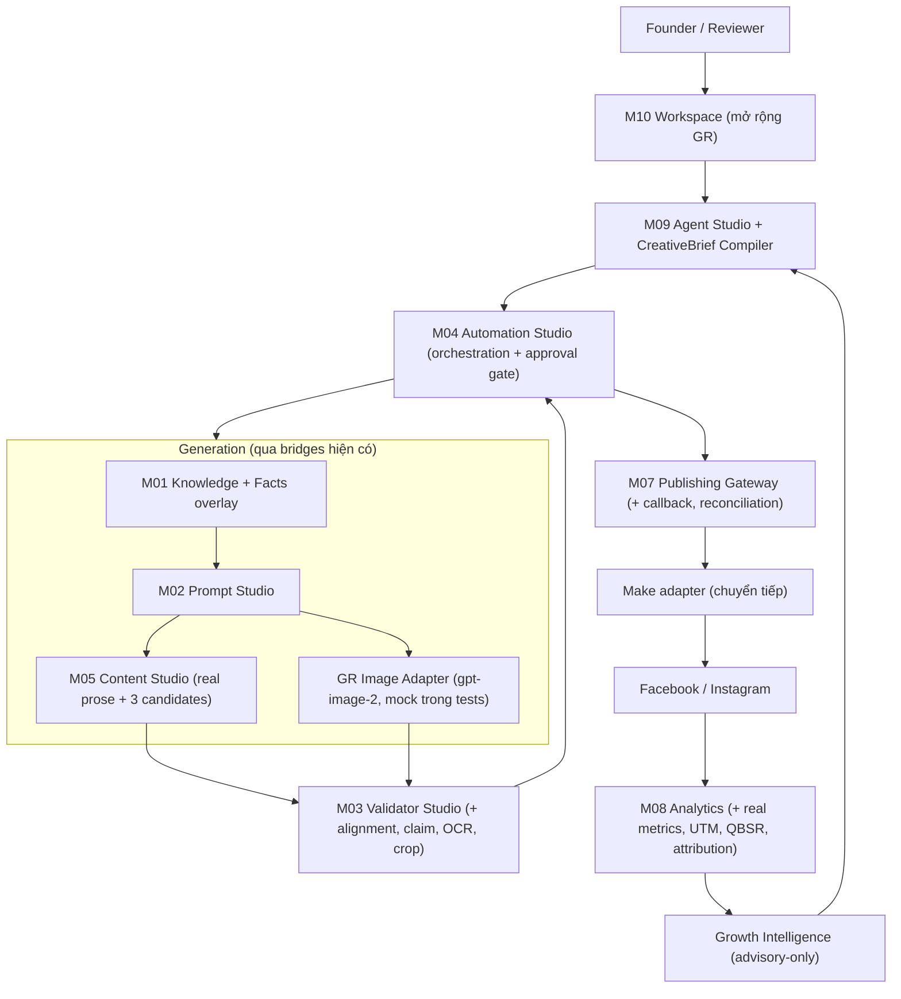

# VENHO GROWTH CONTENT & IMAGE AGENT — MASTER PLAN v2.2 (QC Consolidated)

**Trạng thái:** Ready for implementation handoff (Claude Code / Claude Extension VS Code)
**Ngày:** 2026-08-03
**Thay thế:** `..._TECHNICAL_SPECIFICATION_AND_PLAN_v2.0.md` và `..._IMPLEMENTATION_SPECIFICATION_v2.1.md` (hai bản này trở thành tài liệu tham chiếu, không phải baseline triển khai)
**Vai trò trong hệ thống:** Đây là **chương trình nâng cấp A3 Content & Creative Agent** theo Living Lab Roadmap v1.3 §1.3 — chạy TRÊN VENHO AI Studio (M01–M10), không phải hệ thống song song
**Mã chương trình:** `GR` (Growth) — tránh đụng độ namespace M01–M10 và A1–A8
**Repo chính:** `venho-ai-studio` · Repo legacy đang thu hẹp: `venho-social-content-agent`
**Kênh:** Facebook Page + Instagram Professional · **Timezone:** `Asia/Ho_Chi_Minh`

---

# PHẦN 0 — KẾT QUẢ QC HAI BẢN KẾ HOẠCH GỐC

## 0.1. Quy trình QC

Áp dụng quy trình 4 bước chuẩn: phân tích toàn bộ → nhận diện lỗi → sửa → hợp nhất. Đối chiếu với 4 nguồn sự thật: `task_memory.md`, `task_status.md` (430/430 tests), `VENHO_OS_LIVING_LAB_HUMAN_AI_AGENT_ROADMAP_v1_3_QC.md`, và các nguyên tắc bất biến của Studio.

## 0.2. Bảng lỗi (12 lỗi — 2 Critical, 3 High, 5 Medium, 2 Low)

| # | Mức | Lỗi trong v2.0/v2.1 | Sửa trong v2.2 |
|---|---|---|---|
| **GR-E1** | **Critical** | Đề xuất hệ content song song (`venho-os` control plane + Python workers) — vi phạm **Decision Locked #11** ("A3 chạy trên Studio pipeline, không build hệ content thứ hai") và tái hiện rủi ro "build trùng" mức Cao trong Roadmap §22. Reimplement M03 (validators), M04 (approval), M05 (content), M07 (publishing), M08 (analytics), M09 (planning) | Toàn bộ năng lực mới được ghép vào đúng module Studio sở hữu chúng (mapping tại §2.3). Nếu Harry vẫn muốn hệ song song, việc đó phải qua **Change Request L2 Governance**, không quyết ngầm trong spec |
| **GR-E2** | **Critical** | Hai publishing gateway cùng tồn tại: Make.com (spec mới) và M07 Publishing Gateway (đã có HMAC approval, idempotency, receipt store, FB/IG adapters, 19 tests). Hai đường publish = rủi ro duplicate post — chính là điều spec lo ngại ở BASE-08 | **M07 là gateway duy nhất.** Make.com trở thành một adapter đứng SAU M07 (`publishing_gateway/adapters/make_gateway.py`) trong giai đoạn chuyển tiếp, sau đó retire khi Meta adapter live. Callback + reconciliation (ý tưởng tốt của v2.1) được build vào M07, không build ngoài |
| **GR-E3** | **High** | Yêu cầu validator chạy song song TypeScript + Python với cross-language contract tests — gấp đôi chi phí maintain cho solo founder, và vi phạm nguyên tắc "M10 presentation-only" (UI không tính lại score) | **M03 là chủ sở hữu duy nhất của mọi validation logic (Python).** UI (M10 hoặc venho-os tương lai) chỉ đọc kết quả qua contract JSON, không bao giờ tính lại. Contract fixtures vẫn cần, nhưng chỉ để validate schema, không phải logic |
| **GR-E4** | **High** | Kế hoạch phụ thuộc repo `venho-os` làm control plane — repo này **chưa tồn tại** (Decision Record DR-OS-01 đang pending) | MVP control plane = **mở rộng M10 Workspace (Streamlit)** — các card Needs Review / Ready to Publish đã có sẵn. React/Next control plane là Phase sau, gắn với DR-OS-01 |
| **GR-E5** | **High** | Migration toàn bộ sang PostgreSQL ngay từ đầu — vi phạm nguyên tắc stack "không thêm công cụ mới khi công cụ hiện tại chưa là bottleneck" và Markdown/JSON Source of Truth | Durable state là nhu cầu thật (jobs, publications, budget) nhưng bắt đầu bằng **SQLite** (zero-ops, local-first, cùng SQL dialect chuẩn). PostgreSQL là **Decision D3** (§9), kích hoạt khi có multi-process workers hoặc hosted control plane. Schema thiết kế Postgres-compatible từ đầu |
| **GR-E6** | **Medium** | State machine mâu thuẫn giữa v2.0 và v2.1 (ContentPackage: v2.0 thiếu `UNVALIDATED`, `PUBLISH_UNKNOWN`, tách `GENERATING_COPY/IMAGE`; CreativeBrief: v2.0 có `READY`, v2.1 có `READY_FOR_APPROVAL`) | Chuẩn hóa một bộ canonical duy nhất (§4) — lấy v2.1 làm gốc vì đầy đủ hơn về fail-closed semantics |
| **GR-E7** | **Medium** | Ba ngưỡng QC ảnh khác nhau tồn tại song song: legacy 7/10, v2.1 visual quality 8.5/10, mandatory 9.0/10 — không có single source | Mọi threshold nằm trong **policy registry** (`config/projects/venho_hotel/growth/quality_policy.yaml`), align với rubric 07F đã khóa: `>=9.0 APPROVED · 8.0–8.9 CONDITIONAL · <8.0 REJECT`. M03 đọc policy; không module nào hard-code ngưỡng |
| **GR-E8** | **Medium** | Knowledge Facts được thiết kế như subsystem mới ở repo khác — trùng vai trò K-Core/K1 Knowledge và curated overlay của M01 | Knowledge Facts = **tầng curated overlay mới trong M01 domain** (`knowledge_studio/facts/`), cùng cơ chế governance với Forbidden overlay hiện có: single source, không bị overwrite khi regenerate |
| **GR-E9** | **Medium** | Legacy pipeline (GitHub Actions T2/T4/T6 trong `venho-social-content-agent`) được spec "harden" lâu dài — kéo dài tình trạng hai hệ | Phase 0 chỉ **containment tối thiểu** (chặn publish sai) trên legacy; mọi đầu tư mới đổ vào Studio. Legacy retire theo migration gate ở Phase 4, không harden thêm |
| **GR-E10** | **Medium** | v2.1 mở adapter `gpt-image-2` trực tiếp — điều này **đóng External Breakpoint #1** (image generation hiện là manual, ngoài phạm vi Studio) mà không ghi nhận đây là thay đổi phạm vi | Ghi nhận rõ là **Decision D2** (§9): đóng breakpoint #1 qua versioned adapter là hợp lý (Creative Studio đã có `generate_image.py` chạy thật) — nhưng phải qua quyết định tường minh của Harry, adapter mock trong tests, và giữ 2 breakpoints còn lại (video render, post-render validation) |
| GR-E11 | Low | DoD "9.3/10" và baseline "4.1/10" tự chấm không cùng eval harness — không so sánh được | Điểm chỉ có giá trị khi tính từ **golden eval set có version** (§8.4). Baseline 4.1 giữ làm ước lượng kỹ thuật, không phải điểm chứng nhận |
| GR-E12 | Low | Budget ledger không map vào envelope 200 triệu VND của Roadmap | Paid generation cost thuộc nhóm "CRM, AI tools, automation, data — 20 triệu"; alert 70/85/100% nối vào ngân sách này |

## 0.3. Chín năng lực mới đáng giữ từ v2.0/v2.1 (Studio chưa có)

1. **CreativeBrief** — hợp đồng sáng tạo khóa mục tiêu/audience/message/visual trước mọi generation.
2. **Knowledge Facts + Claim Verification** — mọi claim về giá/tiện nghi/review/khoảng cách phải có fact được duyệt còn hiệu lực.
3. **Cross-modal Alignment Validator** — copy và ảnh phải kể cùng một câu chuyện (location/subject/action/offer).
4. **Publication callback + reconciliation** — Make/Meta `200` chỉ là `GATEWAY_ACCEPTED`; `PUBLISHED` cần platform post ID hoặc bằng chứng reconciliation.
5. **QBSR + attribution** — tối ưu theo qualified booking signals, không theo engagement.
6. **Budget ledger** RESERVE → COMMIT | RELEASE cho mọi paid call.
7. **Immutable image runs** — mỗi lần generate là một run mới, không overwrite, có manifest.
8. **3-candidate copy generation** với rubric chọn có lưu lý do loại.
9. **Golden eval sets** có version cho content và image.

---

# PHẦN 1 — MỤC TIÊU VÀ TIÊU CHÍ THÀNH CÔNG

## 1.1. Mục tiêu sản phẩm

Tạo nội dung và hình ảnh đáng tin, nhất quán Hotel DNA/Linh An, đúng kênh, làm tăng **qualified demand** cho Ven Hồ Hotel — trong khi founder giữ toàn quyền phê duyệt, mọi claim có bằng chứng, và chi phí vận hành dự đoán được.

## 1.2. North-star metric

```text
QBSR (Qualified Booking Signal Rate) = unique_qualified_booking_signals / eligible_reach
```

Qualified signal = DM/điện thoại có ngày ở/số khách/loại phòng · click booking link có UTM hợp lệ · booking start · booking xác nhận quy nguồn được. **Không** tính like, comment chung chung, spam, click lặp.

## 1.3. Quality gates (đo trên golden set có version)

| Chiều | Pilot gate | 90 ngày |
|---|---:|---:|
| Critical factual precision | 100% | 100% |
| Brand adherence | ≥95% | ≥97% |
| Copy–image alignment | ≥95% | ≥97% |
| Hotel DNA pass (ảnh liên quan) | ≥95% | ≥97% |
| Linh An identity pass (khi yêu cầu) | ≥92% | ≥95% |
| Duplicate publication | 0 | 0 |
| Publication có platform post ID | ≥99% | ≥99.5% |
| Human acceptance không sửa lớn | ≥70% | ≥80% |

## 1.4. Non-goals (giữ nguyên từ v2.1)

Không tự đặt/đổi giá và promotion · không tự trả lời/chốt booking · không coi AI score là thay thế owner approval trong pilot · không tuyên bố winner từ một bài · không tối ưu reach đánh đổi booking intent.

---

# PHẦN 2 — QUYẾT ĐỊNH KIẾN TRÚC

## 2.1. Quyết định chấp hành (thay thế §1.1 của v2.1)

1. **Chương trình GR chạy trên VENHO AI Studio.** Không repo mới, không hệ content thứ hai (Decision Locked #11).
2. **M07 là publishing gateway duy nhất.** Make.com là adapter sau M07 trong giai đoạn chuyển tiếp.
3. **M03 là chủ sở hữu duy nhất của validation.** UI chỉ hiển thị, không tính lại.
4. **Control plane MVP = M10 Workspace mở rộng.** Không chờ `venho-os` repo.
5. **Durable state = SQLite trước, Postgres theo Decision D3.**
6. Topic approval ≠ final package approval — hai quyết định khác nhau.
7. Final approval tham chiếu **exact versions** (copy version ID + asset version ID). Mọi sửa đổi sau approval tự revoke approval.
8. Không validator nào fail/timeout/malformed được phép sinh `APPROVED` — fail-closed thành `UNVALIDATED`.
9. `gpt-image-2` qua versioned adapter; model/quality là config, không hard-code (Decision D2).
10. Tối ưu theo QBSR, không theo engagement.
11. **0 API call trong unit/contract/integration tests mặc định** — nguyên tắc bất biến của Studio, áp dụng nguyên vẹn.
12. Advisory-only cho Growth Intelligence: mọi recommendation là `pending_approval`, route qua M04/M09 — đúng ranh giới M08 hiện có.

## 2.2. Sơ đồ kiến trúc mục tiêu



## 2.3. Bảng mapping năng lực mới → module sở hữu (chống build trùng)

| Năng lực mới | Module sở hữu | Vị trí code | Ghi chú |
|---|---|---|---|
| Knowledge Facts + validity window | **M01** | `knowledge_studio/facts/` | Curated overlay, cùng governance với Forbidden overlay |
| CreativeBrief + Campaign | **M09** | `agent_studio/growth/` | CreativeBrief = chuyên biệt hóa của TaskPlan contract; compiler + lock lifecycle |
| Real prose + 3 candidates + selection rubric | **M05** | `content_studio/generators/` | Thay `generator_fn` mock bằng provider thật — đúng follow-up đã ghi trong task_status M05 |
| Claim extraction + fact verification | **M03** | `validator_studio/claim_validator.py` | Validator type #5 |
| Cross-modal alignment | **M03** | `validator_studio/alignment_validator.py` | Validator type #6; scene-graph so khớp brief–copy–ảnh |
| OCR + crop safety | **M03** | `validator_studio/derivative_validator.py` | Validator type #7 |
| Image generation adapter + immutable runs | **GR mới** (đóng breakpoint #1 — Decision D2) | `image_studio_runtime/` | Package mới, single-purpose; consume prompt từ M02, xuất run/manifest cho M03 |
| Deterministic text overlay | GR | `image_studio_runtime/overlay/` | Critical text không bao giờ để AI render |
| Approval snapshot exact-versions | **M04 + M07** | `automation_studio/approval_snapshot.py`; verify tại `publishing_gateway/approval_verifier.py` | Mở rộng HMAC verifier hiện có, không thay thế |
| Publication callback + reconciliation | **M07** | `publishing_gateway/callback_receiver.py`, `reconciliation.py` | `GATEWAY_ACCEPTED` là state mới trong receipt contract |
| Make adapter (chuyển tiếp) | **M07** | `publishing_gateway/adapters/make_gateway.py` | Đứng sau toàn bộ guardrails M07 |
| Real metrics ingestion + windows 1h/24h/72h/7d/28d | **M08** | `analytics_feedback/adapters/meta_insights.py` | Thay MockMetricsAdapter khi live; mock giữ trong tests |
| UTM + inquiry + booking attribution | **M08** | `analytics_feedback/attribution/` | Null ≠ zero ≠ unavailable |
| Strategy Memory + weekly brief | **M08** | `analytics_feedback/strategy_memory/` | Advisory-only, `pending_approval` |
| Durable jobs + budget ledger | **shared** | `shared/jobs/`, `shared/budget/` | SQLite; dùng chung cho GR pipeline |
| Review/approval UI | **M10** | `ui/studio_app.py` + `dashboard/gateway.py` | Card Needs Review / Ready to Publish có sẵn — thêm panel GR |
| Contracts + policy registry | Repo-level | `contracts/`, `config/projects/venho_hotel/growth/` | Contract-First: schema trước implementation |

## 2.4. Số phận `venho-social-content-agent` (legacy)

- **Phase 0:** nhận containment tối thiểu (chặn publish sai) — không đầu tư thêm tính năng.
- **Phase 1–3:** chạy song song read-only trong khi Studio pipeline nhận việc mới.
- **Phase 4 gate:** khi Studio pipeline publish thành công 4 tuần liên tục với 0 duplicate, legacy chuyển sang standby.
- **Retire:** archive repo, giữ CLI compat scripts trong `docs/legacy/` cho recovery.

---

# PHẦN 3 — CLEAN ARCHITECTURE

## 3.1. Bốn tầng (áp dụng cho mọi package GR mới)

```text
┌─────────────────────────────────────────────────────────┐
│ TẦNG 4 — INFRASTRUCTURE                                 │
│ SQLite store, file storage, scheduler, config loader,   │
│ HTTP callback server, secret loading                    │
├─────────────────────────────────────────────────────────┤
│ TẦNG 3 — INTERFACE ADAPTERS                             │
│ Provider adapters (OpenAI text, gpt-image-2, Meta       │
│ insights, Make), module bridges (M01–M09), renderers,   │
│ CLI, Streamlit gateway                                  │
├─────────────────────────────────────────────────────────┤
│ TẦNG 2 — APPLICATION (Use Cases)                        │
│ PlanCampaign · CompileBrief · LockBrief · GenerateCopy  │
│ · GenerateImage · ValidatePackage · RequestApproval ·   │
│ ApproveExactVersions · DispatchPublication ·            │
│ ReconcilePublication · IngestMetrics · AttributeSignal  │
│ · RecommendStrategy                                     │
├─────────────────────────────────────────────────────────┤
│ TẦNG 1 — DOMAIN                                         │
│ Aggregates, state machines, invariants, value objects,  │
│ policy interfaces. KHÔNG import provider, KHÔNG I/O     │
└─────────────────────────────────────────────────────────┘
```

**Quy tắc phụ thuộc:** chỉ hướng vào trong. Domain không biết SQLite hay OpenAI tồn tại. Use case nhận adapter qua interface (dependency injection) — đây chính là cách M04 adapters và M06 bridges đang làm; GR tiếp tục pattern đó.

## 3.2. Hai quy tắc Studio kế thừa nguyên vẹn

1. **Bridge, không import sâu:** GR use case gọi M05 qua `content_bridge`, M03 qua `validator_bridge` — không import nội bộ module khác.
2. **Config-first:** mọi threshold, model name, quality routing, budget cap nằm trong YAML tại `config/projects/venho_hotel/growth/`; code đọc config, không hard-code.

---

# PHẦN 4 — DOMAIN MODEL VÀ STATE MACHINES (CANONICAL)

## 4.1. Aggregates

| Aggregate | Mục đích | Module lưu trữ |
|---|---|---|
| `Campaign` | Mục tiêu kinh doanh, segment, kỳ, offer, budget | M09/GR |
| `CreativeBrief` | Hợp đồng khóa chia sẻ giữa copy, image, validation | M09/GR |
| `ContentPackage` | Exact copy + asset versions publish cùng nhau | GR |
| `CopyVersion` | Copy bất biến theo platform | M05 output, GR lưu |
| `ImageRun` / `ImageArtifact` | Một lần generate + artifacts bất biến | `image_studio_runtime` |
| `ValidationRun` | Một validator chạy trên một target bất biến | M03 output, GR lưu |
| `ApprovalRequest` | Quyết định human trên exact versions | M04 |
| `Publication` | Một ý định publish cho một platform | M07 |
| `MetricObservation` / `ConversionEvent` | Metric tại observation window / signal quy nguồn | M08 |
| `StrategyMemory` | Pattern có confidence + expiry | M08 |
| `KnowledgeFact` | Fact có validity window + approval | M01 |

**Định danh:** UUIDv7 (fallback UUIDv4). Mọi artifact production mang đủ: `brand_id, campaign_id, creative_brief_id+version, content_package_id, copy_version_id, image_run_id, asset_version_id, validation_snapshot_id, approval_request_id, publication_id, trace_id`. Slug chỉ là nhãn, không phải identity.

## 4.2. CreativeBrief

```text
DRAFT -> VALIDATING -> READY_FOR_APPROVAL -> LOCKED | REJECTED
LOCKED -> SUPERSEDED
```

Invariants: chỉ `LOCKED` được generate final · locked = bất biến · mọi sửa đổi tạo version mới supersede bản cũ · mọi proof point tham chiếu fact/source đã duyệt.

## 4.3. ContentPackage

```text
DRAFT -> GENERATING_COPY -> GENERATING_IMAGE -> VALIDATING
VALIDATING -> NEEDS_REVISION | READY_FOR_REVIEW | UNVALIDATED
READY_FOR_REVIEW -> APPROVED | REJECTED
APPROVED -> SCHEDULED -> PUBLISHING
PUBLISHING -> PUBLISHED | PUBLISH_UNKNOWN | PUBLISH_FAILED | CANCELLED
PUBLISHED -> MEASURING -> MEASURED
```

Invariants:
- `READY_FOR_REVIEW` đòi hỏi MỌI validator bắt buộc đã hoàn tất (không phải pass — hoàn tất; kết quả quyết định nhánh).
- `APPROVED` đòi hỏi đúng một active copy version mỗi platform + một active asset version.
- Sửa copy/image/crop/overlay/CTA/offer/schedule sau approval → tự revoke.
- `PUBLISHED` đòi hỏi platform post ID hoặc reconciliation proof.
- `PUBLISH_UNKNOWN` không được retry mù — bắt buộc reconcile trước.

## 4.4. ImageRun

```text
QUEUED -> GENERATING -> GENERATED -> VALIDATING
VALIDATING -> APPROVED | NEEDS_REVIEW | UNVALIDATED | FAILED
```

Mỗi regeneration = run mới. Không run nào overwrite artifact của run khác.

## 4.5. Publication (mở rộng receipt contract M07)

```text
DRAFT -> READY -> DISPATCHING -> GATEWAY_ACCEPTED
GATEWAY_ACCEPTED -> PUBLISHED | UNKNOWN | FAILED
UNKNOWN -> PUBLISHED | FAILED | NEEDS_OPERATOR
```

`GATEWAY_ACCEPTED` là state DUY NHẤT được phép sinh trực tiếp từ HTTP `200` của gateway. Facebook và Instagram là hai Publication row độc lập kể cả khi dùng chung ảnh.

## 4.6. Job (shared/jobs)

```text
READY -> RUNNING -> SUCCEEDED | RETRYABLE_FAILED | TERMINAL_FAILED
```

Worker claim bằng lease có expiry; reconciliation worker thu hồi lease hết hạn. Trường bắt buộc: idempotency key, job type+version, attempt/max, lease owner+expiry, scheduled time, redacted last error, trace ID.

---

# PHẦN 5 — CONTRACTS (Contract-First)

> Mọi schema đặt tại `contracts/` (repo-level), version hóa, có fixtures pass/fail. Code viết SAU khi contract được duyệt — đúng nguyên tắc Contract-First của OS.

## 5.1. CreativeBrief (`contracts/creative_brief.schema.json` — v1.0)

```jsonc
{
  "schema_version": "1.0",
  "id": "01J...",                       // UUIDv7
  "version": 1,
  "brand_id": "venho-hotel",
  "campaign_id": "01J...",
  "objective": "qualified_inquiry",     // enum: qualified_inquiry|booking_click|awareness|retention
  "primary_metric": "qualified_dm_rate",
  "platforms": ["facebook", "instagram"],
  "audience_segment": "couple",         // enum theo taxonomy v1
  "funnel_stage": "consideration",
  "customer_tension": "muốn nghỉ gần Hồ Tây nhưng lo ảnh quảng cáo không đúng thực tế",
  "single_minded_message": "...",       // BẮT BUỘC — một thông điệp duy nhất
  "proof_points": [                     // mỗi điểm PHẢI tham chiếu fact
    { "text": "12 phòng boutique", "fact_key": "hotel.room_count" }
  ],
  "content_angle": "local_experience",
  "hook_hypothesis": "một buổi sáng chậm bên Hồ Tây",
  "cta": { "type": "booking_link", "destination_key": "hotel.website", "strength": "soft" },
  "visual": {
    "scenario_key": "venho_rooftop_sunrise",   // BẮT BUỘC — không dùng pillar-level path
    "required_entities": ["west_lake", "rooftop_railing"],
    "forbidden_entities": ["bedroom_window", "highrise_skyline"],
    "linh_an": { "required": false, "reference_mode": "none" },
    "target_formats": ["feed_4_5", "square_1_1"]
  },
  "constraints": { "prohibited_claims": [], "critical_text_in_image": false },
  "status": "LOCKED",
  "checksum": "sha256:..."
}
```

Validation rules: `objective, audience_segment, funnel_stage, single_minded_message, cta, visual.scenario_key` bắt buộc · conversion brief cần CTA đo được · proof point cần fact active · Linh An brief cần reference có `rights_status=approved` · scenario resolver reject xung đột required/forbidden.

## 5.2. KnowledgeFact (`contracts/knowledge_fact.schema.json` — v1.0)

```jsonc
{
  "fact_key": "hotel.room_count",       // namespace: hotel.* | offer.* | venue.* | review.*
  "value": 12,
  "value_type": "integer",
  "source_type": "owner_confirmed",     // owner_confirmed|document|platform_verified
  "confidence": 1.0,
  "valid_from": "2026-01-01T00:00:00+07:00",
  "valid_to": null,                     // null = không hết hạn; giá/promotion BẮT BUỘC có valid_to
  "status": "approved",
  "version": 3,
  "approved_by": "harry",
  "approved_at": "2026-08-03T00:00:00+07:00"
}
```

Fact bắt buộc có validity: giá phòng, promotion, chính sách trẻ em, tồn phòng/room types, tiện nghi, điểm review + số review, khoảng cách/thời gian di chuyển, phone/website/booking URL/địa chỉ, tên/menu/giá/giờ mở cửa của venue bên thứ ba.

Claim pipeline (M03 claim_validator):

```text
Copy -> deterministic claim extraction -> claim list
     -> match knowledge_facts -> VERIFIED | UNSUPPORTED | CONFLICTED | EXPIRED
```

Critical claim `UNSUPPORTED|CONFLICTED|EXPIRED` = kill switch chặn publish. Ngôn ngữ mô tả chủ quan rõ ràng được pass. Validator lưu exact evidence + fact version.

## 5.3. Copy candidate (`contracts/copy_candidate.schema.json` — v1.0)

3 candidate khác biệt thật sự mỗi brief: (1) emotional/experiential · (2) practical/problem-solution · (3) proof-led/trust. Paraphrase cùng hook không tính. Mỗi candidate trả structured fields: `platform, language, hook, body, cta, hashtags, alt_text, claims[], scene_summary{location, time_of_day, entities, mood}`.

Rubric chọn: Factual support = kill switch · Brief adherence 20% · Audience relevance 20% · Hook 15% · Benefit clarity 15% · Brand voice 10% · Platform fit 10% · CTA coherence 10%. Lưu toàn bộ điểm + lý do loại. Chỉ candidate được chọn đi tiếp sang paid image generation.

## 5.4. Image manifest (`contracts/image_manifest.schema.json` — v2.2)

```jsonc
{
  "schema_version": "2.2",
  "run_id": "01J...",
  "content_package_id": "01J...",
  "creative_brief_id": "01J...",
  "model": "gpt-image-2",               // đọc từ config, không hard-code
  "operation": "edit",                  // generate|edit
  "quality": "medium",
  "size": "1024x1280",
  "prompt_contract_version": "1.0",
  "base_prompt": "...", "override_patch": {...}, "final_prompt": "...",
  "prompt_hash": "sha256:...",
  "reference_asset_ids": ["01J..."],
  "reference_mode": "environment",      // environment|face|none — theo quy tắc use_ref của Creative Studio
  "dna_subject": "lake_view_room", "dna_version": "2.7",
  "scenario_key": "venho_lake_view_room_sunrise",
  "estimated_cost_minor": 0, "actual_cost_minor": null,
  "artifacts": [], "validation_run_ids": [],
  "created_at": "..."
}
```

Layout bất biến:

```text
data/projects/venho_hotel/growth/artifacts/{content_package_id}/images/{run_id}/
  source-reference.json · generated.png · feed-4x5.png · square-1x1.png
  story-9x16.png · validation-report.json · manifest.json
```

## 5.5. Publication command + callback (`contracts/publication_command.schema.json` — v2.2)

Idempotency key tất định: `brand + platform + account + content_package_id + copy_version_id + asset_version_id + scheduled_at`. Cùng key → trả kết quả cũ, không bao giờ tạo post thứ hai. Callback bắt buộc: `publication_id, idempotency_key, platform, status, platform_post_id, permalink, published_at, error_code` — authenticated (HMAC v1, timestamp replay protection) + deduplicated. Thiếu callback → `UNKNOWN` → reconcile trước mọi retry.

## 5.6. Quality policy (`config/projects/venho_hotel/growth/quality_policy.yaml`)

```yaml
version: 1
image:
  dna_min: 9.0            # align rubric 07F
  linh_an_identity_min: 9.0
  action_geometry_min: 9.0
  visual_quality_min: 8.5
  conditional_band: [8.0, 8.9]
copy:
  brand_voice_min: 9.0
  duplicate_similarity_block: 0.88
alignment:
  package_min: 9.0
kill_switches:
  - unsupported_critical_claim
  - wrong_hotel_environment
  - missing_required_identity
  - location_mismatch
  - critical_text_error
verdict_rules:
  validator_incomplete: UNVALIDATED     # fail-closed
  any_kill_switch: NEEDS_REVISION
  all_pass: READY_FOR_REVIEW
```

Verdict aggregation: điểm KHÔNG được average qua các chiều kill-switch.

---

# PHẦN 6 — FILE TREE CHUẨN HÓA

```text
venho-ai-studio/
│
├── contracts/                                # ★ MỚI — schema version hóa, Contract-First
│   ├── creative_brief.schema.json
│   ├── knowledge_fact.schema.json
│   ├── copy_candidate.schema.json
│   ├── content_package.schema.json
│   ├── image_prompt_contract.schema.json
│   ├── image_manifest.schema.json
│   ├── validation_report.schema.json
│   ├── approval_snapshot.schema.json
│   ├── publication_command.schema.json
│   ├── publication_callback.schema.json
│   ├── metric_observation.schema.json
│   ├── conversion_event.schema.json
│   ├── strategy_memory.schema.json
│   └── fixtures/                             # cặp pass/fail cho từng schema
│       ├── creative_brief/
│       ├── image_manifest/
│       └── ...
│
├── knowledge_studio/                         # M01
│   ├── vision/                               # (hiện có)
│   └── facts/                                # ★ MỚI — Knowledge Facts overlay
│       ├── __init__.py
│       ├── fact_store.py                     # CRUD + validity window + version
│       ├── fact_resolver.py                  # resolve fact_key -> giá trị active tại thời điểm t
│       └── fact_approval.py                  # approval lifecycle, append-only history
│
├── prompt_studio/                            # M02 (hiện có — không đổi vai trò)
│
├── validator_studio/                         # M03
│   ├── image_validator.py                    # (hiện có)
│   ├── prompt_validator.py                   # (hiện có)
│   ├── face_validator.py                     # (hiện có — rubric 07F)
│   ├── content_validator.py                  # (hiện có)
│   ├── claim_validator.py                    # ★ MỚI — validator #5: claim vs facts
│   ├── alignment_validator.py                # ★ MỚI — validator #6: scene-graph brief–copy–ảnh
│   └── derivative_validator.py               # ★ MỚI — validator #7: OCR + crop safety
│
├── automation_studio/                        # M04
│   ├── adapters/                             # (hiện có)
│   ├── approval_snapshot.py                  # ★ MỚI — exact-version snapshot + revocation rules
│   └── ...
│
├── content_studio/                           # M05
│   ├── builders/                             # (hiện có)
│   ├── generators/                           # ★ MỚI — thay mock prose
│   │   ├── provider_text.py                  # Claude/OpenAI adapter (mock trong tests)
│   │   ├── candidate_generator.py            # 3 candidates khác biệt thật
│   │   └── candidate_selector.py             # rubric + lưu điểm + lý do loại
│   └── ...
│
├── video_studio/                             # M06 (hiện có — ngoài phạm vi GR)
│
├── publishing_gateway/                       # M07
│   ├── adapters/
│   │   ├── facebook.py · instagram.py        # (hiện có)
│   │   └── make_gateway.py                   # ★ MỚI — Make đứng SAU guardrails M07
│   ├── approval_verifier.py                  # (hiện có — mở rộng verify approval_snapshot)
│   ├── receipt_store.py                      # (hiện có)
│   ├── callback_receiver.py                  # ★ MỚI — HMAC callback, dedupe
│   ├── reconciliation.py                     # ★ MỚI — UNKNOWN -> proof hoặc NEEDS_OPERATOR
│   └── ...
│
├── analytics_feedback/                       # M08
│   ├── adapters/
│   │   ├── mock_metrics.py                   # (hiện có — mặc định trong tests)
│   │   └── meta_insights.py                  # ★ MỚI — real metrics, feature-flag off
│   ├── attribution/                          # ★ MỚI
│   │   ├── utm_builder.py                    # utm_content = publication_id
│   │   ├── inquiry_matcher.py                # DM keyword, pseudonymize identifiers
│   │   └── attribution_engine.py             # direct last-touch | assisted | unattributed
│   ├── strategy_memory/                      # ★ MỚI — advisory-only
│   │   ├── pattern_inference.py              # Bayesian smoothing, decay, expiry
│   │   └── weekly_brief_generator.py
│   └── ...
│
├── agent_studio/                             # M09
│   ├── growth/                               # ★ MỚI
│   │   ├── campaign_planner.py               # objective -> campaign + funnel mix
│   │   ├── brief_compiler.py                 # campaign -> CreativeBrief draft
│   │   ├── brief_lifecycle.py                # DRAFT->...->LOCKED, supersede
│   │   └── scenario_registry.py              # scenario_key -> DNA subject + refs + rules
│   └── ...
│
├── image_studio_runtime/                     # ★ MỚI — GR package (Decision D2)
│   ├── __init__.py
│   ├── domain/
│   │   ├── image_run.py                      # aggregate + state machine
│   │   └── quality_router.py                 # risk class -> quality (low/medium/high)
│   ├── application/
│   │   ├── generate_image.py                 # use case: brief+prompt -> run
│   │   └── repair_image.py                   # one targeted repair, sau đó NEEDS_REVIEW
│   ├── adapters/
│   │   ├── gpt_image_provider.py             # gpt-image-2 API (429/5xx backoff+jitter)
│   │   ├── mock_image_provider.py            # mặc định trong tests
│   │   └── m02_prompt_bridge.py              # consume prompt contract từ M02
│   ├── overlay/
│   │   └── text_compositor.py                # deterministic overlay — critical text
│   └── storage/
│       └── run_store.py                      # immutable run folders + manifest
│
├── growth_orchestrator/                      # ★ MỚI — GR use cases xâu chuỗi (Tầng 2)
│   ├── domain/
│   │   ├── content_package.py                # aggregate + canonical state machine §4.3
│   │   └── publication_policy.py
│   ├── application/
│   │   ├── run_content_pipeline.py           # brief -> copy -> image -> validate -> review
│   │   ├── approve_exact_versions.py
│   │   ├── dispatch_publication.py           # qua M07, không bao giờ trực tiếp
│   │   └── measure_publication.py            # qua M08
│   ├── bridges/                              # gọi module khác — KHÔNG import sâu
│   │   ├── m03_validator_bridge.py
│   │   ├── m04_automation_bridge.py
│   │   ├── m05_content_bridge.py
│   │   ├── m07_publishing_bridge.py
│   │   └── m08_analytics_bridge.py
│   └── cli.py                                # venho-growth run|status|approve|reconcile
│
├── shared/
│   ├── vision/                               # (hiện có)
│   ├── jobs/                                 # ★ MỚI — SQLite lease queue
│   │   ├── job_store.py                      # READY->RUNNING->... + lease expiry
│   │   ├── worker.py                         # claim, heartbeat, recovery
│   │   └── scheduler.py                      # 08:00 Asia/Ho_Chi_Minh, idempotent dispatch
│   └── budget/                               # ★ MỚI
│       └── ledger.py                         # RESERVE->COMMIT|RELEASE, alert 70/85/100%
│
├── dashboard/                                # M10 (hiện có — thêm GR sections vào gateway)
├── ui/
│   └── studio_app.py                         # (hiện có — thêm GR review panels)
│
├── config/
│   └── projects/venho_hotel/
│       ├── growth/                           # ★ MỚI
│       │   ├── quality_policy.yaml           # §5.6 — single source thresholds
│       │   ├── model_policy.yaml             # model names, quality routing
│       │   ├── budget_policy.yaml            # caps ngày/tháng/campaign, map envelope 20tr
│       │   ├── taxonomy.yaml                 # audience/funnel/angle/pattern/format/cta/style
│       │   ├── scenario_registry.yaml        # scenario_key -> DNA/refs/required/forbidden
│       │   ├── attribution_policy.yaml       # windows, dedupe, pseudonymization
│       │   └── feature_flags.yaml            # §10 rollback flags
│       └── ...                               # (hiện có: content/, video/, publishing/, ...)
│
├── data/projects/venho_hotel/
│   ├── growth/                               # ★ MỚI (.gitignore như các data khác)
│   │   ├── growth.db                         # SQLite: jobs, packages, publications, ledger
│   │   ├── facts/                            # knowledge facts JSON export (audit)
│   │   ├── briefs/
│   │   ├── artifacts/{package_id}/images/{run_id}/
│   │   ├── analytics/
│   │   └── exports/YYYY/MM/{package_id}/     # brief.json, facebook.txt, instagram.txt,
│   │                                         # manifest.json, validation-summary.json,
│   │                                         # publication-summary.json
│   └── ...
│
├── tests/
│   ├── ...                                   # (hiện có — 430 tests giữ nguyên pass)
│   ├── test_knowledge_facts.py               # ★ MỚI
│   ├── test_claim_validator.py
│   ├── test_alignment_validator.py
│   ├── test_brief_lifecycle.py
│   ├── test_candidate_generation.py
│   ├── test_image_runtime.py                 # mock provider only
│   ├── test_approval_snapshot.py
│   ├── test_publication_reconciliation.py
│   ├── test_jobs_and_budget.py
│   ├── test_attribution.py
│   └── contracts/                            # schema fixtures pass/fail
│
├── docs/
│   ├── growth/                               # ★ MỚI
│   │   ├── how_to_run_growth_pipeline.md
│   │   ├── migration_from_legacy_agent.md
│   │   └── eval_golden_sets.md
│   └── legacy/                               # CLI compat khi retire repo cũ
│
├── task_memory.md · task_status.md           # cập nhật theo Task Closing Protocol
└── pyproject.toml                            # thêm packages: image_studio_runtime*, growth_orchestrator*

venho-social-content-agent/                   # LEGACY — chỉ Phase 0 containment, sau đó freeze
```

---

# PHẦN 7 — KẾ HOẠCH TRIỂN KHAI THEO PHASE

> Nguyên tắc: gap-based, không greenfield. Mỗi phase dừng ở MVP milestone chờ Harry accept (đúng pattern build M01→M06). Toàn bộ 430 tests hiện có phải pass sau MỖI phase.

## Phase 0 — Containment trên legacy (tuần 1)

**Mục tiêu:** chặn publish sai trên hệ hiện tại, không đầu tư tính năng mới vào legacy.

- Tách topic approval khỏi final approval trong state + label.
- Bỏ `approved=true` hard-code trong Make payload.
- Nâng threshold ảnh lên policy-driven `9.0` cho chiều bắt buộc.
- Thêm `UNVALIDATED` fail-closed.
- Guard brief–copy–ảnh location alignment (đơn giản, rule-based).
- Make `200` lưu là `GATEWAY_ACCEPTED`.
- Feature flag rollback cho behavior cũ.

**Exit gate:** rooftop brief + bedroom image không thể publish · điểm 8 không thể hiển thị là approved · không paid call nào trong verification · tests legacy pass.

## Phase 1 — Contracts + Policy Registry (tuần 2–3)

- Tạo `contracts/` với 13 schema + fixtures pass/fail.
- Tạo `config/projects/venho_hotel/growth/` đầy đủ 7 file YAML.
- `shared/budget/ledger.py` + `shared/jobs/` (SQLite, lease queue, scheduler skeleton).

**Exit gate:** mọi fixture pass/fail đúng · không threshold/model string nào bị lặp ngoài policy registry · 430 tests + tests mới pass.

## Phase 2 — Knowledge Facts + Copy thật (tuần 4–6)

- `knowledge_studio/facts/` — store, resolver, approval.
- M05 `generators/` — provider thật (mock trong tests), 3 candidates, selection rubric.
- M03 `claim_validator.py`.
- Seed facts ban đầu từ dữ liệu Ven Hồ đã có (12 phòng, review 8.5, địa chỉ, kênh...).

**Exit gate:** critical factual error = 0 trên golden content set v1 · giá/policy/review/khoảng cách không nguồn bị chặn · Harry approve được locked brief trước paid generation.

## Phase 3 — Image runtime + Multimodal QC (tuần 7–10) — cần Decision D2

- `image_studio_runtime/` — provider adapter, mock, quality router, immutable runs, overlay.
- `agent_studio/growth/scenario_registry.py` + `scenario_registry.yaml` (map từ Visual DNA v2.7 subjects).
- M03 `alignment_validator.py` + `derivative_validator.py`.
- Chính sách paid: 1 generation + 1 targeted repair → `NEEDS_REVIEW`. 429/5xx backoff+jitter không tạo variant mới.

**Exit gate:** required-subject omission = 0 trên release sample · alignment ≥95% · mọi paid run có manifest đầy đủ · không artifact bị overwrite.

## Phase 4 — Approval exact-versions + Publishing tin cậy (tuần 11–13)

- M04 `approval_snapshot.py` + revocation rules.
- M07 `callback_receiver.py`, `reconciliation.py`, `make_gateway.py` adapter, receipt contract mở rộng `GATEWAY_ACCEPTED`.
- M10 panels: Final Review (FB/IG preview cạnh nhau, claims + evidence, validation theo chiều, cost, lịch sử revision) + Operations states.
- **Migration gate legacy:** Studio pipeline publish 4 tuần, 0 duplicate → legacy standby.

**Exit gate:** duplicate = 0 trong chaos tests · edit sau approval chặn dispatch · Make acceptance không bao giờ hiển thị là published · mỗi publication thành công có post ID hoặc reconciliation proof.

## Phase 5 — Scheduler + Durable ops (tuần 14–15)

- Scheduler 08:00 Asia/Ho_Chi_Minh idempotent dispatch (Make/cloud scheduler trigger; GitHub cron chỉ là fallback).
- Worker heartbeat, stale-job recovery, retry matrix, lateness alert.
- Budget ledger nối alert 70/85/100%; 100% → block paid call trừ override có ghi nhận.

**Exit gate:** duplicate trigger tạo đúng 1 job · restart thu hồi lease hết hạn · late run có alert · budget cap block đúng.

## Phase 6 — Analytics + Attribution (tuần 16–19)

- M08 `meta_insights.py` (flag off mặc định), windows 1h/24h/72h/7d/28d.
- `attribution/` — UTM (`utm_content=publication_id`), DM keyword, inquiry pseudonymization, direct/assisted/unattributed.
- M10 content performance view (đọc M08 output — không tính lại).

**Exit gate:** một inquiry test truy được về đúng một publication · null ≠ unavailable ≠ zero · sample metrics khớp nguồn.

## Phase 7 — Growth Intelligence pilot (tuần 20–23)

- `strategy_memory/` — Bayesian smoothing, confidence, scope, decay, expiry.
- Weekly strategy brief — **advisory-only, `pending_approval`, route qua M04/M09** (đúng ranh giới M08).
- Sample không đủ → `INCONCLUSIVE`, không promote.

**Exit gate:** mọi recommendation có evidence + limitations · không strategy memory nào promote từ dữ liệu thiếu · QBSR không giảm quá guardrail so với baseline.

## Phase 8 — Controlled rollout (tuần 24+)

```text
Shadow -> 25% pilot (human-approved) -> 50% -> 100% (vẫn human-approved)
-> auto-approval phạm vi hẹp CHỈ KHI có quyết định riêng của Harry
```

**Exit gate:** scorecard ≥9.3/10 trên golden set có version sau đủ thời gian quan sát · 90-day metrics đủ để so sánh · runbook/rollback/budget/ownership documented.

---

# PHẦN 8 — TEST & EVAL

## 8.1. Quy tắc bất biến

- **0 API call trong pytest.** Text/image/metrics provider mặc định mock. `optimize_fn=optimize_mock` giữ nguyên cho M02.
- Không publish thật từ tests. Không đọc secret thật.
- Legacy tests + 430 Studio tests pass sau mọi phase.

## 8.2. Test pyramid

**Unit:** state transitions (kể cả forbidden), claim extraction/matching, prompt contract assembly, scenario resolution, platform formatting, duplicate scoring, verdict aggregation, idempotency key, budget reserve/commit/release, UTM + dedupe.

**Contract:** mỗi schema có fixtures pass/fail; schedule 1.0 legacy vẫn đọc được trong migration window; provider adapter request/response mapping.

**Integration (mock providers):** locked brief → 3 candidates → selection → mock image → validation → review → approval exact versions → dispatch → callback → ambiguous timeout → reconciliation → artifact+manifest recovery → budget release on failure.

**E2E (staging, non-paid fixture image):** FB success + IG failure là hai state độc lập · duplicate dispatch cùng key = 1 post · edit sau approval revoke · validator unavailable không bao giờ publish · scheduler duplicate = 1 job.

## 8.3. Acceptance style bắt buộc

```text
Given [persisted precondition]
When  [command hoặc API action]
Then  [observable domain result]
And   [audit / cost / validation / side-effect invariant]
```

## 8.4. Golden eval sets (version hóa)

- **Content set:** ≥100 CreativeBrief cases — audience × funnel × factual conflict × local topics × offers × 2 platforms.
- **Image set:** ≥60 cases — phòng thật, rooftop, street, local food, Linh An static/dynamic, mọi target crop.
- Release report ghi: dataset version, policy+model versions, automated + reviewer scores, disagreements + adjudication, cost, latency, pass/fail theo gate.
- Paid eval chạy trong workflow riêng có budget cap được duyệt — không nằm trong CI thường.

---

# PHẦN 9 — OPEN DECISIONS CẦN HARRY CHỐT TRƯỚC KHI CODE

| ID | Quyết định | Đề xuất của kiến trúc sư | Cơ chế |
|---|---|---|---|
| **GR-D1** | Xác nhận GR chạy trên Studio (hủy hướng hệ song song của v2.0/v2.1) | **Chấp thuận** — đúng Decision Locked #11, tiết kiệm ~40–50% effort nhờ tái dùng M03/M04/M07/M08/M09 | Ghi vào Decisions Locked của plan này |
| **GR-D2** | Đóng External Breakpoint #1: image generation qua versioned adapter trong `image_studio_runtime` | **Chấp thuận có điều kiện** — Creative Studio đã chạy `generate_image.py` thật; adapter hóa là bước chuẩn hóa, không phải mở phạm vi mới. Điều kiện: mock mặc định trong tests, budget ledger hoạt động trước paid call đầu tiên | Decision Record trong L4 |
| **GR-D3** | SQLite → PostgreSQL | **SQLite cho toàn bộ năm 1.** Trigger chuyển Postgres: multi-process workers, hosted control plane (venho-os live), hoặc >2 người dùng đồng thời | Decision Record; schema Postgres-compatible từ đầu |
| **GR-D4** | Số phận `venho-social-content-agent` | Freeze sau Phase 0 → standby sau Phase 4 gate → archive | Ghi trong migration doc |
| **GR-D5** | venho-os control plane (React) | Gắn với **DR-OS-01** (init repo `venho-os`) — không phải blocker của GR; M10 Streamlit đủ cho pilot | Giữ pending như hiện tại |
| **GR-D6** | Text provider cho M05 prose thật | Claude (Sonnet) mặc định, temp > 0 chỉ ở M05 đúng nguyên tắc Studio; model name trong `model_policy.yaml` | Config, không cần CR |

---

# PHẦN 10 — FEATURE FLAGS & ROLLBACK

`config/projects/venho_hotel/growth/feature_flags.yaml`:

```yaml
final_approval_required: true          # không bao giờ tắt trong pilot
canonical_publication_state: true
multimodal_qc_enabled: true
make_callback_enabled: false           # bật ở Phase 4
external_scheduler_enabled: false      # bật ở Phase 5
meta_insights_enabled: false           # bật ở Phase 6
growth_recommendations_enabled: false  # bật ở Phase 7
legacy_agent_active: true              # tắt ở Phase 4 migration gate
```

Rollback rules: tắt flag không được reinterpret state đã lưu · migration forward-only với compatible reads · approved artifacts bất biến · disable dispatch TRƯỚC khi rollback approval/validation · Git export luôn khả dụng cho recovery.

---

# PHẦN 11 — SECURITY & GOVERNANCE

1. Secrets chỉ ở GitHub Secrets / secret manager; không bao giờ trong repo, log, prompt, manifest.
2. Callback + command dùng HMAC version hóa + timestamp replay protection (tái dùng `approval_verifier` pattern của M07).
3. Public image URL dùng lifetime tối thiểu.
4. File access resolve logical asset ID trong approved roots; client không gửi absolute path.
5. External source content = untrusted input, không được override prompt policy (chống prompt injection).
6. Provider output/error redact trước khi lưu.
7. Linh An + human references phải có rights metadata được ghi nhận.
8. Approval override ghi actor, reason, policy version, before/after hash.
9. Audit events append-only.
10. Inquiry identifiers pseudonymize trước khi vào analytics store.

---

# PHẦN 12 — PROTOCOL GIAO VIỆC CHO AI CODING AGENT

## 12.1. Task contract (mỗi task một issue riêng)

```text
Task ID:                    GR-<PHASE>-<SEQ>  (vd: GR-P2-003)
Objective:
Business reason:
Module ownership:           (theo bảng §2.3 — KHÔNG vượt boundary)
Allowed files/modules:
Out of scope:
Current behavior:
Target behavior:
Input/output contract:      (tham chiếu contracts/*.schema.json)
Domain invariants:
Backward-compatibility:
Security constraints:
Cost constraints:
Acceptance tests:           (Given/When/Then/And)
Verification commands:      python3 -m pytest -q  (phải 430+ pass)
Rollback plan:
Documentation updates:      task_memory.md · task_status.md
```

## 12.2. Mandatory AI rules

1. Đọc `task_memory.md` và `contracts/` liên quan TRƯỚC khi sửa code.
2. Kiểm tra dirty worktree; không đụng thay đổi không liên quan.
3. Không sửa nhiều module ownership boundary trong một task.
4. Không duplicate model name, threshold, scenario, policy constant — mọi thứ đọc từ `config/.../growth/`.
5. Không gọi paid API để verify thông thường. Mock provider là mặc định.
6. Không publish platform thật từ tests.
7. Không log secrets, signed URLs, tokens, webhook credentials.
8. Không gán `approved/published` thiếu evidence bắt buộc.
9. Viết tests TRƯỚC khi tuyên bố một domain invariant hoàn thành.
10. Kết thúc task: cập nhật `task_memory.md`, `task_status.md`, commit hash, test result — theo Task Closing Protocol hiện hành.
11. Gặp quyết định chưa chốt → dừng và báo, không tự chọn behavior thay đổi business policy.
12. Bridge, không import sâu: mọi liên kết cross-module đi qua `growth_orchestrator/bridges/` hoặc adapter chính thức của module đó.

## 12.3. Backlog ưu tiên (đã re-map ownership)

| Ưu tiên | Task ID | Nội dung | Module | Phụ thuộc |
|---:|---|---|---|---|
| P0 | GR-P0-001 | Tách topic vs final approval (legacy) | legacy | — |
| P0 | GR-P0-002 | Bỏ `approved=true` hard-code (legacy) | legacy | 001 |
| P0 | GR-P0-003 | Threshold 9.0 policy-driven + `UNVALIDATED` (legacy) | legacy | — |
| P0 | GR-P0-004 | Make `200` = `GATEWAY_ACCEPTED` (legacy) | legacy | 002 |
| P1 | GR-P1-001 | 13 JSON Schemas + fixtures | contracts | P0 xong |
| P1 | GR-P1-002 | 7 file policy YAML | config | 001 |
| P1 | GR-P1-003 | SQLite jobs + budget ledger | shared | 001 |
| P1 | GR-P2-001 | Knowledge Facts store/resolver/approval | M01 | P1 |
| P1 | GR-P2-002 | M05 real prose + 3 candidates + rubric | M05 | P1 |
| P1 | GR-P2-003 | Claim validator | M03 | P2-001 |
| P1 | GR-P3-001 | Scenario registry (map Visual DNA v2.7) | M09 | P1 |
| P1 | GR-P3-002 | image_studio_runtime + mock provider | GR | D2, P3-001 |
| P1 | GR-P3-003 | Alignment + derivative validators | M03 | P3-002 |
| P1 | GR-P4-001 | Approval snapshot exact-versions | M04 | P3 |
| P1 | GR-P4-002 | M07 callback + reconciliation + Make adapter | M07 | P4-001 |
| P1 | GR-P4-003 | M10 Final Review + Operations panels | M10 | P4-002 |
| P2 | GR-P5-001 | Scheduler + recovery + retry matrix | shared | P4 |
| P2 | GR-P6-001 | Meta insights adapter + windows | M08 | P4-002 |
| P2 | GR-P6-002 | UTM + attribution engine | M08 | P6-001 |
| P3 | GR-P7-001 | Strategy memory + weekly brief (advisory) | M08 | P6-002 |
| P3 | GR-P8-001 | Golden sets + shadow/pilot rollout | tests/docs | P7 |

---

# PHẦN 13 — DEFINITION OF DONE

Chương trình GR hoàn thành khi và chỉ khi:

1. Mọi final post sinh từ một CreativeBrief `LOCKED`.
2. Mọi critical claim có fact được duyệt còn hiệu lực.
3. Facebook và Instagram copy validate độc lập.
4. Scenario, Hotel DNA, Linh An policy, references đều version hóa và truy vết được.
5. Copy–brief–ảnh pass cross-modal validation.
6. Owner approval tham chiếu exact copy + asset versions.
7. Publication idempotent, chứng minh bằng platform post ID hoặc reconciliation evidence.
8. Analytics nối publication → qualified inquiry/booking signal khi có evidence.
9. Mọi recommendation có evidence, confidence, scope, expiry — và ở trạng thái advisory chờ duyệt.
10. Cost, latency, errors, retries, manifests audit được đầy đủ.
11. Toàn bộ quality/reliability/business release gates pass.
12. Scorecard ≥9.3/10 trên golden set có version sau đủ thời gian quan sát.
13. **430 tests Studio gốc + toàn bộ tests GR pass, 0 API call.**
14. `task_memory.md` và `task_status.md` phản ánh đúng trạng thái cuối — theo Task Closing Protocol.

Cho tới khi đủ 14 điều kiện, hệ thống phải được mô tả theo phase hiện tại, không phải "fully autonomous growth agent".

---

# CHANGELOG v2.0/v2.1 → v2.2 (QC)

| # | Thay đổi |
|---|---|
| GR-E1 | Hủy kiến trúc hệ song song; toàn bộ năng lực map vào M01–M10 theo Decision Locked #11 |
| GR-E2 | M07 là gateway duy nhất; Make thành adapter sau M07; callback/reconciliation build vào M07 |
| GR-E3 | M03 single-owner validation; bỏ yêu cầu dual TS/Python validators |
| GR-E4 | Control plane MVP = M10 Streamlit; venho-os gắn DR-OS-01, không blocker |
| GR-E5 | PostgreSQL → SQLite năm 1 (Decision D3); schema Postgres-compatible |
| GR-E6 | Hợp nhất state machines về một bộ canonical (Phần 4) |
| GR-E7 | Mọi threshold về policy registry duy nhất, align rubric 07F |
| GR-E8 | Knowledge Facts vào M01 domain như curated overlay |
| GR-E9 | Legacy chỉ nhận containment Phase 0; retire theo migration gate Phase 4 |
| GR-E10 | Đóng breakpoint #1 ghi nhận thành Decision D2 tường minh |
| GR-E11 | Điểm số gắn golden set version hóa; baseline 4.1 là ước lượng, không phải chứng nhận |
| GR-E12 | Budget ledger map vào envelope 20 triệu (nhóm CRM/AI tools) của ngân sách 200 triệu |
| Bổ sung | Chương trình đặt mã `GR` tránh đụng độ namespace M/A/MT/K/L; Clean Architecture 4 tầng; file tree chuẩn; backlog re-map ownership; 14-điều-kiện DoD gồm bảo toàn 430 tests |
